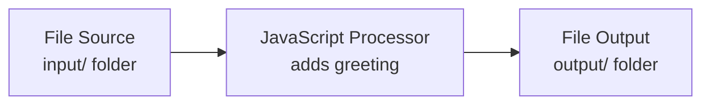

# Hello World (Import)

Get your first workflow running in **3 minutes** — no building required. Import a pre-configured project, create two folders, drop in a sample file, and watch it work.

**Time to complete:** ~3 minutes  
**Prerequisites:** layline.io installed and running ([local](./install-local.md) or [Docker](./install-docker.md))

---

## What we're building

A simple file-processing workflow:



1. **Reads** CSV files from an `input/` folder
2. **Transforms** each line by adding "Hello, {name}!"
3. **Writes** results to an `output/` folder

---

## Step 1: Download the Project

1. Download [`hello-world.zip`](/examples/hello-world.zip)
2. Save it to your desktop or downloads folder

---

## Step 2: Import into layline.io

1. Open the **Configuration Center** at `http://localhost:5841` and log in with `admin` / `admin`
2. In the **Project Hub**, expand **Import from Archive** (right panel)
3. Click the file picker and select `hello-world.zip`
4. Choose a target directory for the project (e.g., `/Users/<yourname>/layline-projects/hello-world`)
5. Click **Import**

<!-- SCREENSHOT: Import from Archive panel with hello-world.zip selected and target path entered -->

After import succeeds, click **Open** to enter the project.

---

## Step 3: Create Input and Output Folders

The project needs two folders for file I/O:

1. Open your file explorer
2. Navigate to the project directory you chose in Step 2
3. Create two folders:
   - `input/` — where source files go
   - `output/` — where processed files appear

```bash
# Or create them via terminal:
mkdir -p /Users/<yourname>/layline-projects/hello-world/input
mkdir -p /Users/<yourname>/layline-projects/hello-world/output
```

---

## Step 4: Add Sample Data

1. Download or create a simple CSV file with names:

   ```csv
   Alice
   Bob
   Charlie
   ```

2. Save it as `names.csv` in the `input/` folder

Or use the sample data included in the project zip (`sample-data/names.csv`).

---

## Step 5: Deploy and Run

1. In layline.io, click **Save** in the toolbar (if Save is visible)
2. Click **Deployments** in the project tabs
3. Select **LocalDeployment** from the list
4. Click the **Deploy** button (paper airplane icon)
5. Select your local engine and confirm

<!-- SCREENSHOT: Deployments tab showing LocalDeployment with Deploy button highlighted -->

The deployment activates within seconds. The File Source polls every 5 seconds.

---

## Step 6: Check the Output

1. Wait 5-10 seconds for the polling interval
2. Check your `output/` folder
3. You should see a new file: `greetings-<timestamp>.csv`

Open it — you'll see:

```csv
Alice,Hello, Alice!
Bob,Hello, Bob!
Charlie,Hello, Charlie!
```

**Success!** Your first workflow processed real data.

<!-- SCREENSHOT: Output folder showing the generated greetings file alongside input folder -->

---

## How It Works

| Component | Purpose |
|-----------|---------|
| **InputFolder** (Source) | Polls `input/` every 5 seconds for `.csv` files |
| **NameFormat** (Format) | Parses simple CSV with a `name` field |
| **Greeter** (Processor) | JavaScript that adds a `greeting` field |
| **OutputFolder** (Sink) | Writes results to `output/` with timestamps |
| **HelloWorldWorkflow** | Connects everything in a pipeline |

The workflow automatically:
1. Deletes processed files from `input/` (configurable)
2. Generates new filenames with timestamps
3. Logs activity to the Engine State log

---

## Troubleshooting

**No output file appears?**
- Check that `input/` and `output/` folders exist in your project directory
- Verify `names.csv` is in the `input/` folder
- Check **Operations** → **Engine State** → **HelloWorldWorkflow** → **Log** for errors
- Make sure the workflow shows as **ACTIVE** (green) in Engine State

**"Directory not found" error?**
- The paths in Source/Sink assets use `${project.basePath}` which resolves at runtime
- Ensure folders are created at the same level as the imported project

**Files not being processed?**
- The File Source only processes files with `.csv` extension
- Check that the file isn't open in another program (file locks)

---

## What next?

- **Modify the greeting** — Open the `Greeter` JavaScript processor and change the message
- **Add more fields** — Edit the `NameFormat` to include additional columns
- **Learn how it was built** — Follow [Build from Scratch](./build-from-scratch.md) to recreate this workflow component by component
- **Try a real tutorial** — Move on to [Your First Workflow](./first-workflow.md) for routing, filtering, and complex transformations

---

## See Also

- [Your First Workflow](./first-workflow.md) — Build a multi-output workflow from scratch
- [Building Workflows](../project/building-workflows.md) — Learn the workflow editor
- [File Source Reference](../assets/workflow-assets/sources/asset-source-file.md) — Deep dive into file-based inputs
