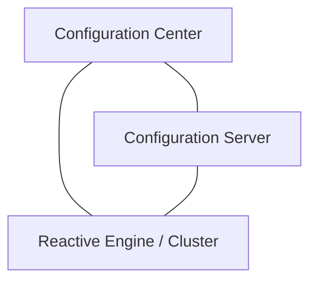

# layline.io at a Glance

**layline.io is an opinionated event data processor.** It wraps the power of reactive stream management in a framework that makes setup, deployment, and monitoring of large-scale event data processing easy and straightforward — without requiring custom code for infrastructure.

> This page gives you the 60-second picture. For the full story, see [What is layline.io?](../concept/introduction.md) in the Concepts section.

---

## What problem does it solve?

Building reliable, scalable data pipelines is hard. Teams spend months creating and maintaining custom infrastructure code to move, transform, and react to data. When requirements change or volume spikes, that code becomes a liability.

layline.io changes this: instead of writing infrastructure, you design workflows visually, connect your systems using built-in assets, and apply business logic using JavaScript or Python. layline.io handles execution, parallelism, fault tolerance, and monitoring.

---

## What you can build

- **Real-time event processing** — react to events from Kafka, message queues, or file streams as they arrive
- **Batch data pipelines** — process large volumes of structured or semi-structured data
- **Data transformation** — normalize, enrich, map, and filter data using built-in processors or custom scripts
- **Multi-output routing** — split and route data to multiple destinations based on content or rules
- **System integration** — connect databases, file systems, Kafka, SFTP/FTP, and more using pre-built connectors

---

## How it works

layline.io has three main components:

1. **Configuration Server** — the control plane. Hosts the Configuration Center, manages project storage, and provides configuration support services.
2. **Configuration Center** — the browser-based UI where you design workflows, configure assets, deploy projects, and monitor running clusters.
3. **Reactive Engine** — the execution engine. Runs your workflows with high throughput and low latency. Scales horizontally across a cluster of nodes.

Projects you design in the Configuration Center are stored by the Configuration Server, then deployed to one or more Reactive Engines. The engines execute your workflows, process data, and report status back to the Configuration Center for monitoring.

---

## Ready to go deeper?

- **[Core Concepts in 5 Minutes](core-concepts)** — understand Projects, Assets, Workflows, and Deployment
- **[Install locally](install-local)** — full installation on your machine (Windows, macOS, Linux)
- **[Run via Docker](install-docker)** — get up and running quickly with a pre-configured image
- **[What is layline.io? (full)](../concept/introduction.md)** — motivation, design philosophy, and feature overview
