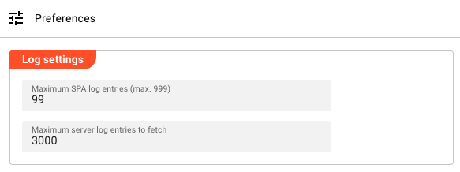
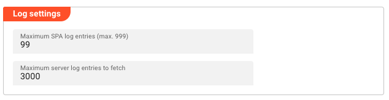
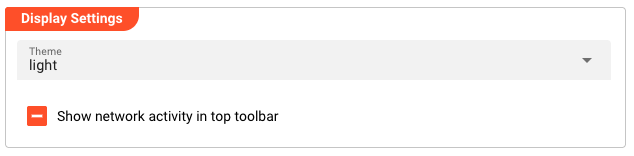

# Application Settings

> Personal preferences that control how the layline.io web interface behaves and appears for your user account.

## Purpose

Application Settings (also labeled **Preferences** in the UI) contain user-specific configuration options that affect your personal experience with the layline.io SPA (Single Page Application). These settings are distinct from project or system configuration — they control how information is displayed to you and how the interface behaves.

Settings here include:
- **Log display limits** — How many log entries to keep in the browser
- **UI appearance** — Theme selection and optional network activity indicator
- **AI Chat configuration** — Consent and connection settings for the integrated AI assistant

## Access

Navigate to **Settings → Application Settings → Preferences**.

Access to the Settings section requires appropriate privileges (typically `admin` or delegated roles with settings access).

## Layout

The Preferences page displays as a **single scrollable panel** with configuration grouped into three sections:

Each section uses a group box to visually separate the settings by function.

---

## Log Settings

Controls how many log entries are retained and displayed in the browser.

### Maximum SPA Log Entries

**Field:** `Maximum SPA log entries (max. 999)`  
**Type:** Numeric input  
**Range:** 1–999  
**Default:** 99

Sets the maximum number of log entries to retain in the browser's memory for the SPA (Single Page Application) log. Older entries are discarded when this limit is reached.

:::tip
A higher value lets you review more history but uses more browser memory. The maximum allowed is 999 entries.
:::

### Maximum Server Log Entries

**Field:** `Maximum server log entries to fetch`  
**Type:** Numeric input  
**Default:** 1000

Controls how many log entries are retrieved from the server when viewing server-side logs. This affects the initial load of log data in the Operations views.

---

## Display Settings

Configures the visual appearance of the layline.io interface.

### Theme

**Field:** `Theme`  
**Type:** Dropdown selection  
**Options:**

| Option | Description |
|--------|-------------|
| **Light** | Light color scheme with dark text on light backgrounds |
| **Dark** | Dark color scheme with light text on dark backgrounds |
| **Auto** | Automatically matches your operating system theme preference |

The theme setting applies immediately when changed — no page reload required.

### Show Network Activity

**Field:** `Show network activity in top toolbar`  
**Type:** Checkbox  
**Default:** Enabled

When enabled, displays a network activity indicator in the top toolbar. This provides visual feedback when the application is communicating with the server.

---

## AI Chat

Configures the integrated AI assistant that can help you with layline.io questions and tasks.

### AI Chat Consent

Before using the AI chat feature, you must agree to the terms of use. The consent status is displayed in an info box:

- **Positive (green):** "You have agreed to the AI chat terms"
- **Negative (red):** "You have NOT agreed to the AI chat terms"

**Action:** Click **Read and Accept Terms** to review and agree to the AI chat terms. Once agreed, the button changes to **Revoke AI chat consent** if you need to withdraw your consent.

### URL of AI Chat

**Field:** `URL of AI chat`  
**Type:** Text input  
**Visible:** Only when AI consent is given

The endpoint URL for the AI chat service. This connects the layline.io interface to the AI assistant backend.

### API Key

**Field:** `API-Key`  
**Type:** Text input (password-style masking recommended)  
**Visible:** Only when AI consent is given

Your personal API key for accessing the AI chat service.

:::caution
If no API key is configured, a warning appears:

> "In order to use the AI-Chat, you must have a valid API key. To obtain one, please contact layline.io at support@layline.io."
:::

---

## Behavior

### Storage Scope

Application Settings are **user-specific and browser-local**:

- Settings are stored in your browser's local storage
- They apply only to your current browser on your current device
- They persist across browser sessions (survive closing and reopening the browser)
- They do **not** sync between different browsers or devices
- They are separate from project configuration or system-wide settings

### Immediate Effect

Most preference changes take effect immediately:
- **Theme** — Applies instantly without reload
- **Show network activity** — Toggles the indicator immediately
- **Log entry limits** — Applies to the next log fetch or entry addition

### AI Chat Requirements

To use the AI chat feature, all three must be configured:
1. **Consent given** — You must accept the AI chat terms
2. **URL configured** — The AI service endpoint must be set
3. **API key provided** — Valid authentication key for the service

Missing any of these will prevent the AI chat from functioning.

---

## See Also

- [**Users & Roles**](/docs/settings/users-and-roles) — Managing user accounts and privileges
- [**Cluster Storage**](/docs/settings/cluster-storage) — Configuring global cluster definitions
- [**Operations → Alarm Center**](/docs/operations/alarm-center) — Where log settings affect log display
