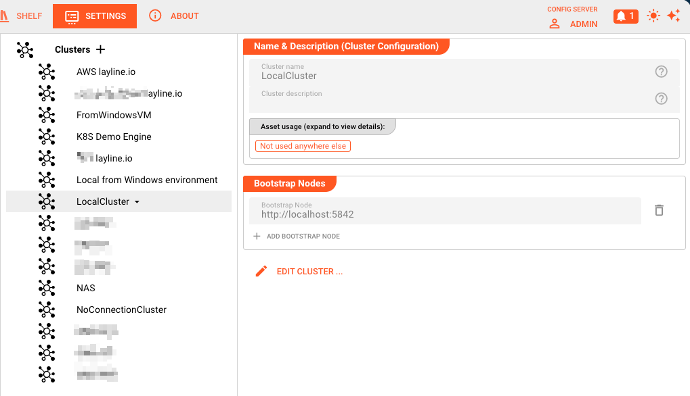
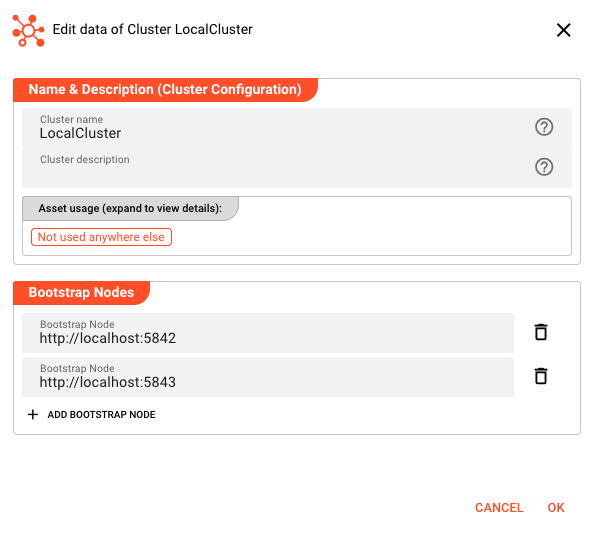

# Cluster Storage

> Global cluster definitions that enable the Configuration Server to connect with Reactive Engine clusters at deployment time.

## Purpose

Cluster Storage holds **global cluster definitions** that are available across all projects in your layline.io installation. These definitions tell the Configuration Server where your Reactive Engine clusters are located and how to connect to them.

Unlike most assets that are project-scoped, cluster definitions are stored at the **Configuration Server level** because they represent shared infrastructure. When you deploy a project, you select which cluster to target from the global cluster definitions stored here.

## Access

Navigate to **Settings → Cluster Storage**. This section is available to the `admin` account and to users who hold the *Read clusters* privilege.

## Layout

The Cluster Storage page uses a **left/right split** layout:



### Left Panel — Cluster List

The left side displays all globally defined clusters:

- **+** button — Creates a new cluster definition (requires *Write clusters* privilege)
- **Cluster items** — Click to select and view details
- **Dropdown menu (**▾**)** — Appears on the selected cluster with a **Remove** option to delete it

### Right Panel — Cluster Details

When you select a cluster, the right panel displays its configuration in read-only mode:

| Field | Description |
|-------|-------------|
| **Cluster name** | Unique identifier for this cluster definition. Used when selecting clusters in Deployment assets. |
| **Cluster description** | Optional free-text description of the cluster's purpose or characteristics. |
| **Bootstrap Nodes** | List of node addresses the Configuration Server uses to establish initial contact with the Reactive Engine cluster. Each node is specified as a URL (e.g., `http://node1:5842`). |

The **Edit Cluster...** button opens a dialog where you can modify the selected cluster.

## Creating and Editing Clusters

### Create a New Cluster

1. Click the **+** button in the left panel
2. The **Edit data of Cluster NewCluster** dialog opens with:



| Field | Description |
|-------|-------------|
| **Cluster name** | Unique identifier. Cannot be empty. |
| **Cluster description** | Optional description. |
| **Bootstrap Nodes** | List of node URLs. Click **+ Add bootstrap node** to add entries. Each node needs a URL in the format `protocol://host:port`. The default suggestion is `http://node:5842` where 5842 is the default Reactive Engine cluster node port. |

3. Click **OK** to save or **Cancel** to discard

### Edit an Existing Cluster

1. Select the cluster in the left panel
2. Click **Edit Cluster...**
3. Modify fields as needed
4. Click **OK** to save changes

### Remove a Cluster

1. Select the cluster in the left panel
2. Click the **▾** dropdown that appears
3. Select **Remove**
4. Confirm the deletion in the dialog

:::warning
Removing a cluster definition does not affect running deployments, but you will not be able to deploy to that cluster until you recreate the definition or select a different cluster.
:::

## Bootstrap Node URLs

Bootstrap nodes tell the Configuration Server how to reach the Reactive Engine cluster. Each entry is a URL with the format:

```
protocol://hostname:port
```

| Component | Description |
|-----------|-------------|
| **protocol** | `http` or `https` depending on your cluster configuration |
| **hostname** | DNS name or IP address of a cluster node |
| **port** | The cluster node's HTTP port (default: **5842**) |

You can define multiple bootstrap nodes for high availability. The Configuration Server will use these addresses to discover the full cluster topology. If one node is unavailable, the system can connect through another.

**Example bootstrap node list:**
- `https://prod-node-1.layline.internal:5842`
- `https://prod-node-2.layline.internal:5842`
- `https://prod-node-3.layline.internal:5842`

## Relationship to Deployment Assets

Clusters defined in Cluster Storage appear as options in the **Cluster Configuration** dropdown within [Deployment assets](/docs/assets/workflow-assets/deployments/asset-deployment-introduction).

When configuring a Deployment asset:

1. In the **Composition** section, the **Cluster Configuration** field shows all global clusters from Cluster Storage
2. Select the cluster where you want this deployment to run
3. When you later deploy the project, layline.io uses the bootstrap nodes from this cluster definition to establish the connection

This separation allows:
- **Infrastructure teams** to define and maintain cluster locations (in Cluster Storage)
- **Development teams** to reference those clusters by name (in Deployment assets) without managing connection details

## Behavior

### Scope

- Cluster definitions are **global** — visible to all projects
- Changes to a cluster definition affect all Deployment assets that reference it
- Cluster definitions are stored by the Configuration Server, not within project files

### Privileges

| Action | Required Privilege |
|--------|-------------------|
| View Cluster Storage | *Read clusters* |
| Create clusters | *Write clusters* |
| Edit clusters | *Write clusters* |
| Remove clusters | *Write clusters* |

The **+** button and **Edit Cluster...** button are disabled if you don't hold the *Write clusters* privilege.

### Inheritance

Cluster assets support the standard layline.io inheritance model when used within Deployment configurations. The bootstrap node configuration and other properties can be inherited from parent Deployment assets, allowing you to define base cluster configurations and override specific values in child assets.

## See Also

- [**Users & Roles**](/docs/settings/users-and-roles) — Managing privileges for cluster configuration access
- [**Deployment Assets**](/docs/assets/workflow-assets/deployments/asset-deployment-introduction) — Using cluster definitions when configuring deployments
- [**Operations → Cluster**](/docs/operations/cluster) — Monitoring and managing running clusters
