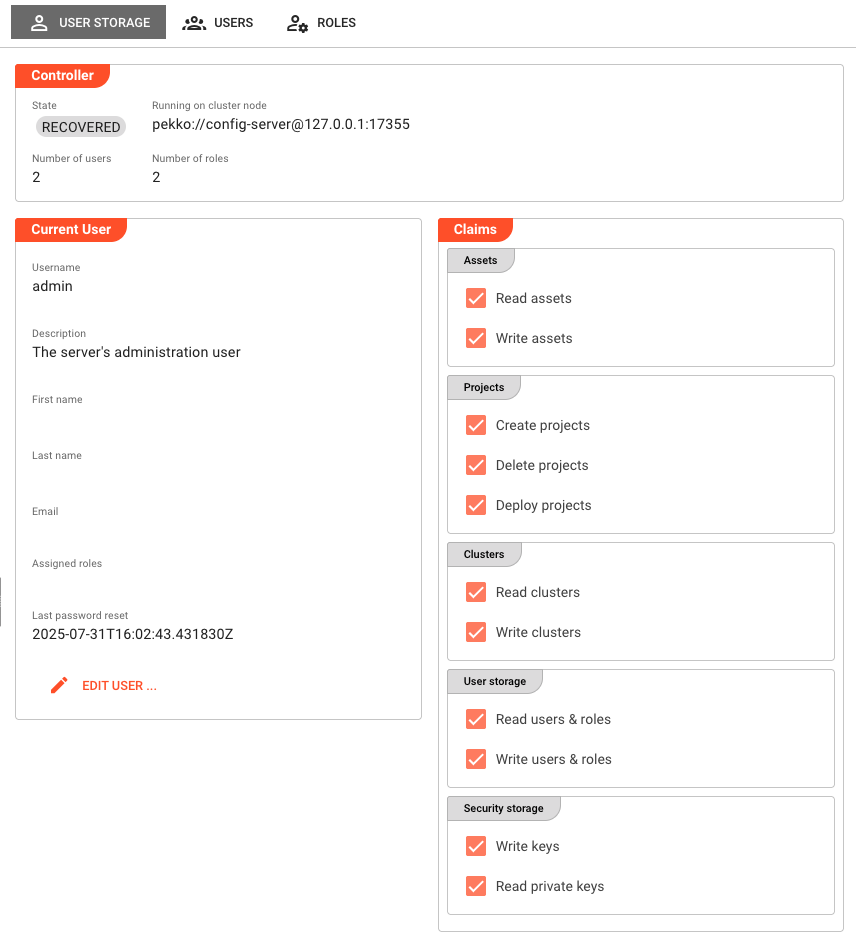
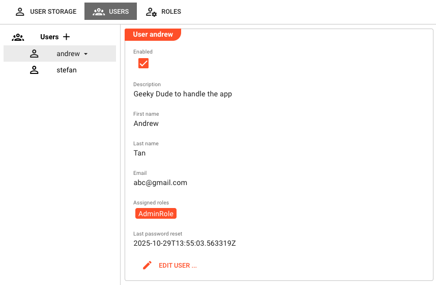
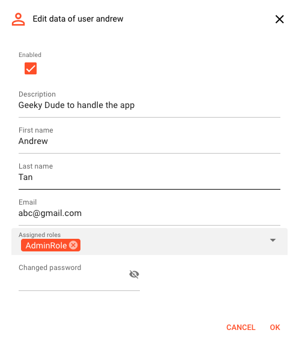
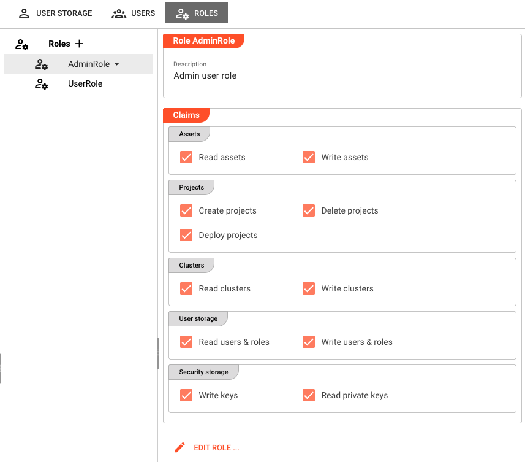

# Users & Roles

> User accounts and role-based access control for the layline.io Configuration Server.

## Concept

layline.io manages Users and Roles in two separate places:

1. **Configuration Server** — controls who can log in to layline.io and what they can do at the configuration level (manage assets, projects, clusters, and other users).
2. **Reactive Engine Cluster** — controls what users can do at the runtime level (manage deployments, workflows, streams, and so on).

These two sets of users and roles are **completely independent**. A user account on the Configuration Server is not the same as a user account on a Reactive Engine Cluster, and the privileges available in each area are different.

This page covers the **Configuration Server** side. For cluster-level user management, see [**Operations > User Storage**](/docs/operations/cluster/operations-user-storage).

The Users & Roles section lives under **Settings > User Storage**. It is accessible to the `admin` account and to users who hold the *Read users & roles* privilege on the Configuration Server.

## The Three Tabs

### User Storage

The **User Storage** tab is the default view when you open Settings. It shows:

**Controller**

| Field | Description |
|-------|-------------|
| State | Current operational state of the User Storage controller (e.g. `running`). |
| Running on cluster node | Address of the cluster node hosting the User Storage controller. |
| Number of users | Total count of user accounts on this Configuration Server. |
| Number of roles | Total count of role definitions on this Configuration Server. |

**Current User**

Displays the profile of the currently logged-in user:

| Field | Description |
|-------|-------------|
| Username | The login name. Not editable here. |
| Description | Optional free-text description. |
| First name | Given name. |
| Last name | Family name. |
| Email | Email address. |
| Assigned roles | The roles currently assigned to this user, shown as chips. |
| Last password reset | Timestamp of the most recent password change. |

A **Claims** panel on the right shows all privileges the current user holds, grouped by category, as read-only checkboxes. These represent the effective permissions inherited from their assigned roles.

Clicking **Edit user…** opens a dialog where the current user can update their description, name, email, and password. Username and role assignments cannot be changed here — only admins can change role assignments.

### Users

The **Users** tab is visible only to the `admin` account and users with the *Read users & roles* privilege.

The tab shows a left/right split:

- **Left panel** — a list of all user accounts (excluding `admin`). Click a user to select them. The **+** button at the top creates a new user (requires *Write users & roles* privilege).
- **Right panel** — details of the selected user.

**User detail fields:**

| Field | Description |
|-------|-------------|
| Enabled | Whether the account is active. Disabled accounts cannot log in. |
| Description | Optional free-text description. |
| First name | Given name. |
| Last name | Family name. |
| Email | Email address. |
| Assigned roles | Roles granted to this user, shown as chips. |
| Last password reset | Timestamp of the most recent password change. |

A **Claims** section below the details panel shows all effective privileges the selected user holds, read-only.

Clicking the **▾** dropdown next to a selected user in the list reveals a **Remove** option to delete the account.

Clicking **Edit user…** opens the user edit dialog with the following fields:

| Field | Description |
|-------|-------------|
| Enabled | Enable or disable the account. |
| Description | Free-text description. |
| First name | Given name. |
| Last name | Family name. |
| Email | Email address. |
| Assigned roles | Multi-select of available roles. Changes take effect on next login. |
| Password / Retype password | Leave blank to keep the current password. Enter a new value to change it. |

When **creating** a new user, the **Username** field also appears (read-only on edit).

:::warning
The username cannot be changed after a user is created.
:::

### Roles

The **Roles** tab is visible only to the `admin` account and users with the *Read users & roles* privilege.

The tab shows a left/right split:

- **Left panel** — a list of all defined roles. Click a role to select it. The **+** button creates a new role (requires *Write users & roles* privilege).
- **Right panel** — details of the selected role.

**Role detail fields:**

| Field | Description |
|-------|-------------|
| Description | Free-text description of the role's purpose. |
| Privileges | All available privileges, grouped by category, shown as read-only checkboxes. Filled checkboxes indicate privileges this role grants. |

Clicking **Edit role…** opens the role edit dialog with:

| Field | Description |
|-------|-------------|
| Name of the role | Unique identifier for this role. Read-only when editing an existing role. |
| Description | Free-text description. |
| Privileges | Checkboxes organized by category. Check to grant a privilege to this role. |

Clicking the **▾** dropdown next to a selected role reveals a **Remove** option to delete the role. Removing a role does not delete users assigned to it, but those users lose the privileges the role provided.

:::warning
The role name cannot be changed after a role is created.
:::

## Privileges Reference

The following privileges are available for roles on the **Configuration Server**. These are distinct from the privileges available on a Reactive Engine Cluster (managed under [Operations > User Storage](/docs/operations/cluster/operations-user-storage)).

| Category | Privilege | Description |
|----------|-----------|-------------|
| Assets | Read assets | View asset definitions in projects. |
| Assets | Write assets | Create and modify asset definitions. |
| Projects | Create projects | Create new projects. |
| Projects | Delete projects | Delete existing projects. |
| Projects | Deploy projects | Deploy projects to a cluster. |
| Clusters | Read clusters | View cluster configurations. |
| Clusters | Write clusters | Create and modify cluster configurations. |
| User storage | Read users & roles | View user accounts and role definitions (enables the Users and Roles tabs). |
| User storage | Write users & roles | Create, edit, and delete users and roles. |
| Security storage | Write keys | Create and manage cryptographic keys. |
| Security storage | Read private keys | Read private key material. |

:::note
The `admin` account always has full access regardless of role assignments. All other accounts derive their permissions exclusively from their assigned roles.
:::

## Behavior

- The **Users** and **Roles** tabs are hidden entirely if the current user does not hold the *Read users & roles* privilege.
- The **+** (create) button on the Users and Roles tabs is disabled if the current user does not hold the *Write users & roles* privilege.
- The **Edit user…** button in the Users tab is also disabled without *Write users & roles*.
- Changes to role assignments take effect on the user's **next login** — currently active sessions are not affected.

## See Also

- [**Operations > User Storage**](/docs/operations/cluster/operations-user-storage) — User and role management for a Reactive Engine Cluster (separate from Configuration Server users)
- [**Security Storage**](/docs/settings) — Managing cryptographic keys and certificates
- [**Settings**](/docs/settings) — Overview of all Settings sections
