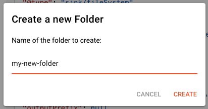
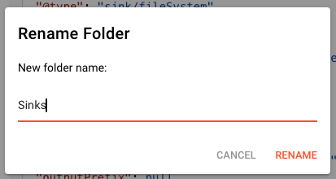
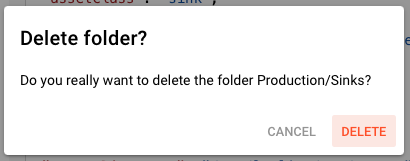

# Folders

> Folders provide organization within Categories, helping you group related Elements together.

## What Are Folders?

Folders exist within Categories and provide a way to organize Elements. While Categories separate Assets from Messages, Folders let you group related Elements by project, environment, or any criteria that makes sense for your team.

<!-- SCREENSHOT: Folder list view showing folders within a Category -->

## Folder Hierarchy

The Shelf supports a simple hierarchy:

```
Category
└── Folder
    └── Elements (Assets or Messages)
```

Folders exist only at one level — there are no sub-folders. If you need additional organization, use naming conventions (e.g., "Production-DB", "Staging-DB") or create more Folders.

## Creating a Folder

To create a new Folder:

1. Navigate to the desired Category (Assets or Messages)
2. Click the **New Folder** button (or right-click in the folder area)
3. Enter a **Name** for the Folder
4. Optionally add a **Description**
5. Click **Create**



### Folder Naming Guidelines

- Use clear, descriptive names
- Include environment indicators when relevant (Prod, Staging, Dev)
- Use consistent naming patterns
- Avoid special characters that might cause issues

Common naming patterns:

| Pattern | Example | Use Case |
|---------|---------|----------|
| By Environment | `Production`, `Staging`, `Development` | Environment-specific Assets |
| By Project | `Invoice-Processing`, `Data-Sync` | Project-specific Elements |
| By Type | `Databases`, `APIs`, `File-Systems` | Type grouping within Category |
| By Team | `Finance`, `Engineering` | Team ownership |

## Managing Folders

### Renaming a Folder

1. Navigate to the Category containing the Folder
2. Right-click the Folder or click the menu
3. Select **Rename**
4. Enter the new name
5. Confirm to save



### Deleting a Folder

:::caution
Deleting a Folder removes all Elements within it. This action cannot be undone.
:::

1. Right-click the Folder
2. Select **Delete**
3. Confirm the deletion

All Elements in the Folder are permanently removed from the Shelf.



## Folder Organization Patterns

### Environment-Based

Organize by deployment environment:

```
Assets/
├── Production/
│   ├── Primary-DB-Connection
│   ├── API-Gateway-Config
│   └── Backup-Service
├── Staging/
│   ├── Staging-DB-Connection
│   └── Test-API-Config
└── Development/
    ├── Local-DB-Connection
    └── Mock-Service-Config
```

### Project-Based

Organize by project or application:

```
Messages/
├── Invoice-System/
│   ├── Invoice-Format
│   ├── Customer-Schema
│   └── Payment-Types
├── HR-Platform/
│   ├── Employee-Schema
│   └── Timesheet-Format
└── Common/
    ├── Error-Response-Format
    └── Standard-Headers
```

### Type-Based

Organize by specific type:

```
Assets/
├── Databases/
│   ├── PostgreSQL-Prod
│   ├── MySQL-Analytics
│   └── MongoDB-Logs
├── Cloud-Storage/
│   ├── S3-Primary-Config
│   ├── GCS-Archive-Config
│   └── Azure-Backup-Config
└── Message-Queues/
    ├── Kafka-Main-Config
    └── RabbitMQ-Events-Config
```

## Folder Contents

Each Folder displays:

- **Name** — The Folder name
- **Description** — Optional explanatory text
- **Element Count** — Number of Elements in the Folder
- **Last Modified** — Date of most recent change

<!-- SCREENSHOT: Folder details showing metadata -->

## Best Practices

1. **Be consistent** — Use the same organizational pattern across Categories
2. **Keep it flat** — Aim for 3-10 Folders per Category; create more Categories if needed (though only Assets and Messages are available)
3. **Use clear names** — Folder names should indicate contents at a glance
4. **Add descriptions** — Help teammates understand Folder purpose
5. **Review regularly** — Merge empty or duplicate Folders
6. **Don't over-organize** — Too many Folders make browsing harder

## See Also

- [**Categories**](./categories) — Top-level Shelf organization
- [**Elements**](./elements) — The Assets and Messages stored in Folders
- [**Shelf Overview**](./) — Introduction to the Shelf concept
