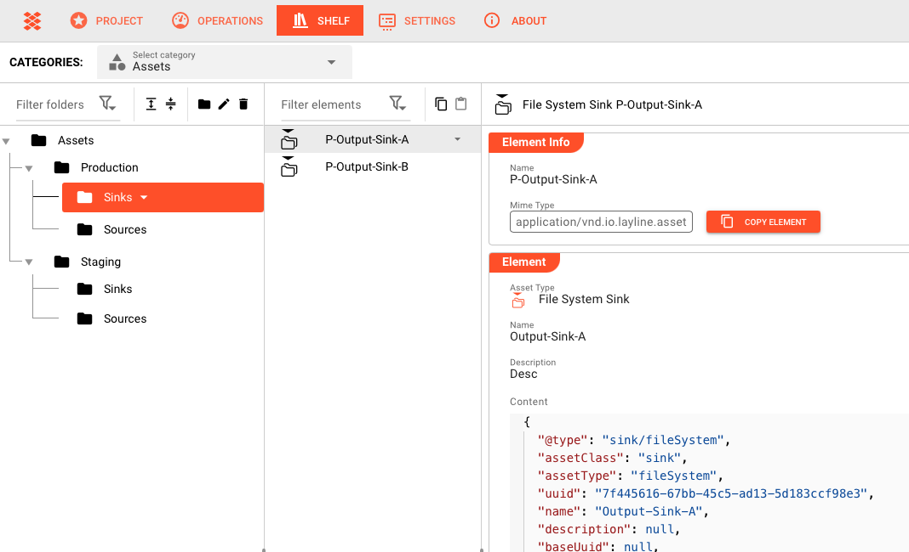

# Navigation

> Efficiently find and use Shelf content with browsing and search.

## Shelf Interface Layout

The Shelf interface is organized into three main areas:

1. **Categories Sidebar** (left) — Lists the top-level Categories (Assets, Messages)
2. **Folders List** (middle) — Shows Folders within the selected Category
3. **Elements Grid** (right) — Displays Elements within the selected Folder or Category

## Browsing

### Category Navigation

The left sidebar lists the two Categories:

- **Assets** — Reusable Asset configurations
- **Messages** — Data format definitions

Click a Category to see its Folders in the middle panel.

<!-- SCREENSHOT: Category sidebar with Assets selected -->

### Folder Navigation

The middle panel shows Folders within the selected Category:

- Click a Folder to see its Elements
- Click **All** to see Elements across all Folders in the Category
- Folder names and Element counts help you find what you need

<!-- SCREENSHOT: Folder list showing multiple folders with Element counts -->

### Element Grid

The right panel displays Elements:

- **Grid view** — Visual cards with name and type
- **List view** — Compact rows (if available)
- Click an Element to open its detail view

<!-- SCREENSHOT: Element grid view showing multiple Asset cards -->

## Search

### Using Search

The search bar at the top of the Shelf helps you find Elements:

1. Click the search bar
2. Type your search term
3. Results filter as you type
4. Click a result to open its detail view

<!-- SCREENSHOT: Search bar with active search showing results -->

### Search Scope

Search looks for matches in:

- Element names
- Element descriptions (if indexed)
- Asset type names

## Finding Elements

### Browse by Category

If you know what type of Element you need:

1. Click **Assets** or **Messages** in the sidebar
2. Browse the Folders
3. Click a Folder to see its Elements

### Search by Name

If you know the name:

1. Use the search bar
2. Type part of the Element name
3. Click the result

### Recent Elements

The Shelf may track recently viewed Elements:

1. Look for a **Recent** section (if available)
2. See last viewed Elements
3. Click to jump directly to Element details

<!-- SCREENSHOT: Recent Elements view -->

## Using Elements

### Copying from the Shelf

Once you find an Element:

1. Click the Element to view its details
2. Click **Copy** (or use the copy action)
3. Navigate to where you want to use it (Project Asset Editor, Engine State, etc.)
4. **Paste** the Element

<!-- SCREENSHOT: Element detail view with Copy button -->

### Checking Dependencies

Before copying an Asset:

1. Open the Element detail view
2. Review the configuration
3. Note any referenced Assets or Formats
4. Ensure those dependencies exist in your target Project

## Detail View

### Opening Elements

Open an Element detail view by:

- Clicking an Element card in the grid
- Clicking an Element name in search results

### Detail View Contents

The detail view shows:

| Section | Content |
|---------|---------|
| **Overview** | Name, type, description, metadata |
| **Configuration** | Full settings of the Asset or Message |

<!-- SCREENSHOT: Element detail view showing overview -->

### Closing Detail View

Close the detail view by:

- Clicking the **X** button
- Clicking outside the panel
- Selecting a different Element

## Best Practices

1. **Use Categories** — Start with Assets or Messages based on what you need
2. **Search first** — Faster than browsing for specific named Elements
3. **Organize Folders well** — Good Folder names make browsing efficient
4. **Check before copying** — Review the configuration and dependencies
5. **Use recent** — Often faster for Elements you use frequently

## See Also

- [**Categories**](./categories) — Top-level organization
- [**Folders**](./folders) — Secondary organization
- [**Elements**](./elements) — Working with Shelf Elements
- [**Shelf Overview**](./) — Introduction to the Shelf concept
