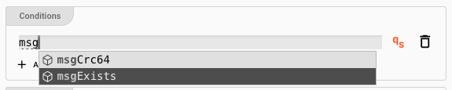

In you picked either option `At least one` or `All` from the previous section, then you can now enter conditions for when the rule should evaluate to true.
Click `ADD CONDITION` to add your first condition.

You can then start entering conditions in [Quickscript](/docs/language-reference/quickscript) language:

The system will support you in this quest. When you start typing, you will be presented with options for autocomplete.

Let's fill in some conditions:

**Explanation:**
This rule will now evaluate to true, if

1. The message includes a data dictionary structure `Record.Boat`, and
2. The length of the boat is greater than 10.

Depending on what you selected in the [Conditions Options](#conditions-that-must-be-fulfilled), either all or at least one of these conditions must be met.

Enter as many conditions as necessary.

