[//]: # (Description of Service Test Facility)

## Service Testing

layline.io provides a test facility for testing your Services before you deploy them.
In this way, you save time and effort by testing your Services without having to deploy and activate a whole Project with Workflows. 

Once you have configured your Service(s), you can test them:
Within your Asset Configuration tab (1), switch to the `Test` tab (2) to test your Service.

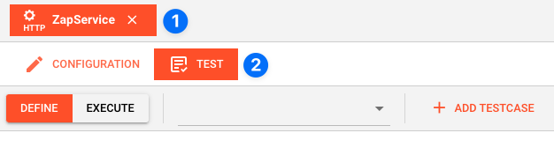

### Test Facility Toolbar

The toolbar provides the following options:

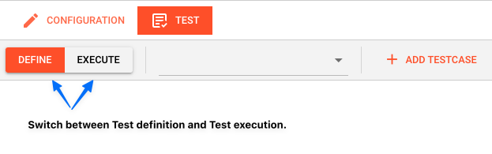

The Testing tab provides two major views:

1. **Testcase configuration**: This is where you define the testcases to be executed.
2. **Testcase execution**: This is where you can execute the testcases and see the results.

You switch between these two views by clicking on the leftmost icon in the toolbar (1).

Let's start with the **Testcase configuration** view.

### Testcase Configuration

The concept of the Testing is to define a set of Testcases which can be executed in a batch or individually.
For this purpose, you can define multiple Testcases and configure them individually.
I.e. each Testcase groups a number of indidivual tests which can be executed individually or in a batch.

#### Adding a Testcase

Click `Add Testcase` in the toolbar to add a new testcase:

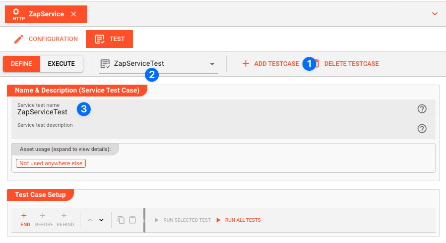

A new Testcase is added. 
It is automatically named `New<Service Asset Name>Test` (3) and added to the list of Testcases (2).

* **`Service test name`** (3): You can change the name of the Testcase here.
* **`Service test description`** (4): You can add a description to the Testcase here.

#### Test Case Setup

##### Basics

In this section you define the individual tests to be executed for this Testcase.

To start, click `# END` in the toolbar:

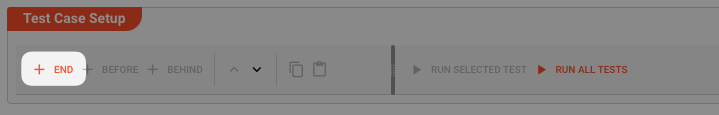

A new test is added to the list of tests (1), and the test is opened for configuration (2).

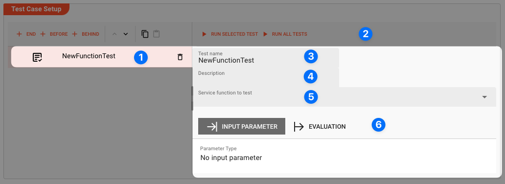

Next we fill in the details:

* **`Test name`** (3): You can change the name of the Test here.
* **`Test description`** (4): You can add a description to the Test here.
* **`Service function to test`** (5): Select the Service function to test here.
  
  This list contains all Service functions which are defined in the Service Asset.
  Pick the one you want to test.

  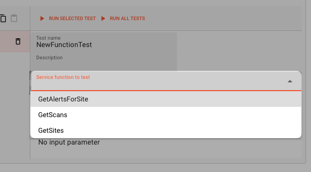

   Once a Service function is selected, the system will automatically create a skeleton to fill in the respective parameters for the selected Service function.

   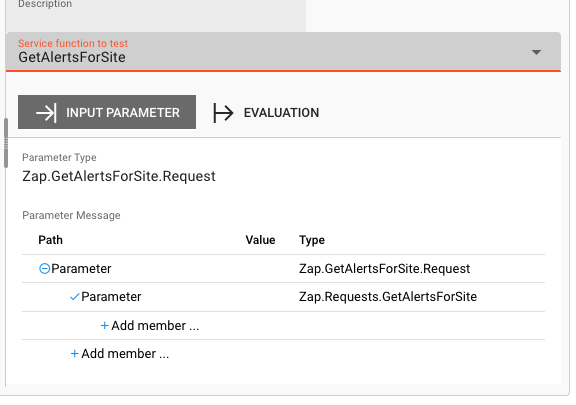

##### Service Function Input Parameters

* **`Service Function Input Parameters`** (6): Fill in the respective parameters for the selected Service function.

  In our example we have a function `GetAlertsForSite` which takes two parameters `baseurl` and `riskId`.
  If we click on `Add member` in the skeleton table the system will allow you to select the respective parameter from the list of available parameters:

  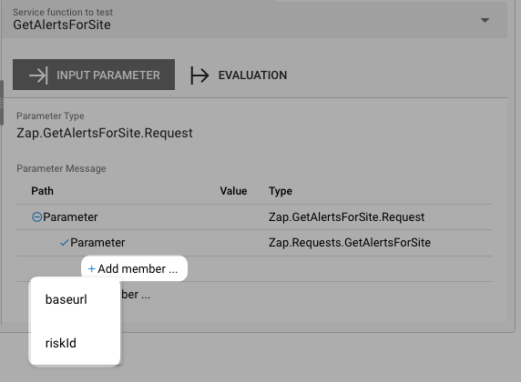

  Once you have selected the parameter, the system will automatically add the respective parameter name.
  You then add the respective value for the parameter:

  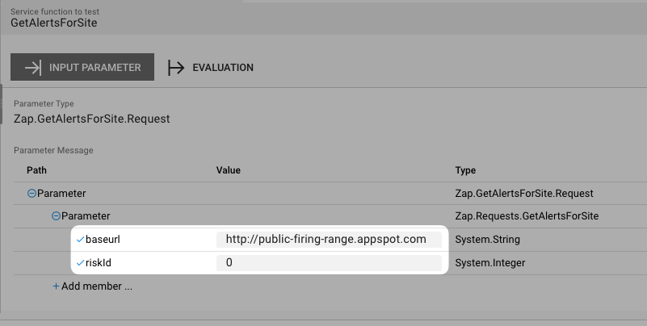

##### Service Function Evaluation Parameters

To automatically evaluate the result, you can add a script which analyzes the results.
  
### Testcase Execution

Once you have configured your Testcases, you can execute them.

There are two ways on how to trigger execution:
* **Option 1**: Select `Run selected test` in the toolbar (1) to execute the currently selected Testcase.

  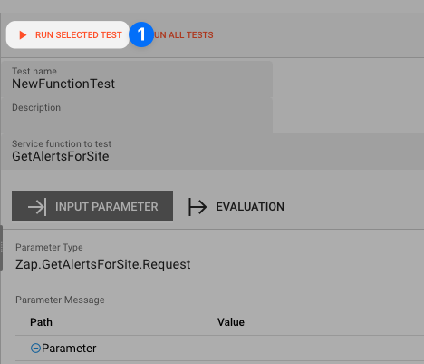

  Executing a test this way will switch the tab to the **Testcase execution** view, execute the test and show the results. 

* **Option 2**: Switch to the **Testcase execution** view by clicking on the leftmost icon in the toolbar (1) select the test to execute, and then hit the `play` button next to the test.

  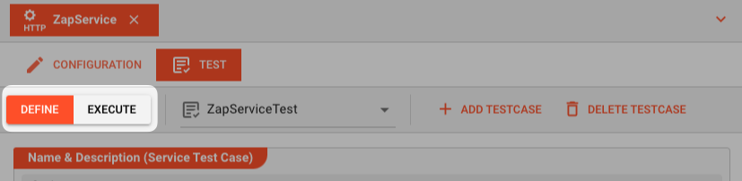

Each option will take us to the Testcase execution view:

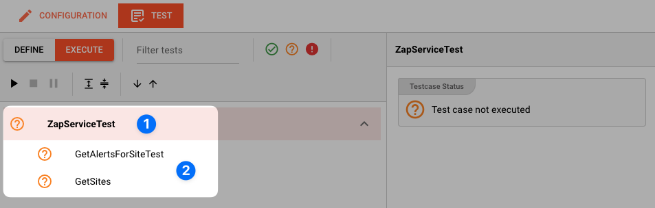

In this view you can find the `Testcase` (1) and the `Tests` (2) we have created. 
If we had created additional tests for this Testcase, they would be listed here as well.

Question marks indicate that the test has not yet been executed.

We can now either execute all tests, or run them individually:

* **`Run all Tests`** (1): Click this button to execute all tests.
* **`Run Testcase`** (2): Click this button to a Testcase with all its underlying individual tests.

  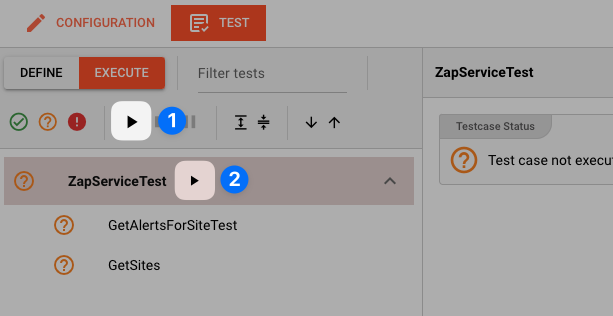

* **`Run individual Test`** (3): Click this button next to a test to execute this individual test.

  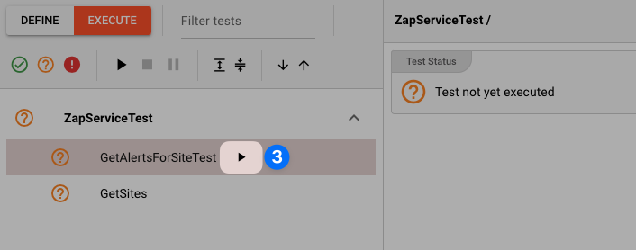

Once a test has been executed, the question mark will be replaced by a green check mark or a red cross depending on whether the test was successful or not.

The right hand-panel will show the results of the test execution respectively:

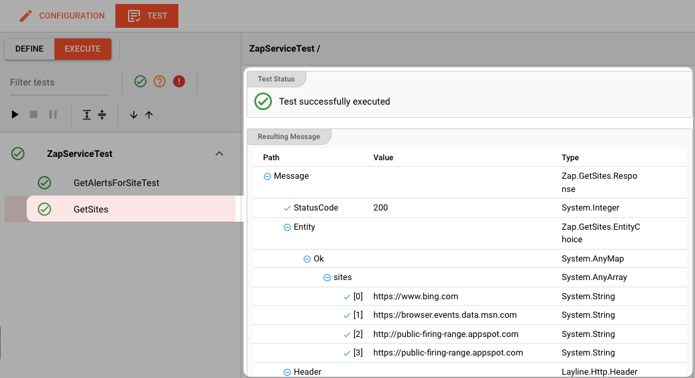

In case of errors, the system will show the error message for further investigation.
