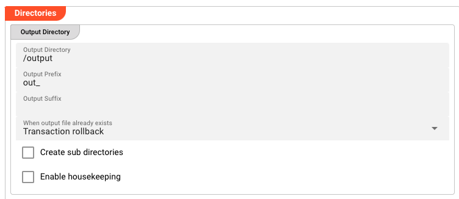
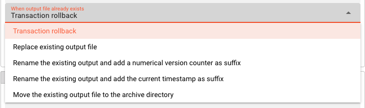
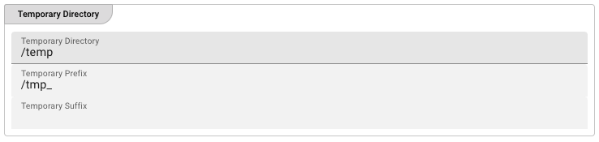
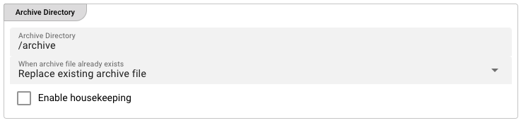
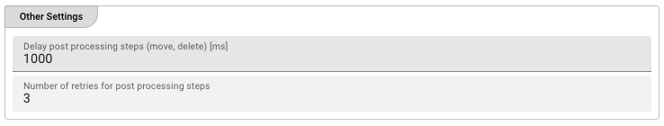

[//]: # (Precede this section with the header "### Directories")

This sink allows the definition of three different directories, all relative to the connection mount point:

1. **Output Directory** : The directory to write output files to.
2. **Temporary Directory** : The directory to which files are temporarily written during processing.
3. **Archive Directory** : Files which caused problems during processing can be moved to the Archive Directory for further analysis.

#### Output Directory

* **`Output Directory`** : The directory to write output files to.
  The path must be relative to the connection mount point and accessible to the Reactive Engine.
  You can use $\{...\} macros to expand variables defined in [environment variables](../resources/asset-resource-environment).

* **`Output prefix`** : Prefix to add to the filename of the processed file when writing to the output directory.
  E.g. `out_` will add the `out_`-prefix to the beginning of the filename when written to the output directory.

* **`Output suffix`** : Suffix to add to the filename of the processed file after move to the output directory.
  E.g. `_out` will add the `_out`-suffix to the end of the filename when written to the output directory.

* **'When output file already exists'** : Define what should happen if the output file already exists.

  

  * **`Transaction rollback`** : Rollback the complete transaction. No output file will be written.
  
  * **`Replace existing output file`** : A file by the same name will be replaced in the output directory.
  
  * **`Rename existing output and add a numerical version counter`** : An file by the same name in the output directory will be renamed by adding a number to the end of the filename.
  
  * **`Rename the existing output and add the current timestamp as suffix`** : An file by the same name in the output directory will be renamed by adding the current timestamp as suffix to the filename, e.g. `out_products.csv.2025-04-03_14-25-22`.
  
  * **`Move the existing output file to the archive directory`** : An file by the same name in the output directory will be moved to the archive directory. The settings for this will appear when this option is selected.

* **`Create subdirectories`** : If the output directory is a subdirectory to the mount point of the connection, the subdirectory will be created if it does not exist.

* **`Enable housekeeping`** : If enabled, the output directory will be checked for files older than the specified number of days and deleted.

    

    * **`Delete after`** : The age in units of days, hours or minutes to check for and delete old files.

    * **`Units`** : The units of days, hours or minutes to check for and delete old files.
  
    * **`Execute housekeeping at`** : A cron expression to define when the housekeeping should be executed. Click on the calendar icon to open the cron expression editor.

#### Temporary Directory

* **`Temporary Directory`** : Before the final output file is written to the output directory defined above, the system will create a temporary file.
  When processing is complete, this temporary file will become the final file and moved to the output directory as defined in [Output Directory](#output-directory).
  When finally written to output, the prefix and suffix defined above will be observed.
  The temporary prefix and suffix defined below will only be relevant for the duration of writing the temporary file.
  All temporary files should be automatically removed upon successful processing.
  Should you encounter a temporary file in a temporary directory even though there is no current processing ongoing, then this is likely a residue from a crash which needs to be further investigated.

  The path must be relative to the connection mount point and accessible to the Reactive Engine.
  You can use $\{...\} macros to expand variables defined in [environment variables](../resources/asset-resource-environment).

* **`Temporary prefix`** : Prefix to add to the filename of the temporary file when writing to the temporary directory.
  E.g. `temp_` will add the `temp_`-prefix to the beginning of the filename when written to the output directory.

* **`Temporary suffix`** : Suffix to add to the filename of the temporary file after move to the temporary directory.
  E.g. `_temp` will add the `_temp`-suffix to the end of the filename when written to the output directory.

#### Archive Directory

This configuration is only relevant if the **`Move the existing output file to the archive directory`** option is selected in the [Output Directory](#output-directory) configuration.

* **`Archive Directory`** : The directory to which files are moved in case of a problem during processing.
  The path must be relative to the connection mount point and accessible to the Reactive Engine.
  You can use $\{...\} macros to expand variables defined in [environment variables](../resources/asset-resource-environment).

* **`When archive file already exists`** : Define what should happen if the archive file already exists.

    * **`Replace existing archive file`** : A file by the same name will be replaced in the archive directory.

    * **`Rename existing archive and add a numerical version counter as suffix`** : An file by the same name in the archive directory will be renamed by adding a number to the end of the filename.

    * **`Rename the existing archive and add the current timestamp as suffix`** : An file by the same name in the archive directory will be renamed by adding the current timestamp as suffix to the filename, e.g. `out_products.csv.2025-04-03_14-25-22`.

#### Other Settings

* **`Delay post processing steps`** : You can ask the system to slow (delay) post-processing steps such as move and delete.
  Enter a number in milliseconds which should be observed before for example moving a temporary file to the output directory and then deleting it from the temporary directory.
  This can prove to be helpful in environments where connections are a little "sensitive", and allow the system to "settle".
  It's something we learned from working with such systems.

* **`Number of retries`** : In addition defining a post-processing delay time, we can define a number of retries, should an operation fail.
  Again, this is to allow for more robustness in operation as connections can prove to be sensitive at times and ridden with timeouts, etc.
  An optimally connected and tuned sink should not require these settings, but this is often not the case.

