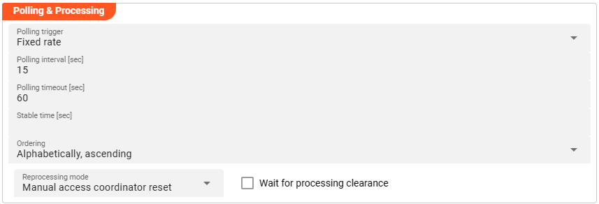
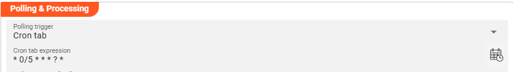
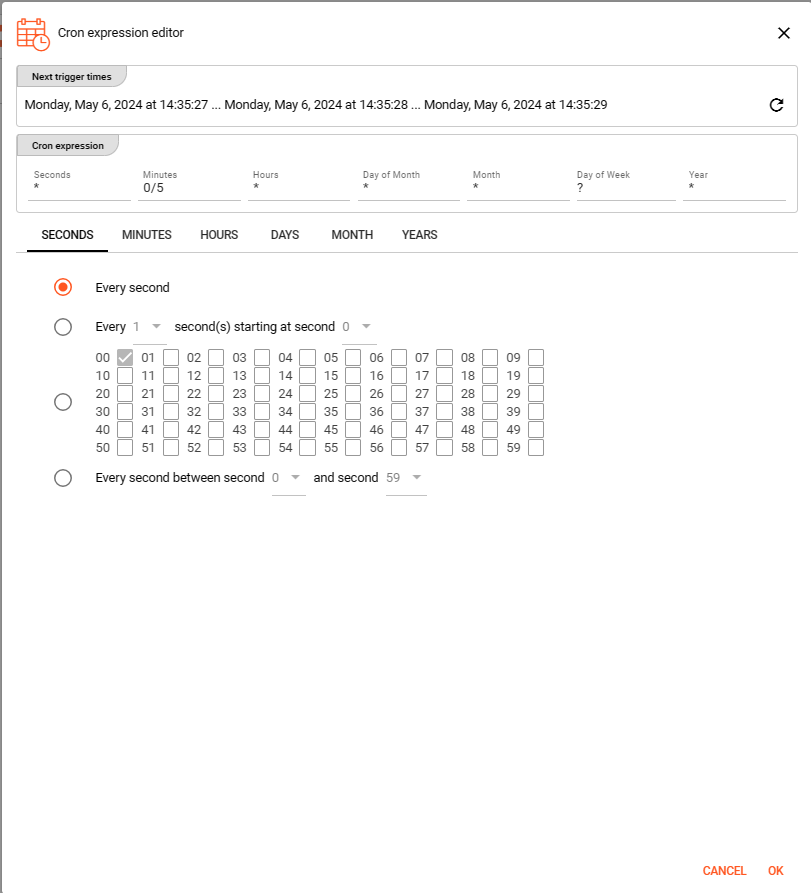
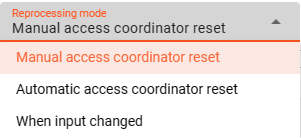

This source does not reflect a stream, but an object-based storage source which does not signal the existence of new objects to observers. We therefore need to define how often we want to look up (poll) the source for new objects to process.

You can choose between `Fixed rate polling` and `Cron tab style` polling.

#### Fixed rate

Use `Fixed rate` if you want to poll at constant and frequent intervals.

**Polling interval [sec]** — The interval in seconds at which the configured source is queried for new objects.

#### Cron tab

Use `Cron tab` if you want to poll at specific scheduled times. The `Cron tab expression` follows the cron tab style convention. Learn more about crontab syntax at the [Quartz Scheduler documentation](https://www.quartz-scheduler.org/documentation/quartz-2.3.0/tutorials/crontrigger.html).

You can also use the built-in **Cron expression editor** — click the calendar symbol on the right hand side:

Configure your expression using the editor. The **Next trigger times** display at the top helps you visualize when the next triggers will fire. Press **OK** to store the values.

#### Polling timeout

**Polling timeout [sec]** — The time in seconds to wait before a polling request is considered failed. Set this high enough to account for endpoint responsiveness under normal operation.

#### Stable time

**Stable time [sec]** — The number of seconds that file statistics must remain unchanged before the file is considered stable for processing. Configuring this value enables stability checks before processing.

#### Ordering

When listing objects from the source for processing, you can define the order in which they are processed:

- Alphabetically, ascending
- Alphabetically, descending
- Last modified, ascending
- Last modified, descending

#### Reprocessing mode

The `Reprocessing mode` setting controls how layline.io's [Access Coordinator](../../07-operations/02-cluster/01-cluster-overview.md#access-coordinator) handles previously processed sources that are re-ingested.

- **Manual access coordinator reset** — Any source element processed and stored in layline.io's history requires a manual reset in the **Sources Coordinator** before reprocessing occurs (default mode).
- **Automatic access coordinator reset** — Allows automatic reprocessing of already processed and re-ingested sources as soon as the respective input source has been moved into the configured done or error directory.
- **When input changed** — Behaves like `Manual access coordinator reset`, but also checks whether the source has potentially changed — i.e., the name is identical but the content differs. If the content has changed, reprocessing starts without manual intervention.

#### Wait for processing clearance

When **Wait for processing clearance** is activated, new input sources remain unprocessed in the input directory until either:

- A manual clearance is given through Operations, or
- A JavaScript processor executes `AccessCoordinator.giveClearance(source, stream, timeout?)`
