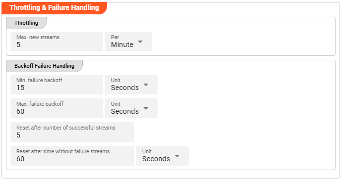

[//]: # (Precede this section with the header "### Throttling & Failure Handling")

#### Throttling

The following parameters allow to control the maximum number of new stream creations per given time period.

* **`Max. new streams`**: Maximum number of streams this source is supposed to open resp. process within a given time period.
* **`Per`**: Time interval unit for the provided `Max. new streams` number from the drop-down list.

:::info
Configuration values for this parameter are dependent on the use case scenario.
Assuming your data arrives in low frequency cycles these values are negligible.
In scenarios with many objects arriving in short time frames it is recommended to have a closer look on adapting the default values.
:::

#### Backoff Failure Handling

These parameters define the backoff timing intervals in case of failures. Based on the following parameters, the system will 
step by step throttle down the processing cycle based on the time boundaries of min. failure backoff and max. failure backoff. 
It thereby allows to slow down the processing during failure scenarios.

* **`Min. failure backoff`**: The minimum backoff time before the next source item processing (in case of failure scenario). 
* **`Unit`**: The Unit that goes with the given minimum time value.
* **`Max. failure backoff`**: The maximum backoff time before the next source item processing (in case of failure scenario).
* **`Unit`**: The Unit that goes with the given maximum time value.

Based on these values the next processing will be delayed: 
starting with the min. failure backoff time interval the waiting time will be increased step by step up to the max. failure backoff.   

* **`Reset after number of successful streams`**: The backoff failure throttling reset.
* **`Reset after time without failure streams`**: Time-based reset for backoff failure throttling .
* **`Unit`**: The Unit that goes with the given time-based backoff failure throttling reset.

Whatever comes first will reset the failure scenario throttling after the system is back to successful stream processing. 

