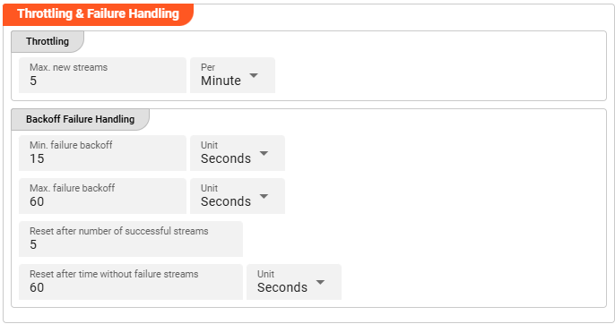

#### Throttling

These parameters control the maximum number of new stream creations per given time period.

**Max. new streams** — Maximum number of streams this source is allowed to open or process within the given time period.

**Per** — Time interval unit for the `Max. new streams` value.

:::info
Configuration values for this parameter depend on the use case scenario.
Assuming your data arrives in low frequency cycles, these values are negligible.
In scenarios with many objects arriving in short time frames, it is recommended to review and adapt the default values accordingly.
:::

#### Backoff Failure Handling

These parameters define backoff timing intervals in case of failures. The system will progressively throttle down the processing cycle based on the configured minimum and maximum failure backoff boundaries.

**Min. failure backoff** — The minimum backoff time before retrying after a failure.

**Unit** — Time unit for the minimum backoff value.

**Max. failure backoff** — The maximum backoff time before retrying after a failure.

**Unit** — Time unit for the maximum backoff value.

Based on these values, the next processing attempt is delayed: starting at the minimum failure backoff interval, the wait time increases step by step up to the maximum failure backoff.

**Reset after number of successful streams** — Resets the failure backoff throttling after this many successful stream processing attempts.

**Reset after time without failure streams** — Resets the failure backoff throttling after this amount of time passes without any failures.

**Unit** — Time unit for the time-based backoff reset.

Whatever comes first — the stream count or the time threshold — resets the failure throttling after the system returns to successful stream processing.
