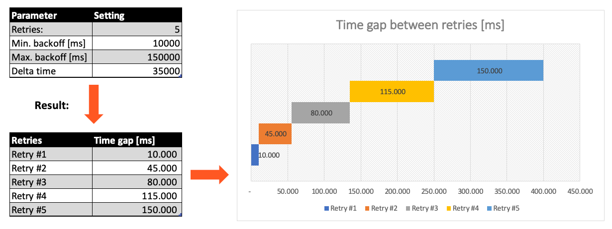

Processing within a Flow Processor like this one can fail for various reasons.
In this section you can define how the system should behave in case of such problems.

#### Failure Types

Four types of failures are observable:

| # | Failure observables / Reaction                                                                                   | Ignore | Retry Event/Message | Retry Stream | Rollback Stream | 
|:--|------------------------------------------------------------------------------------------------------------------|:------:|:-------------------:|:------------:|:---------------:|
| 1 | **`Stream start failure handling`**<br/>A problem occurred in this Asset when starting a new stream.             |   ✔    |          ✔          |      ✔       |        ✔        |
| 2 | **`Stream end failure handling`**<br/>A problem occurred in this Asset when ending a stream.                     |   ✔    |          ✔          |      ✔       |        ✔        |
| 3 | **`Message failure handling`**<br/>A problem occurred when handling a specific message in this Asset.            |   ✔    |          ✔          |      ✔       |        ✔        |
| 4 | **`Rollback commit failure handling`**<br/>A problem occurred during system issued rollback or commit procedure. |   ✔    |          ✔          |      ✔       |        ✔        |

#### Failure Type Reactions

Each of these failure types can be responded to with four different reactions:

##### `Ignore`

Don't do anything.

##### `Rollback Stream`

Rollback the complete stream. In the case of batch/file processing for example the complete file (which represents the stream) will be rolled back and put into error.

:::caution
A rollback signal will be issued to all participating Workflow Processors.
Each Processor needs to ensure itself how to deal with a rollback.
A Javascript Flow Processor, for example, which directly interacts with a database will have to react to a [rollback signal](/docs/language-reference/javascript/API/classes/JavaScriptProcessor#onrollback):

```js title="Rollback example in Javascript"
   function onRollback() {
    if (connection) {
        try {
            connection.rollbackTransaction();
            connection.closeConnection();
        } catch (err) {
        } finally {
            connection = null;
        }
    }
}
```

:::

##### `Retry Stream`

Don't simply give up. Try to process the whole stream again.
This option allows you to define how often and in what intervals the retries should be performed.


**Stream Retry Settings**

* **`Max. Retries`**: The number of retries which should be performed. For example "_5_".
* **`Min. Backoff [ms]`**: Wait at least x milliseconds between each retry. For example "_12000_" (12 seconds).
* **`Max. Backoff [ms]`**: Wait at max x milliseconds between each retry. For example "_150000_" (150 seconds).

Based on these parameters, the system will try to balance the defined number of retries within the time boundaries of min. backoff and max. backoff.  
Taken the example numbers from above, the five retries would happen in this timespan:



##### `Retry Event/Message`

Pick this reaction if you want to retry processing the current message.
As is the case with the [Retry Stream](#retry-stream) reaction you can define how often and in what intervals the retries should be performed.


The settings are the same as with the [Retry Stream](#retry-stream) reaction. So please refer to this.
There is one additional setting, however, which is `When final retry failed`.

You here have the option to decide what to do if the message cannot be processed, even after the final retry:

* **`Ignore`**: Don't do anything.
* **`Rollback Stream`**: Fallback to rolling back the whole stream.
* **`Retry Stream`**: Retry the whole stream once again.
  If you pick this option, then you can again define all relevant [Retry Stream](#retry-stream) parameters.

  

:::caution Only works for specific Source Types within a Workflow
A Workflow has one Input Processor which is responsible for reading data from a Source.
Sources are for example files, databases, or message queues.

The settings for `Retry Event/Message` and `Retry Stream` only work for specific Source Types which a Workflow uses.
These are:
- [Email](/docs/assets/sources/asset-source-email)
- [File](/docs/assets/sources/asset-source-file)
- [FTP](/docs/assets/sources/asset-source-ftp)
- [S3](/docs/assets/sources/asset-source-s3)
- [SMB](/docs/assets/sources/asset-source-smb)
- [WebDav](/docs/assets/sources/asset-source-webdav)


:::

