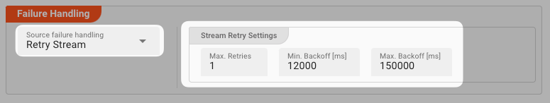

Processing within an Input Processor like this one can fail.
In this section, you can define how the system should behave in case of problems.

#### Failure Types

One type of failure is observable:

| # | Failure observables / Reaction                                                         | Ignore | Retry Event/Message | Retry Stream | Rollback Stream | 
|:--|----------------------------------------------------------------------------------------|:------:|:-------------------:|:------------:|:---------------:|
| 1 | **`Source failure handling`**<br/>A problem occurred with the Source of the messsages. |        |                     |      ✔       |        ✔        |

#### Failure Type Reactions

The following two failure reactions are supported.

##### `Rollback Stream`

Rollback the complete stream.
In the case of batch/file processing for example the complete file (which represents the stream) will be rolled back and put into error.
This is the default behavior.

:::warning
A rollback signal will be issued to all participating Workflow Processors.
Each Processor needs to ensure itself how to deal with a rollback.
A Javascript Flow Processor, for example, which directly interacts with a database will have to react to a [rollback signal](/docs/language-reference/javascript/API/classes/JavaScriptProcessor#onrollback):

```js title="Rollback example in Javascript"
   function onRollback() {
    if (connection) {
        try {
            connection.rollbackTransaction();
            connection.closeConnection();
        } catch (err) {
        } finally {
            connection = null;
        }
    }
}
```

:::

##### `Retry Stream`

Don't simply give up. Try to process the whole stream again.
This option allows you to define how often and in what intervals the retries should be performed.



**Stream Retry Settings**

* **`Max. Retries`**: The number of retries which should be performed. For example "_5_".
* **`Min. Backoff [ms]`**: Wait at least x milliseconds between each retry. For example "_12000_" (12 seconds).
* **`Max. Backoff [ms]`**: Wait at max x milliseconds between each retry. For example "_150000_" (150 seconds).

Based on these parameters, the system will try to balance the defined number of retries within the time boundaries of min. backoff and max. backoff.  
Taken the example numbers from above, the five retries would happen in this timespan:


