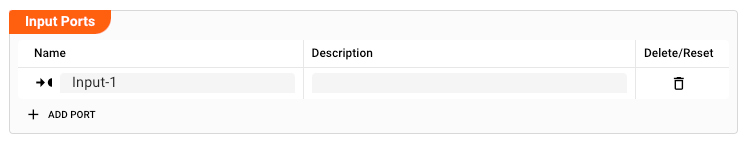

This Processor can have one or more input ports from which it receives data to process.
**It must have at least one input port, however.**

A port can have a name and description. Names must exist and be unique within the Processor.

You can add an input port by clicking on `Add Port`, or remove an input port by clicking on `Delete`.
You cannot delete the port if it is the last one within the processor.
