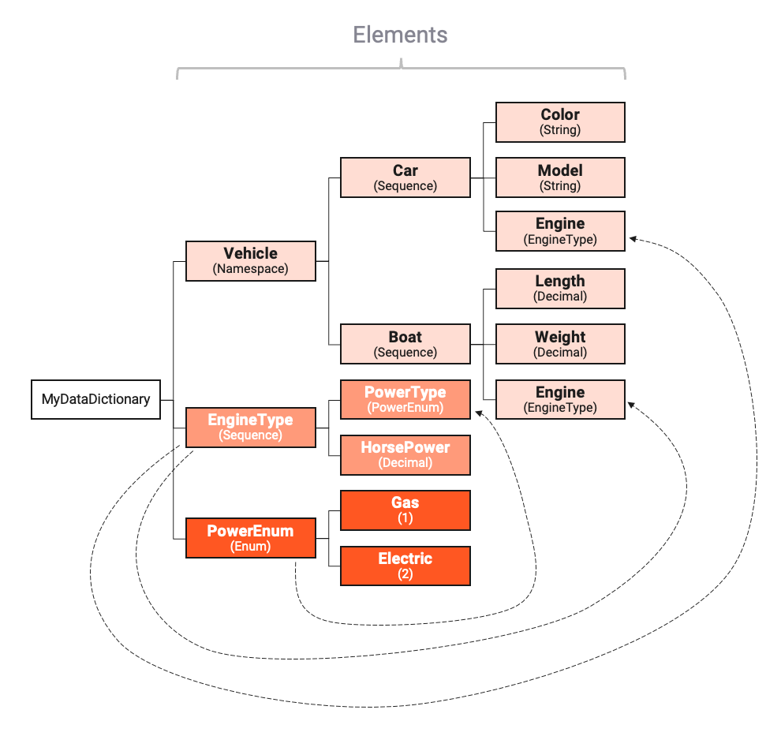
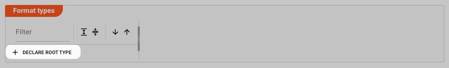
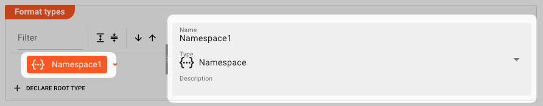

## Data Dictionary Card {#data-dictionary-card}

### Purpose

The **Data Dictionary Card** is a split-pane component used throughout the layline.io SPA wherever a Data Dictionary needs to be configured — for example in the [Data Dictionary Format Asset](../../03-assets/01-workflow-assets/formats/03-asset-format-data-dictionary.md), Service configurations, and Resource configurations.

Its purpose is to let you define custom data structures that describe the shape of your data — similar to how you might define a table schema in a database or a class in an object-oriented language. These structures can then be used to map incoming data from external sources (such as a JDBC query result or a DynamoDB item) into layline.io's internal message format, and vice versa when writing data back out.

Each data structure you define in the Data Dictionary is called an **entity**. Entities can represent simple values, but more often they represent complex composite types — such as a `Customer` record containing a name, an address, and a list of orders. Entities can reference other entities, allowing you to build reusable type hierarchies.

### UI Layout

The component is divided into two panes connected by a draggable vertical divider:

| Pane | Content |
|------|---------|
| **Left** | A hierarchical tree of all declared entities, with a toolbar above for navigation and manipulation |
| **Right** | The detail panel for the currently selected entity — shows all configuration fields for that entity type |

The **Format types** dropdown at the top of the component lets you switch between different format views. Selecting a format collapses the tree to show only the entities relevant to that format.

### Toolbar Controls

The toolbar above the tree pane provides controls for navigating and manipulating the entity tree:

- **Filter** — type a value in the text field to filter tree nodes by name. The tree immediately shows only nodes whose names match the entered text. Click the **×** button to clear the filter and restore the full tree.
- **Expand All** — expands all collapsed tree nodes so the full hierarchy is visible at once.
- **Collapse All** — collapses all tree nodes back to the top level.
- **Sort Ascending** — sorts all tree nodes alphabetically from A to Z.
- **Sort Descending** — sorts all tree nodes alphabetically from Z to A.
- **Copy Entity** — copies the selected entity (including all its children) to the clipboard. The copied entity can then be pasted elsewhere in the tree. This button is disabled when no entity is selected.
- **Paste Entity** — pastes the clipboard entity as a child of the selected target node. This button is disabled when the clipboard is empty or no target node is selected in the tree.

### Tree View

The left pane displays all declared entities in a hierarchical tree. Each node is identified by an icon indicating its type and by its name.

**Node states:**
- **Normal** — a user-defined entity that can be selected, edited, and deleted.
- **Inherited** — shown in a distinct inherited style. These entities originate from a parent format or resource and are read-only unless you override them.
- **Deleted / Overridden** — shown with a disabled overlay. These entities have been removed or replaced at this level.

Click any node to select it. The right pane immediately loads the detail panel for that entity, where you can view and edit its configuration.

### Declaring a Root Type

To start building a new data structure, click **Declare Root Type** in the toolbar (visible only when no node is selected in the tree). A new root-level node is created with the default type `Namespace`.

Click the new node to select it. The right pane shows the entity detail panel where you can configure its properties — for example, setting the name and switching the type from `Namespace` to a more specific type such as `Sequence`.

### Entity Type Reference

Each entity type has its own set of configuration fields in the detail panel. The available fields are described below.

#### Namespace

A **Namespace** is a container that groups related types together. It does not hold data itself — it exists purely as an organizational layer. When you assign a name to a namespace, any other namespace with the same name in the same Project is automatically merged with it, combining both sets of child entities under a single namespace node.

| Field | Description |
|-------|-------------|
| **`Name`** | A unique identifier for the namespace within this Data Dictionary. |
| **`Type`** | The entity type. Select `Namespace` to create a namespace. |
| **`Description`** | Optional free-text description of the namespace. |

#### Sequence

A **Sequence** is an ordered list of named, typed members — similar to a `struct` in C or a row in a database table. Each member has a name and a data type. You access members by name.

| Field | Description |
|-------|-------------|
| **`Name`** | A unique identifier for the sequence within its parent. |
| **`Type`** | The entity type. Select `Sequence`. |
| **`Description`** | Optional free-text description of the sequence. |
| **`Members`** | The list of fields that make up this sequence. Click **Add Child** in the right pane to add a new member. Each member requires a `Name`, a `Type`, and an `Optional` flag. |
| **`Extendable Sequence`** | When checked, the sequence can be dynamically extended at runtime to accommodate fields that are present in incoming data but not explicitly declared in the schema. |

#### Enumeration

An **Enumeration** (or Enum) is a fixed set of named integer constants. Enums are useful for representing categorical values with a limited number of options — for example, a status field that can only be `Pending`, `Active`, or `Closed`.

| Field | Description |
|-------|-------------|
| **`Name`** | A unique identifier for the enumeration within its parent. |
| **`Type`** | The entity type. Select `Enumeration`. |
| **`Description`** | Optional free-text description of the enumeration. |
| **`Elements`** | The list of named constants. Each element has a name and an integer value. Elements must have unique integer values. |

#### Choice

A **Choice** type represents a value that can be exactly one of several possible member types — similar to a tagged union or a discriminated union in programming languages. Only one member can be active at a time.

| Field | Description |
|-------|-------------|
| **`Name`** | A unique identifier for the choice type within its parent. |
| **`Type`** | The entity type. Select `Choice`. |
| **`Description`** | Optional free-text description of the choice. |
| **`Exclusive`** | When checked (default), only one member may be active at a time. |

#### Array

An **Array** represents a sequence of elements of a single contained type. All elements in the array share the same data type.

| Field | Description |
|-------|-------------|
| **`Name`** | A unique identifier for the array within its parent. |
| **`Type`** | The entity type. Select `Array`. |
| **`Description`** | Optional free-text description of the array. |
| **`Contained Type`** | The data type of each element in the array. This can be a system type (such as `String` or `Integer`) or any entity type defined in this Data Dictionary or another format. |

### Entity Operations

Each entity node exposes a context menu via the **▼** arrow on the right side of the node. The available operations depend on the current selection:

| Operation | When Available | Description |
|-----------|----------------|-------------|
| **Add Root Type** | No node selected | Adds a new top-level entity to the dictionary at the root level of the tree. |
| **Add Sibling** | A node is selected | Adds a new entity at the same hierarchical level as the selected node, as a child of the selected node's parent. |
| **Add Child** | A node is selected | Adds a new entity nested under the selected node. The new node becomes a child of the selected node. |
| **Delete** | A node is selected | Removes the entity and all its children from the dictionary. This operation cannot be undone. |
| **Reset to Parent** | An overridden inherited entity is selected | Resets the entity back to its original definition inherited from the parent format, discarding any overrides made at this level. |

### Adding Members to a Sequence

Once you have created a Sequence node in the tree, you can populate it with members that represent the fields of the data structure.

Select the Sequence node in the tree. In the right pane, click **Add Child** to declare a new field. Each member requires the following:

- **`Name`** — a unique identifier for the field within the sequence (e.g., `CustomerName`, `OrderId`). This is how you reference the field in scripts and mappings.
- **`Type`** — the data type of the field. You can choose from system types (such as `String`, `Integer`, `Boolean`, `Binary`) or any entity type defined in this Data Dictionary or another format.
- **`Optional`** — check this box if the field is not required to be present in the data. When a field is optional, it may be absent from incoming data without causing a parsing error.

You can add any number of members to a sequence. Members are ordered — the order you define them is the order in which they appear in the data structure.

### Inheritance and Overriding

When a Data Dictionary is used within a Service or Resource that itself inherits from another Service or Resource, some entity types may already be defined in the parent. These inherited entities appear in the tree in a distinct inherited style.

Inherited entities are read-only — you cannot modify their structure directly. However, you can **override** an inherited entity by selecting it and changing its values in the right pane. Once you override an entity, it is no longer inherited and becomes a local definition.

To revert an overridden entity back to its inherited definition, select it and choose **Reset to Parent** from the context menu.

### Namespaces and Type Merging

A key feature of the Data Dictionary is automatic namespace merging: if two namespaces in the same Project share the same name, their child entities are combined into a single namespace node in the tree. This means you do not need to coordinate namespace names across different parts of your Project — as long as the names match, layline.io treats them as one.

This behavior is particularly useful when the same logical namespace (for example, a set of shared customer types) needs to be referenced from multiple Services or Formats. Instead of duplicating the type definitions, you define the namespace once and reference it from wherever it is needed.
