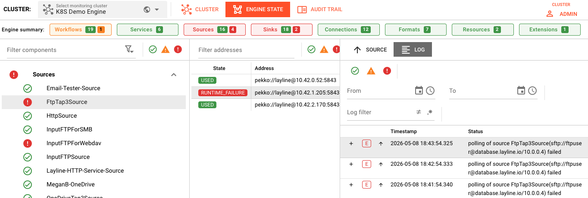
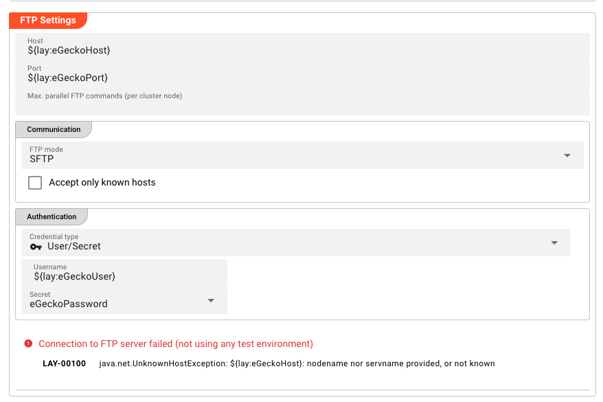

# Connection Issues

> I can't connect to my source/sink or keep getting connection errors.


*Operations → Engine State → Sources showing FtpTap3Source in RUNTIME_FAILURE state with connection polling errors*

## Common Symptoms

- **Connection timeout** errors in logs
- **Authentication failed** messages
- Source/Sink shows **ERROR** state in Engine State
- **Intermittent failures** — works sometimes, fails other times

---

## Diagnosis Checklist

### 1. Verify Connection Asset Configuration


*Connection Asset configuration panel for SFTP showing FTP Settings (host, port), Communication settings, and Authentication with environment variable placeholders*

Most external systems require a Connection Asset. Connections are tested automatically when possible. Check:

| Field | What to Verify |
|-------|----------------|
| **Host/Endpoint** | Correct server address or URL |
| **Port** | Right port for the service |
| **Protocol** | Correct protocol (TCP, SSL, HTTPS, etc.) |
| **Credentials** | Valid username/password or API keys |

### 2. Test Network Connectivity

From the cluster node, verify basic connectivity:

```bash
# Test if host is reachable
ping your-server.example.com

# Test if port is open
telnet your-server.example.com 5432

# For HTTP/HTTPS
curl -v https://your-api.example.com/health
```

### 3. Check Authentication

<!-- SCREENSHOT: Settings > Secret Storage showing credentials being referenced -->

1. Go to **Settings → Secret Storage**
2. Verify the secret referenced by your Connection Asset exists
3. Check that credentials haven't expired
4. Confirm the secret value is correct (no extra spaces)

### 4. Verify Service Status

Ensure the external service is actually running (examples):

| Service Type | Check Command |
|--------------|---------------|
| **Database** | Try to connect using database's cli tools or check DB admin console |
| **Kafka** | `kafka-topics.sh --list --bootstrap-server host:9092` |
| **HTTP API** | `curl -I https://api.example.com` |
| **SFTP** | `sftp user@host` |

---

## Common Error Scenarios

### "Connection Timeout"

**Causes:**
- Network firewall blocking the port
- Wrong host or port
- Service not running
- Network routing issues

**Resolution:**
1. Verify the server is running
2. Check firewall rules between cluster nodes and the service
3. Confirm the port is correct
4. Test from the cluster node, not your local machine

### "Authentication Failed"

**Causes:**
- Wrong username or password
- Expired credentials
- Account locked
- Missing required authentication parameters

**Resolution:**
1. Verify credentials in Secret Storage
2. Test credentials with a standalone client
3. Check for account lockouts or password expiration policies
4. Ensure all required auth fields are filled

### "SSL/TLS Certificate Error"

**Causes:**
- Self-signed certificate not trusted
- Certificate expired
- Hostname mismatch
- Missing CA certificate

**Resolution:**
1. For self-signed certs: Add to trust store or use "Trust All" option (dev only)
2. Verify certificate validity dates
3. Check the certificate's CN/SAN matches the hostname
4. Import required CA certificates

### "Permission Denied"

**Causes:**
- User lacks required permissions
- Resource doesn't exist (database, bucket, queue)
- ACL/restrictions on the resource

**Resolution:**
1. Verify the user has necessary permissions
2. Confirm the resource (table, topic, bucket) exists
3. Check resource-level ACLs
4. Review service-specific permission requirements

---

## Connection-Specific Tips

### Database Connections

<!-- SCREENSHOT: Connection Asset for database showing JDBC URL format and connection pool settings -->

**Checklist:**
- JDBC URL format is correct
- Database exists and is accessible
- User has SELECT/INSERT/UPDATE permissions as needed
- Connection pool settings aren't exceeded
- Database server allows connections from cluster nodes

### Kafka Connections

**Checklist:**
- Bootstrap servers list is correct
- Topic exists
- Consumer group ID is unique (or intentionally shared)
- Authentication (SASL/SSL) is properly configured
- Topic has messages (not empty)

### HTTP/REST Connections

**Checklist:**
- Base URL is correct (including any path prefix)
- Authentication headers or tokens are valid
- Rate limiting isn't blocking requests
- SSL certificates are valid
- API version is supported

### File-based Connections (FTP, SFTP, SMB)

**Checklist:**
- Directory path exists on the server
- User has read/write permissions
- Passive vs active mode (for FTP)
- Binary vs ASCII mode for file transfers
- Filename patterns match actual files

---

## Testing Connections

Connections are tested automatically by the system when possible. Monitor the connection status in **Operations → Engine State → Sources** or **Sinks**.

### Create a Minimal Test

Create a simple workflow to isolate the issue:

```
[Timer Source] → [JavaScript: stream.logInfo("Test")] → [Your Sink]
```

If this works, the issue is in your main workflow logic.
If this fails, the issue is the connection itself.

---

## See Also

- [**Sources**](../assets/workflow-assets/sources/index.md) — Source Asset documentation
- [**Sinks**](../assets/workflow-assets/sinks/index.mdx) — Sink Asset documentation
- [**Connections**](../assets/workflow-assets/connections/index.md) — Connection Asset types
- [**Secret Storage**](../settings/secret-storage.md) — Managing credentials
