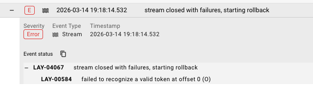
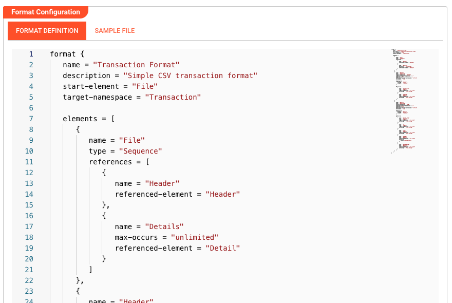
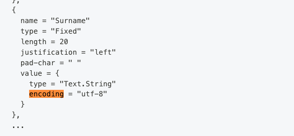

# Format and Parsing Issues

> Messages are failing to parse or validation errors are occurring.


*Audit Trail showing parse error with LAY-04067 "stream closed with failures, starting rollback" and LAY-00584 token recognition error*

## Common Symptoms

- **"Parse error"** in processor logs
- **Schema validation failures**
- **Incorrect data** appearing in message payload
- **Character encoding issues** (garbled text)
- **Binary data** treated as text or vice versa

---

## Diagnosis Checklist

### 1. Verify Format Definition


*Format Asset configuration showing Format Definition with schema structure (Transaction Format with File, Header, and Detail elements)*

The Format Asset defines how raw bytes are converted to structured messages. Check:

| Aspect | What to Verify |
|--------|----------------|
| **Format Type** | JSON, CSV, XML, Binary, Fixed-width, etc. |
| **Schema** | Field names, types, and structure |
| **Encoding** | UTF-8, ASCII, ISO-8859-1, etc. |
| **Delimiters** | For CSV/flat files — correct delimiter character |

### 2. Compare Sample Data to Format

Get a sample of the actual data and compare:

```
Expected (Format Definition):    Actual (Received Data):
{
  "id": number,                  {
  "name": string,                  "id": "ABC123",
  "timestamp": datetime           "name": "Test",
}                                   "created": "2024-01-15"
                                 }
```

**Look for:**
- Field name mismatches
- Type mismatches (string vs number)
- Missing fields
- Extra fields

### 3. Check Encoding


*Format grammar configuration showing encoding set to "utf-8" within a field value definition*

Encoding is configured within the format grammar (not via dropdown). Check the `encoding` property in your format definition:

**Common encoding issues:**

| Symptom | Likely Cause | Fix |
|---------|--------------|-----|
| Garbled special characters | Wrong encoding | Set encoding to match source (e.g., `encoding = "utf-8"` or `encoding = "iso-8859-1"`) |
| "�" replacement characters | Invalid UTF-8 bytes | Check source encoding |
| Accented chars wrong | Latin-1 vs UTF-8 mismatch | Match source encoding in format grammar |

### 4. Validate Binary vs Text Mode

<!-- SCREENSHOT: Source Asset configuration showing binary/text mode toggle or setting -->

- **Text formats** (JSON, CSV, XML): Use text mode
- **Binary formats** (Avro, Protobuf, images): Use binary mode
- **Mixed content**: May need custom handling

---

## Common Error Scenarios

### "Unexpected token at position X"

**Cause:** The data doesn't match the expected format.

**Examples:**
- JSON parser receiving CSV data
- Missing closing brace/bracket
- Trailing commas in JSON
- Unescaped quotes in CSV

**Resolution:**
1. Capture a sample of the failing message
2. Validate it with an online parser (JSONLint, etc.)
3. Update the Format Asset or fix the data source

### "Required field missing"

**Cause:** Schema validation expects a field that isn't present.

**Resolution:**
1. Check if the field is truly required
2. Update Format Asset to make field optional
3. Or fix the data source to include the field

### "Type mismatch: expected Number, got String"

**Cause:** Data type doesn't match schema definition.

**Examples:**
- `"123"` (string) vs `123` (number)
- `"true"` (string) vs `true` (boolean)
- Date format doesn't match expected pattern

**Resolution:**
1. Update Format Asset to accept the actual type
2. Add a Flow Processor to convert types
3. Or fix the data source

### CSV-Specific Issues

| Issue | Cause | Solution |
|-------|-------|----------|
| Columns misaligned | Wrong delimiter | Set correct delimiter (comma, tab, semicolon) |
| Headers not recognized | Header row missing | Disable "Has header row" or add header |
| Quoted fields break | Quote character mismatch | Set correct quote char (`"` or `'`) |
| Newlines in fields | Multiline fields | Enable multiline support |

---

## Debugging Format Issues

### Log Raw Messages

Add a processor to see what's being received:

```javascript
// At the start of your workflow
stream.logInfo('Raw message received:');
stream.logInfo('Content type: ' + message.typeName);
stream.logInfo('Payload: ' + message.toJson());
```

### Test with a Simple Format

Temporarily replace your complex Format with a simple **Text** or **JSON** format:

1. Create a new Format Asset (JSON, no schema)
2. Update your Input Processor to use it
3. Deploy and test
4. If it works, the issue is in your original Format definition

### Use Message View

<!-- SCREENSHOT: Operations > Audit Trail > Message detail view showing parsed payload structure -->

In Operations → Audit Trail:

1. Find a processed message
2. Click to view details
3. Compare "Raw" vs "Parsed" views
4. Identify where the mismatch occurs

---

## Format Best Practices

### Start Simple

Begin with a permissive format and add constraints:

1. Start: JSON with no schema (accepts any valid JSON)
2. Add: Required field validation
3. Add: Type checking
4. Add: Range/format constraints

### Handle Variations

If data format varies:

```javascript
// JavaScript Processor to normalize
if (typeof message.data.id === 'string') {
    message.data.id = parseInt(message.data.id);
}
```

### Document Expected Format

Keep a sample message in your Project documentation:

```json
{
  "example": "of expected message format",
  "id": 12345,
  "timestamp": "2024-01-15T10:30:00Z"
}
```

---

## See Also

- [**Formats**](../assets/workflow-assets/formats/index.md) — All format types and configuration
- [**Audit Trail**](../operations/audit-trail/index.md) — Inspecting processed messages
- [**JavaScript Processor**](../assets/workflow-assets/processors-flow/asset-flow-javascript.md) — Message transformation
- [**Python Processor**](../assets/workflow-assets/processors-flow/asset-flow-python.md) — Message transformation
