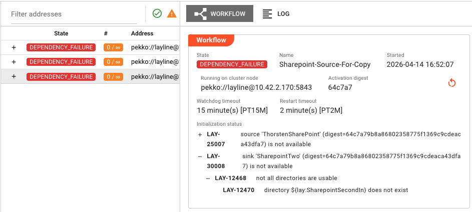

import SchemaMarkup from '@site/src/components/SchemaMarkup';

<SchemaMarkup schema={{
  "@context": "https://schema.org",
  "@type": "FAQPage",
  "mainEntity": [
    {
      "@type": "Question",
      "name": "My deployment won't start. What should I check?",
      "acceptedAnswer": {
        "@type": "Answer",
        "text": "Check for configuration errors in Assets or Workflows, missing Environment/Secret Assets, missing resource dependencies, or validation failures. See the Deployment Issues guide for step-by-step diagnosis."
      }
    },
    {
      "@type": "Question",
      "name": "My workflow is running but not processing data. What's wrong?",
      "acceptedAnswer": {
        "@type": "Answer",
        "text": "Common causes include: source not producing data, format parsing errors, processor exceptions, or output sink misconfiguration. Check the Workflow Processing Issues guide."
      }
    },
    {
      "@type": "Question",
      "name": "I'm getting connection errors to my source or sink. How do I fix this?",
      "acceptedAnswer": {
        "@type": "Answer",
        "text": "Verify connection parameters (host, port, credentials), check network connectivity, ensure the external system is reachable, and review authentication settings. See the Connection Issues guide."
      }
    },
    {
      "@type": "Question",
      "name": "My JavaScript or Python processor is throwing errors. How do I debug it?",
      "acceptedAnswer": {
        "@type": "Answer",
        "text": "Check for syntax errors in the code editor, review runtime exceptions in the Audit Trail, verify API usage against the Language Reference, and test with sample data. See the Processor Script Issues guide."
      }
    },
    {
      "@type": "Question",
      "name": "I'm seeing alarms in the Operations view. What do they mean?",
      "acceptedAnswer": {
        "@type": "Answer",
        "text": "Alarms indicate system issues ranging from minor warnings to critical errors. Check the Alarm Center for severity breakdown and detailed error messages. See the Alarms and Error States guide."
      }
    },
    {
      "@type": "Question",
      "name": "Messages are failing to parse. How do I fix format issues?",
      "acceptedAnswer": {
        "@type": "Answer",
        "text": "Verify the format grammar matches your data structure, check character encoding settings, ensure schema validation rules are correct, and test parsing with sample data in the Configuration Center. See the Format and Parsing Issues guide."
      }
    }
  ]
}} />

# Troubleshooting

> When something isn't working, start here. Symptom-based guides to get you back on track.

This section helps you diagnose and resolve the most common issues encountered when working with layline.io. Each guide is organized by the symptom you observe — what you see when things go wrong — with step-by-step diagnosis and resolution.

---

## Quick Diagnosis by Symptom

### 🚨 My deployment won't start

**What you see:** The deployment fails to activate, shows an error state in Operations, or produces initialization failures.

**Common causes:**
- Configuration errors in Assets or Workflows
- Missing or incorrect Environment/Secret Assets
- Missing resource dependencies
- Validation failures

**Start here:** [Deployment Issues](./deployment-issues)

---

### 📤 My workflow isn't processing data

**What you see:** The workflow is deployed and running, but no data is flowing through, or messages aren't being processed.

**Common causes:**
- Source connectivity issues
- Input Processor not triggering
- Flow Processor logic errors
- Message routing problems

**Start here:** [Workflow Processing Issues](./workflow-issues)

---

### 🔌 I can't connect to my source/sink

**What you see:** Connection errors, timeouts, or authentication failures when reading from sources or writing to sinks.

**Common causes:**
- Incorrect connection parameters
- Network/firewall issues
- Authentication credential problems
- Missing or misconfigured Connection Assets

**Start here:** [Connection Issues](./connection-issues)

---

### 📋 I'm getting format/parsing errors

**What you see:** Messages failing to parse, schema validation errors, or incorrect data structures.

**Common causes:**
- Format definition mismatches
- Schema validation failures
- Character encoding issues
- Binary vs text mode configuration

**Start here:** [Format and Parsing Issues](./format-issues)

---

### 🛡️ I'm seeing alarms or error states

**What you see:** Alarms appearing in the Alarm Center, red error states in Engine State, or failure indicators on Assets.



**Common causes:**
- Runtime exceptions in processors
- Resource exhaustion
- Dependency failures
- State synchronization issues

**Start here:** [Alarms and Error States](./alarm-issues)

---

### 🔧 My JavaScript/Python processor isn't working

**What you see:** Script errors, processor failures, or unexpected behavior in custom processor code.

**Common causes:**
- Syntax or runtime errors in code
- API method misuse
- Message handling issues
- State management problems

**Start here:** [Processor Script Issues](./script-issues)

---

## Error Code Reference

When you encounter an error message or code, use this reference to understand what it means and how to resolve it.

### Deployment Error Codes

| Status Code | Error Message | Resolution |
|-------------|---------------|------------|
| `AssetStatus` | `missing environment variable name` | Ensure all Environment Asset entries have a name defined |
| `AssetStatus` | `asset has no valid name` | Check the asset Name field is not empty and uses valid characters |
| `AssetStatus` | `asset uses a reserved name '%1'` | Rename the asset to avoid reserved keywords |
| `AssetStatus` | `cyclic inheritance relationship for asset %1` | Review and break the circular inheritance chain |
| `AssetStatus` | `duplicate environment value '%1'` | Remove duplicate entries in the Environment Asset |
| `WorkflowStatus` | `workflow has no valid name` | Ensure the workflow has a valid name defined |
| `DeploymentStorageStatus` | `unknown deployment with digest '%1'` | Verify the deployment exists and is correctly referenced |

### Runtime Error Codes

| Code | Description | Resolution |
|------|-------------|------------|
| `RUN-001` | Source Connection Failed | Verify connection parameters and network access |
| `RUN-002` | Sink Write Failed | Check sink configuration and destination availability |
| `RUN-003` | Format Parse Error | Verify format definition matches actual message structure |
| `RUN-004` | Processor Script Error | Check processor logs for JavaScript/Python runtime errors |
| `RUN-005` | Message Routing Failed | Verify route conditions and destination processors |

### Configuration Error Codes

| Code | Description | Resolution |
|------|-------------|------------|
| `CFG-001` | Invalid Asset Reference | The referenced asset does not exist or is of the wrong type |
| `CFG-002` | Missing Required Field | A mandatory configuration field is empty or not set |
| `CFG-003` | Invalid Value Format | A field value does not match the expected format or type |
| `CFG-004` | Environment Variable Not Found | The referenced environment variable is not defined |
| `CFG-005` | Secret Not Found | The referenced secret does not exist in Secret Storage |

---

## Diagnostic Tools

### In the Configuration Center

| Tool | Location | Use When |
|------|----------|----------|
| **Validation** | Project toolbar | Before deploying — catches configuration errors early |
| **Test Connection** | Connection Asset settings | Verifying connectivity to external systems |
| **Debug Mode** | Workflow editor | Troubleshooting workflow logic and message flow |
| **Log Viewer** | Operations → Engine State | Investigating runtime errors and processor logs |

### From the Command Line

```bash
# Check cluster and node status
layline cluster status

# View recent logs
layline logs --tail 100

# Validate a project locally
layline project validate --path ./my-project
```

---

## Getting More Help

If the guides here don't resolve your issue:

1. **Check the logs** — Operations → Engine State → select the failing component → Log tab
2. **Review the Audit Trail** — Operations → Audit Trail for execution history
3. **Consult the documentation** — Use the search bar at the top of this page
4. **Contact support** — Include error codes, log excerpts, and steps to reproduce

---

## See Also

- [**Operations Overview**](../operations/index.md) — Monitoring and controlling deployments
- [**Engine State**](../operations/engine-state/index.md) — Live view of running workflows
- [**Alarm Center**](../operations/cluster/alarm-center/index.md) — Managing system alarms
- [**Audit Trail**](../operations/audit-trail/index.md) — Execution history and diagnostics
