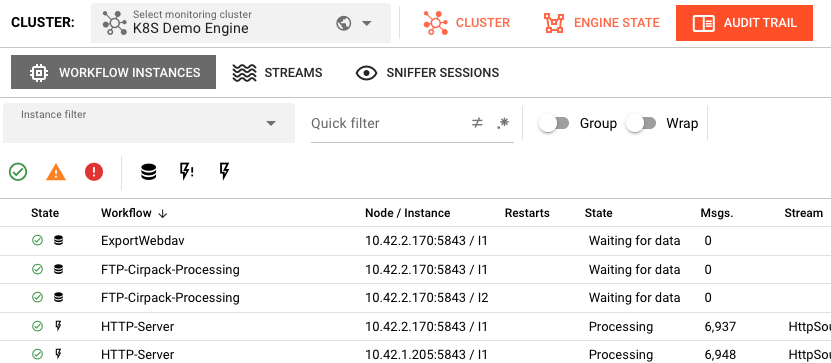
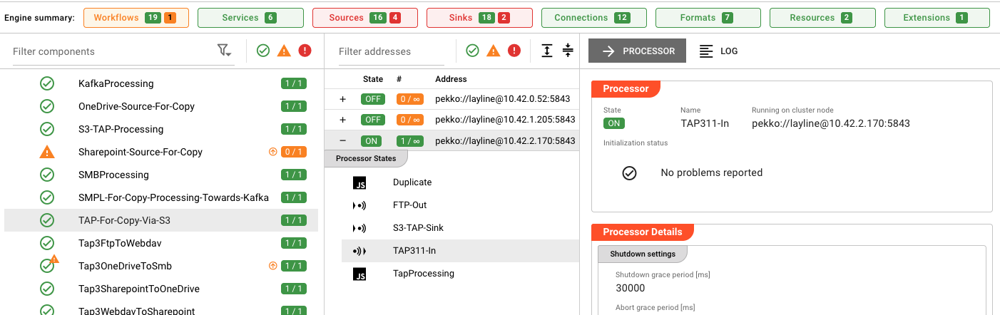
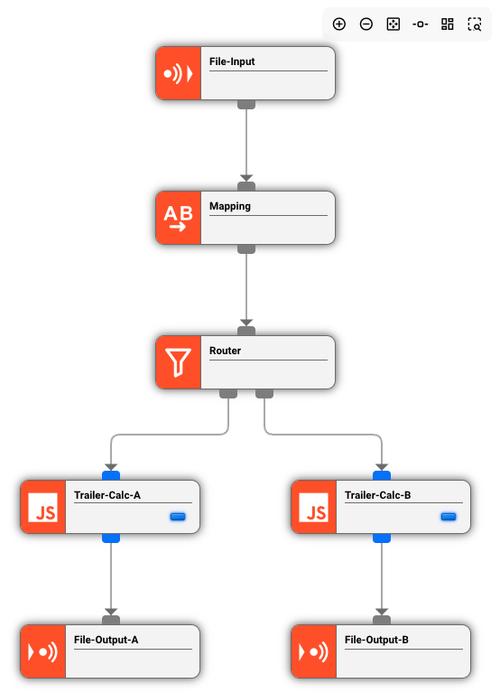
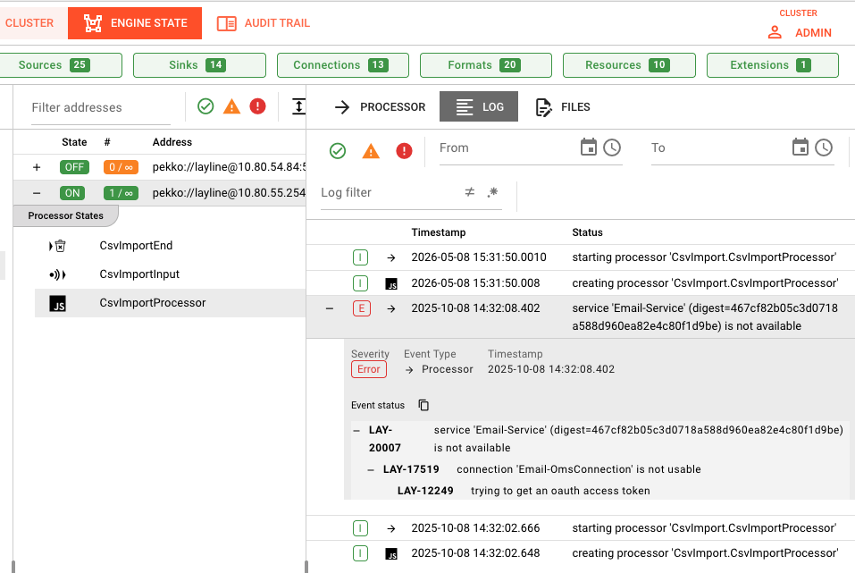
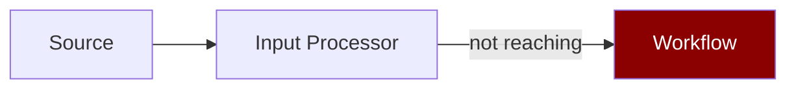
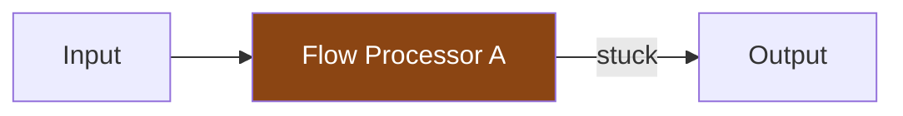
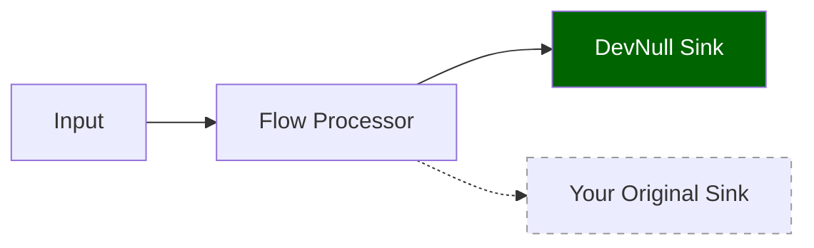
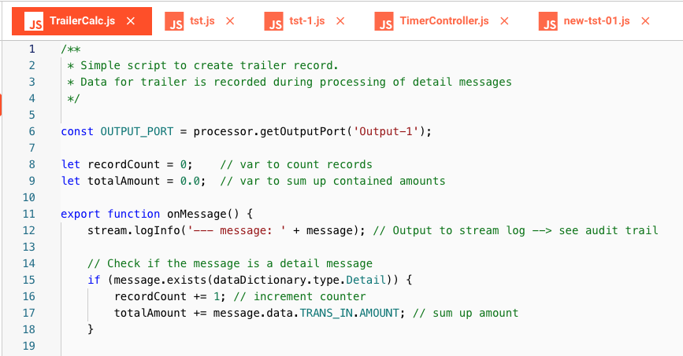

# Workflow Processing Issues

> My workflow is deployed and running, but no data is being processed.


*Operations → Engine State → Workflows showing workflow instances with their states and message counts*

## Common Symptoms

- Workflow shows as **RUNNING** but message count is **0**
- Messages **stuck** in a particular processor
- **No output** being written to sinks
- Workflow **processes some messages then stops**

---

## Diagnosis Checklist

### 1. Verify the Input Processor

Every workflow has exactly **one Input Processor** that drives execution. If it's not triggering, nothing flows.

**Check in Operations → Engine State:**


*Engine State showing expanded workflow with component processors and their initialization status*

1. Find your workflow in the list
2. Expand it to see component processors
3. Check the Input Processor state:
   - Should show **HEALTHY** or active processing indicators
   - Look for error states or warnings

**Common Input Processor issues:**

| Processor Type | Check This |
|----------------|------------|
| **File** | Is the source directory configured correctly? Are files present? |
| **Timer** | Is the schedule expression valid? Check cron syntax |
| **Kafka** | Is the consumer group active? Are there messages in the topic? |
| **HTTP** | Is the endpoint accessible? Check network/firewall |
| **Database** | Is the connection valid? Does the query return data? |

### 2. Check Message Flow


*Workflow editor displaying processor connections: File-Input → Mapping → Router → Trailer-Calc-A/B → File-Output-A/B*

In the Project view, open the Workflow:

1. **Verify connections:** Are all processors properly connected?
2. **Check routing:** Are route conditions correct? (e.g., `msg.typeName === 'order'`)
3. **Look for dead ends:** Does every path lead to an Output Processor?

### 3. Inspect Processor Logs


*Operations → Engine State → Log tab showing error messages including service availability issues (Email-Service not available)*

1. Go to **Operations → Engine State**
2. Select your workflow
3. Click the **Log** tab
4. Look for:
   - JavaScript/Python errors
   - Connection timeouts
   - Format parsing errors

### 4. Test Message Processing

For Services with callable functions:

1. Go to **Operations → Engine State → Services**
2. Select the service
3. Click the **Functions** tab
4. Test with sample input

---

## Common Error Scenarios

### Messages Not Entering the Workflow

**Symptoms:** Input Processor shows 0 messages received.

**Diagnosis:**



**Check:**
1. Source connection parameters
2. Network/firewall access
3. Authentication credentials
4. File permissions (for file-based sources)

### Messages Stuck Mid-Workflow

**Symptoms:** Messages enter but don't reach the output.

**Diagnosis:**



**Common causes:**
- JavaScript/Python runtime error in a Flow Processor
- Route condition that never matches
- Infinite loop or blocking operation
- Resource exhaustion

**Resolution:**
1. Check processor logs for errors
2. Simplify route conditions to test flow
3. Review processor code for blocking calls

### Output Processor Failures

**Symptoms:** Messages process but sink shows errors.

**Diagnosis:**


**Check:**
1. Sink connection parameters
2. Destination availability
3. Write permissions
4. Disk space (for file sinks)

---

## Debugging Techniques

### Add Logging

Add explicit logging to your processors:

```javascript
// JavaScript Processor
stream.logInfo('Processing message: ' + message.id);
stream.logInfo('Payload: ' + JSON.stringify(message.data));
```

```python
# Python Processor  
stream.logInfo(f"Processing message: {message.id}")
stream.logInfo(f"Payload: {message.data}")
```

### Use a Test Sink

Route messages to a **DevNull Sink** temporarily to isolate output issues:



If flow works to DevNull but not your sink, the issue is sink-specific.

### Check Message Content


*JavaScript Processor code editor showing TrailerCalc.js with logger statements for debugging message processing*

Log the full message structure:

```javascript
stream.logInfo('Message structure:');
stream.logInfo('  payload: ' + message.toJson());
```

---

## See Also

- [**Engine State**](../operations/engine-state/index.md) — Monitoring running workflows
- [**Audit Trail**](../operations/audit-trail/index.md) — Message execution history
- [**JavaScript Processor**](../assets/workflow-assets/processors-flow/asset-flow-javascript.md) — Writing JavaScript processors
- [**Python Processor**](../assets/workflow-assets/processors-flow/asset-flow-python.md) — Writing Python processors
