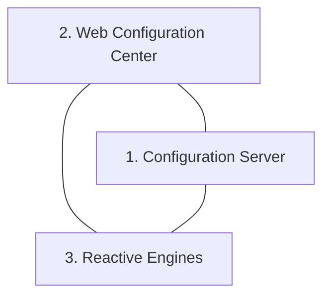

# What is layline.io?

layline.io is an opinionated event data processor. 
It wraps the power of reactive stream management in a framework which makes setup, deployment and monitoring of
large scale event data processing requirements easy and straightforward. 
layline.io provides everything you would expect from a product-base solution including
upgradability, carrier-grade resilience and scalability, among other features.

## Motivation

The world is transitioning from analog to digital at an ever faster pace.
These transformation processes lead to ever-increasing requirements towards data gathering, data analysis, and data exchange. Mainly in real-time.
While there are ways to manage, these are - in many ways - exclusive to large corporations with respective IT-muscle and budgets.

The volume of information is bound to grow at a rate of 50% each year, and may like exceeed this expectation.
To stay competitive and ahead businesses need to be able to "play" but at the same time focus on their core-competence (mostly not IT).

**Business digitization drives the real-time economy**

")

What motivated us to create layline.io were a number of reallife
problems in the area of event-processing, which were
largely unaddressed by existing solutions. We deemed these
issues so important, that we thought it is worthwhile
addressing them with a new product.
- Real-time volume to increase tenfold in the next few
years.
- Companies struggling to reap transactional value of
real-time data (do something useful with it in the first 0-
3 seconds).
- Companies‘ system architectures solidly migrating to
cloud architectures, without proper solutions to support
this in all aspects.
- Lack of actual products to support distributed real-time
event processing, instead of having to create custom
programmed solution based on development toolkits.
- Availability of awesome streaming technology like akka
and flink, which unfortunately have a steep learning
curve and do not allow for complete setup and
operations by configuration.

**Business versatility and survival, are a result digital maturity and speed**

")

## Can’t I solve these problems by other means?

Yes, but it’s tough, lengthy and will cost you dearly. In the
past years, and in the context of the Big Data evolution we
have witnessed a myriad of new concepts and truly
awesome technologies emerge. Cloud, process distribution,
asynchronous processing and many more, just to name a
few.

You have seen many cool examples and show cases, for
sure. None of them, however, were simple to create and
required lots of time and specialized staff and resources.

## Solution

layline.io wants to make this easy by enabling users to
1. create individual event workflow processing logic
2. which can be deployed across a distributed processing
   network (physically, logically and geographically)
3. which asks to configure and deploy everything without
   custom coding, and
4. supports any event-processing scenario from small to
   super extra large in a highly scalable and resilient
   environment (or simply on your laptop!)

layline.io provides a solution to integrate real-time and non-real-time event/message-exchange in a relatively easy and configurable way.
Time and cost to production are exceptionally low compared to other solutions.

Now on to the show ...

[//]: # (================================================================================)

## How it works

### The story in a nutshell

#### 1. Creation

Using the web-based _**Configuration Center**_, you create a new **_Project_**.
Within the Project you create 1..n **_Workflows_**.
Each Workflow represents one event data flow which can range from very simple to very complex. 
The Project itself merely acts as an organizational container.
The Workflow in turn is assembled out of a number of **_Processors_** which can be pre-configured in **Assets**.
Assets can be reused in Processors throughout the Project.
Assets can also inherit configurations from other Assets of the same kind. Much like class inheritance does.

Projects, together with its Workflows, Assets and other parts, are stored by the **_Configuration Server_**. The Configuration Server also provides the web-based Configuration Center.

#### 2. Deployment

Once your configuration is ready, you deploy all or a selection of the Workflows to a **_Reactive Engine_**.
A Reactive Engine runs on a **_Node_**. A Node can be either your laptop or a Docker container et al running in a remote Kubernetes cluster. 
The Reactive Engine can be part of a **_Logical Cluster_** of many Reactive Engines running in concert. We call this the "_**Reactive Cluster**_"  (In fact, a single Reactive Engine could be considered a logical Cluster already).
Once the Project is deployed, you can activate it. The Reactive Cluster then takes the designated Workflows into operation.
If you have deployed to a Reactive Engine which is part of a cluster of Reactive Engines, then the Workflows are automatically propagated to all the Reactive Engines running within the same logical Cluster.
 
 

")

#### 3. Monitoring

You can monitor execution on the Reactive Engine or Reactive Engine Cluster through the web-based Configuration Center. 
It is possible to tweak operating parameters during runtime, for example how many Workflows should be running in parallel and more.
If you need to stop parts of the processing (e.g. for maintenance) you can do so using the Operations part of Configuration Center.
You can change how the workload is balanced among Nodes and Workflows. 

#### 4. Repeat

To change any of the configuration you can simply repeat the process. layline.io allows to inject new and changed Workflows while everything is running to eliminate potential downtime.

### Moving Parts

Let's revisit: layline.io consists of three main components:

#### Configuration Server
A process which
- Serves the Web-based Configuration Center
- Handles some configuration support services
- Manages the Project storage

#### Configuration Center
A web-based UI which is used for
- the configuration of layline.io Projects
- the deployment of Projects to a Reactive Engine / Reactive Engine Cluster
- the monitoring of one or more Reactive Engine Clusters

#### Reactive Engine
A process which
- executes a Project and Project Workflows
- is spawned 1..n times on 1..n nodes.

### Supporting the DevOps process

As outlined above, configuration, deployment and monitoring are done in steps which are in line with the DevOps cycle:

")

## Features

- **Fast Data** 
High-speed and low-latency processing. Leads to smaller hardware and much less cost.

- **Elastic** 
Automatically adapts to changing workloads and balances across nodes based on intelligent algorithms. Scale up and out.

- **Connected** 
Connects to all popular and not so popular data sources and sinks. Both in real-time and batch.

- **Distributed** 
Deploys locally on a single node, or in geographically scattered environments as if it were one system.

- **Immortal** 
Nodes take on other Node's work until rejoin.

- **Multi-OS** 
Works on current Linux, MacOS and Window operating system versions.

- **Flexible** 
Supports any processing and service scenario, no matter how individual by mere configuration.

- **One-click deployment** 
Deploy even to a multiple nodes with only one-click.

- **Payload aware** 
Not just passing data: Understands payload structure by configuration. 

- **Self-balancing** 
Auto-balances work across available resources (e.g. Workflows, Engines, Cluster nodes)

- **Streamed processing** 
Native stream processing instead of batch

- **Streamed processing** 
Native stream processing instead of batch

## Use Cases

layline.io is not a one-trick pony. It's infrastructure software which is required in almost any small to large scale digital environment. Here are some examples:

- **Stream Data Processing** 
Real-time streaming data scenarios with multiple ingestion points. Sophisticated data-treatment and non-stop operation.

- **Data Integration** 
Multi-faceted data integration scenarios which require fast and reliable connectivity to a variety of real-time and non-real-time data sources and sinks.

- **Edge Computing** 
Deployment in sophisticated distributed environments. Typical for edge-computing setups where computing needs to be autonomous and spread over geographies.

- **Complex Event Processing** 
Typical complex-event-processing scenarios which require utmost flexibility, scalability and adaptability.

- **Data Transformation** 
Transform data from one shape into another. Apply any sort of data enrichment, filtering and routing. Feed into any target.

- **Data Mediation** 
Typical data mediation scenarios. Involving elements of data transformation, multi-connectivity, complex custom data formats, massive data volumes.

- **Batch Data Processing** 
Traditional batch processing, but in a cloud-native architecture and at much larger scale than possible with legacy systems.

- **Corporate API Hub** 
Establishment of a corporate API layer which acts as the single gateway from/to systems internal and external to the business.

- **ETL / ELT** 
Big data loading and transformation routines for small to very large and complex scenarios.

- **Data Filtering** 
Filtering data from streams based on custom filtering rules. 

- **Systems Monitoring** 
Feeding systems data from any data-source in real-time for the purpose of systems-monitoring.

- **Many more** 
The use cases for layline.io in its field of expertise are virtually endless. Any industry which is already highly digitized or is undergoing digital transformation likely requires layline.io. What\'s your use case?
