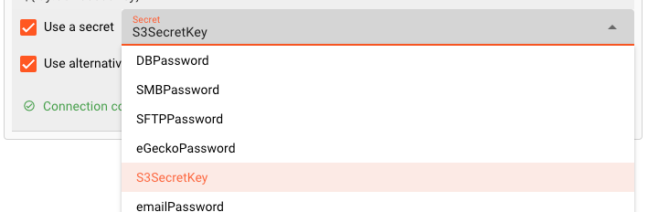
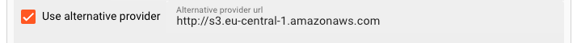
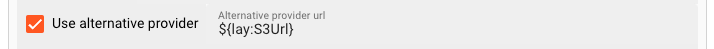
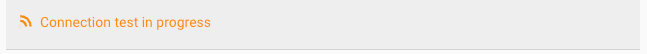
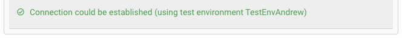
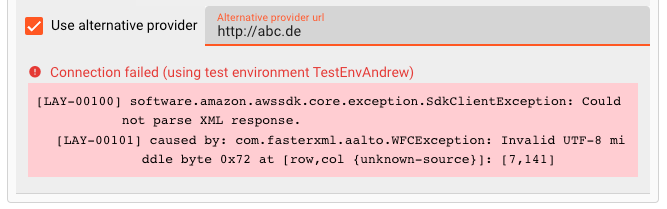

# Connection AWS

## Purpose

Amazon Simple Storage Service (Amazon S3) is an object storage service that offers industry-leading scalability, data availability, security, and performance.
Next to Amazon's S3 there are now various object storage providers which grant S3 compatible access to their storage solutions as well (e.g. Google Cloud Storage, IONOS, et al).

This UI helps to define the connection parameters for a S3 compatible storage endpoint. 

### This Asset is required by:

#### Sources
* [S3 Source](/assets/sources/asset-source-s3.md)
* [SQS Source](/assets/sources/asset-source-sqs.md)
 
#### Sinks
* [S3 Sink](/assets/sinks/asset-sink-s3.md)
* [SNS Sink](/assets/sinks/asset-sink-sns.md)
* [SQS Sink](/assets/sinks/asset-sink-sqs.md)

## Configuration

### Name & Description

")

**`Name`** : Name of the Asset. Whitespaces are not allowed in the name.

**`Description`** : Enter a description.

The **`Asset Usage`** box shows how many times this Asset is used and which parts are referencing it. Click to expand and then click to follow, if any.

### Required roles

")

In case you are deploying to a Cluster which is running (a) Reactive Engine Nodes which have (b) specific Roles configured, then you **can** restrict use of this Asset to those Nodes with matching roles.
If you want this restriction, then enter the names of the `Required Roles` here. Otherwise, leave empty to match all Nodes (no restriction).

### AWS Server

Use these settings to define the AWS connection parameters.

")

#### Authentication Mode

")

Select the mode of authentication accepted by the endpoint. Choice of:

* **`No credentials required`**: Pick this for access to an AWS endpoint which does not require authentication.

* **`Use the default credential provider chain (AWS only)`**: To avoid using clear text credentials in AWS connector, customers can enable "Default AWS Credentials Provider Chain" and use Role in AWS connector.
Please check [Working with AWS Credentials](https://docs.aws.amazon.com/sdk-for-java/v1/developer-guide/credentials.html) to learn more about this type of authentication. 

* **`Access key / Secret key credentials`**: Pick this for an Access and Secret Key driven authentication.
This requires the provision of an Access Key and a Secret as described below.

#### Region

Use this setting if your AWS (compatible) Server requires region information. 
You can find standard Amazon Web Services (AWS) regions in the drop-down list.
If your endpoint does not require a region, simply ignore the entry or leave empty.

#### Endpoint URL

If you are connecting to an AWS endpoint, you can ignore this field. 
Otherwise, you need to enter the endpoint URL here.

#### Access Key and Secret

If you have selected `Access key / Secret key credentials` as the Authentication Mode above,
then you will have to enter the Access Key and Secrete here respectively.
Both are made available to you by the endpoint provider (e.g. AWS or your compatible setup).

")

* **`Access Key`**: Enter the Access Key you want to use to access the endpoint. 
You can use ${...} placeholders to expand variables defined in [environment variables](/assets/resources/asset-resource-environment.html). 

* **`Use Secret`**: Check this box, if you have a configured a secret and want to reference this here
instead of entering the Secret directly.
Pick one of the Secrets in the list. The Secret must have been defined in a [Secrets Resource](/assets/resources/asset-resource-secret.md).
You cannot manually enter a secret here.

* **`Use alternative provider`**: Check this box, if you do not want to connect to Amazon AWS, but an alternative, compatible provider with a different URL.

or use a placeholder:

#### Connection test

The UI will constantly try to verify your connection credentials and show the results at the bottom of the box:

In case you have used placeholders you must also have specified a test environment, so that the system understands what to replace the placeholders with when testing.
When a connection could be established, you will see:

In case the connection failed, it will display failure. When hovering over the red text, you will be able to see the details of the problem:

## Related Topics

### Internal
* [S3 Source](/assets/sources/asset-source-s3.md)
* [S3 Sink](/assets/sinks/asset-sink-s3.md)
* [Create and manage secrets](/assets/resources/asset-resource-secret.md)

### External
* [Working with AWS Credentials](https://docs.aws.amazon.com/sdk-for-java/v1/developer-guide/credentials.html).

## Potential problems

:::note Can't find what you are looking for?
Please note, that the creation of the online documentation is **Work-In-Progress**. It is constantly being updated.
Should you have questions or suggestions, please don't hesitate to contact us at support@layline.io .
:::

