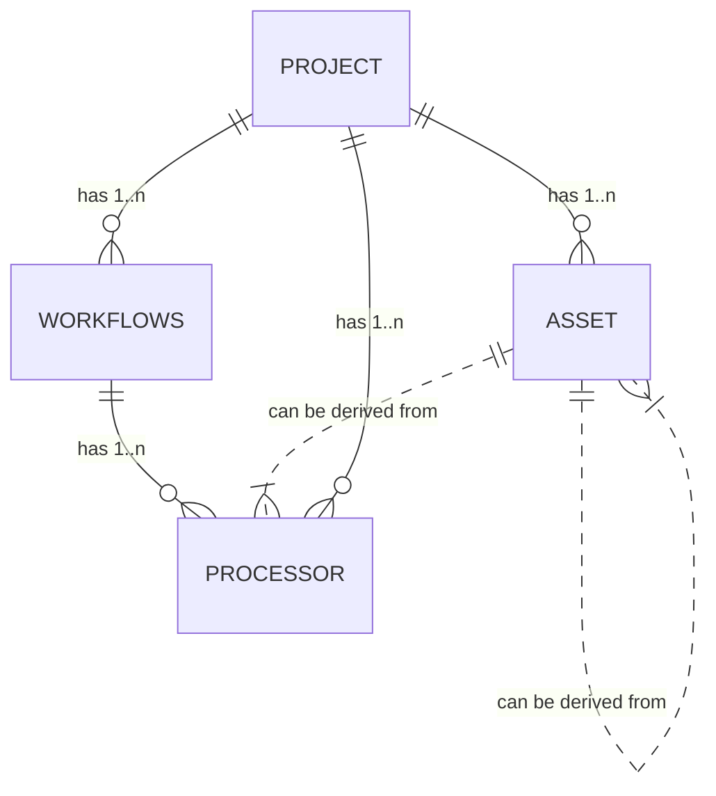

## Glossary

### Configuration Server

### Reactive Engine

### Configuration Center

### Project

### Workflow

### Asset

### Asset Class

### Asset Type

What is an asset.

### Processor Instance

### Deployment Asset

### Reactive Engine

### Reactive Engine Cluster or simply Cluster

### Node

### Event / Message

## UI Elements

### Asset Viewer
### Workflow Viewer
