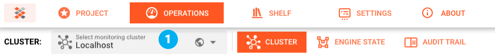
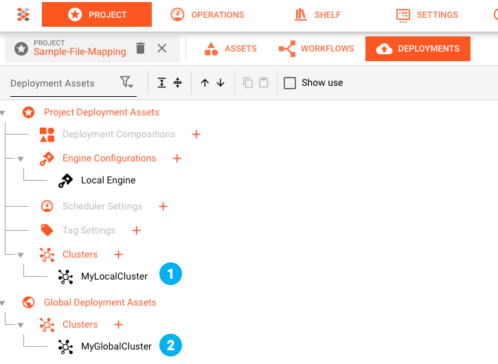
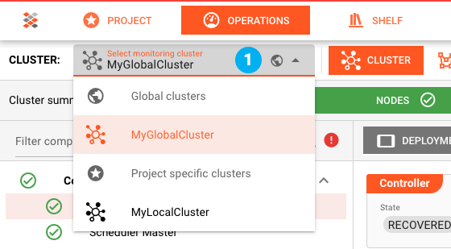

# Introduction

Next to creating Workflows, the Configuration Center also supports you in **monitoring** and **managing** "_Reactive Engine Clusters_". You can find these functions under "_**Operations**_" Tab.

Only one Cluster can be managed at a time. Which cluster you work with, is determined by the selection in the drop-down box **(1)**:

The setup of Clusters available for selection can only be done in an open Project under [Project --> Deployments](../wf-config/deployment#creating-a-cluster-asset). It is possible to either define 

1. Project dependent Clusters **(1)**: Clusters which are part of a Project and only available when the Project is opened.
2. Global Clusters **(2)**: These Clusters are also available for selection when no Project is opened.

It is then possible to select these Clusters in the Cluster Tab **(1)**:

### Next

The next sections will explain how to:
- Start, stop and remove Deployments
- Schedule and balance the number of Workflows 
- Coordinate how data is accessed
- Manage users and roles on the Cluster
- Manage secret keys
- View activity logs for all of the above
- and more

