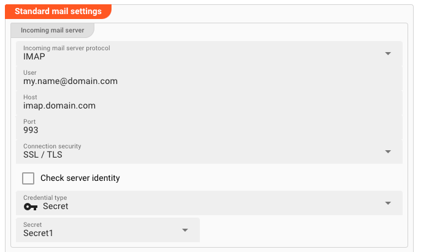
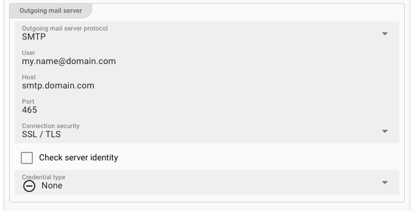
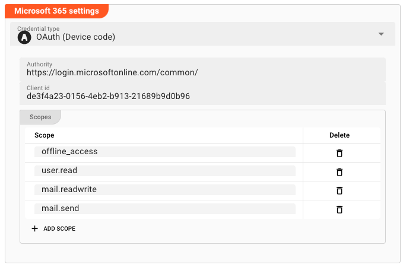
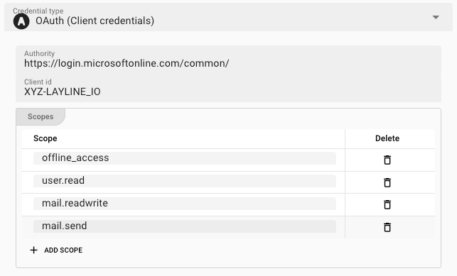

import WipDisclaimer from '../../snippets/common/_wip-disclaimer.md'
import CredentialType from '/docs/snippets/assets/_credential-type.md';

# Connection Email

## Purpose

Defines the connection parameters for an Email endpoint.

### This Asset can be used by:

| Asset type | Link                                                       |
|------------|------------------------------------------------------------|
| Source     | [Email Source](/docs/assets/sources/asset-source-email)    |
| Service    | [Email Service](/docs/assets/services/asset-service-email) |

## Configuration

### Name & Description

**`Name`** : Name of the Asset. Spaces are not allowed in the name.

**`Description`** : Enter a description.

The **`Asset Usage`** box shows how many times this Asset is used and which parts are referencing it. Click to expand and then click to follow, if any.

### Email Connection Type

The Email connection Asset supports two different types of Email connections:

1. **Standard**:
   This is mode supports POP3/SMTP and IMAP connection protocols.
2. **Microsoft 365**:
   This mode supports the Microsoft 365 email connection protocol.
   Note, that this is different from the standard type and proprietary to Microsoft.

:::info
You should be able to obtain the necessary parameters from your email provider or your administrator.
:::

### Standard Mail Settings

This mode supports standard email protocols like SMTP, POP3, and IMAP.

#### Incoming mail server

Specify connection parameters for SMTP, POP3, IMAP connections.

* **`Incoming mail server protocol`**:
  Pick either `IMAP` or `POP3`, depending on how you want to connect to the incoming email.
  Pick `No incoming emails` if you do not want to collect incoming emails.

* **`User`** (_macro supported_):
  Enter the username for the outgoing email account, e.g. `my.name@domain.com`.

* **`Host`**  (_macro supported_):
  This is the host, e.g. `my-host.domain.com`.

* **`Port`**  (_macro supported_):
  The IP-port to use for the connection.

  For IMAP this is typically `143` for non TLS/SSL connections, or `993` for TLS/SSL secured connections.

  For POP3 this is typically `110` for non TLS/SSL connections, or `995` for TLS/SSL secured connections.

* **`Connection security`**:
  Pick the respective encryption for your connection.

* **`Check server identity`**:
  Force-checks the server identity based on the authenticity of the certificate presented by the email server.
  Only applies to connections which use encryption (TLS/SSL)

* **`Credential type`**:
  Please see [Credential type settings](#credential-type) below.

#### Outgoing mail server

* **`Outgoing mail server protocol`**:
  Pick either `SMTP` if you want to send emails, else pick `No outgoing emails`..

* **`User`** (_macro supported_):
  Enter the username for the outgoing email account, e.g. `my.name@domain.com`.

* **`Host`** (_macro supported_):
  This is the host, e.g. `smtp.domain.com`.

* **`Port`** (_macro supported_):
  The IP-port to use for the connection.

  For SMTP this is typically `25` for non TLS/SSL connections, or `2525`, `587`, `465` for TLS/SSL encrypted connections.

* **`Connection security`**:
  Pick the respective encryption for your connection.

* **`Check server identity`**:
  Force-checks the server identity based on the authenticity of the certificate presented by the email server.
  Only applies to connections which use encryption (TLS/SSL)

* **`Credential type`**:
  Please see [Credential type settings](#credential-type) below

#### Credential type

<CredentialType></CredentialType>

### Microsoft 365 Settings

This mode supports the Microsoft 365 email connection protocol.
Note, that this is different from the standard type and proprietary to Microsoft.

#### Credential type

Microsoft Email supports two different authentication flows:

1. OAuth (Client Credentials)
2. OAuth (Device Flow)

Please check with your Microsoft endpoint which authentication flow is appropriate for your use case.

##### Microsoft OAuth (Client Credentials)

The Client Credentials Flow involves an application exchanging its application credentials, such as client ID and client secret, for an access token.
You can check the [Auth0 documentation](https://auth0.com/docs/get-started/authentication-and-authorization-flow/client-credentials-flow) for an example description.

* **`Authority`**:
  The authority URL as provided by the party to connect to. This is the endpoint which authorizes the connection and issues a respective token.

* **`Client ID`**:
  An ID issued by the authenticating authority.

* **`Scopes`**:
  These are the authentication scopes requested by the connection and which ust be granted by the authenticating authority.
  This is typically defined by the issuing authority in the context of the client id.
  I.e. if the other party has granted the access scopes which you define here, they authentication will be successful.
  Otherwise, the authentication may fail.

##### Microsoft OAuth (Device Flow)

With input-constrained devices that connect to the internet, rather than authenticate the user directly, the device asks the user to go to a link on their computer or smartphone and authorize the
device.
This avoids a poor user experience for devices that do not have an easy way to enter text.
To do this, device apps use the Device Authorization Flow, in which they pass along their Client ID to initiate the authorization process and get a token.

You can check the [Auth0 documentation](https://auth0.com/docs/get-started/authentication-and-authorization-flow/device-authorization-flow) for an example description.

For settings please see [Microsoft Client Credential Flow](#microsoft-oauth-client-credentials) above.

---

:::tip Fields marked with "**_macro supported_**"
You can use $\{...\} macros to expand variables defined in [environment variables](/docs/assets/resources/asset-resource-environment).
:::

---

<WipDisclaimer></WipDisclaimer>
