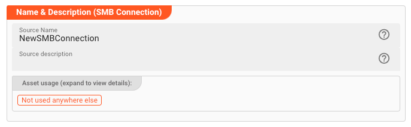
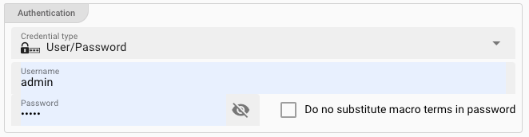
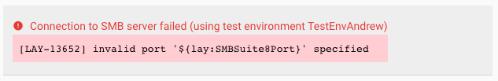

# Connection SMB

## Purpose

Defines the connection parameters for a SMB endpoint.

### This Asset can be used by:

| Asset type | Link                                                |
|------------|-----------------------------------------------------|
| Source     | [SMB Source](../sources/asset-source-smb) |
| Sink       | [SMB Sink](../sinks/asset-sink-smb)       |

## Configuration

### Name & Description

**`Name`** : Name of the Asset. Spaces are not allowed in the name.

**`Description`** : Enter a description.

The **`Asset Usage`** box shows how many times this Asset is used and which parts are referencing it. Click to expand and then click to follow, if any.

### Required roles

### SMB Settings

This is where you specify the individual connection parameters for your specific SMB connection.

* **`Host`**:
  SMB Share computer name, hostname, or IP address.

* **`Port`**:
  IP Port. Typically `139` or `445`.

* **`Domain`**:
  Optional domain name.

* **`Max. parallel SMB commands`**:
  Number of SMB commands which may be in flux in parallel.
  Use this to scale SMB access, e.g. when using the same connection in multiple SMB sources and sinks.

#### Authentication

You have two options to authenticate against the SMB endpoint:

1. Username and Password: Use this for simple username and password authentication.
2. Username and Secret:

##### Username and Password

* **`Credential Type`**:
  Select `User/Passsword` from the drop-down box.

* **`Username`** (_macro supported_):
  Your username.

* **`Password`** (_macro supported_):
  Your SMB password.

* **`Do not substitute macro terms in password`**:
  Check this box, if your password contains wording which could be mistaken as a macro (`${...}`) but should not be replaced by layline.io.

##### Username and Secret

* **`Credential Type`**:
  Select `User/Secret` from the drop-down box.

* **`Username`** (_macro supported_):
  Your username.

* **`Secret`**:
  Select a `Secret` from the drop-down list. If the list is empty, then you need to first [create a secret](../resources/asset-resource-secret) to be able to assign it here.

  Please [follow this link to "Advanced Concepts"](../../concept/advanced/secret-management) to learn about the concept and use of the Security Storage.

#### Connection Test Result:

While you are entering and changing Kafka Settings parameters, layline.io frequently tries to connect to the endpoint.
The status of these attempts are displayed at the bottom of the Settings group box.

In case of error, you can hover the mouse over the red output and view what the problem is:

This usually helps to resolve the issue.

:::info Attention: Connection is not tested between browser and endpoint
Please note that the connection test is not performed between your web browser and the backend.
Connection data is rather sent to the Configuration Server first, which then tries to establish the connection between itself and the endpoint.
In case you run into a connection error, please therefore check whether the endpoint can be reached from the viewpoint of the Configuration Server.

This also does not warrant, that a connection can be established from your deployment on a Reactive Engine, as this will only be evaluated at runtime of the Workflow utilizing this Connection Asset.
The Reactive Engine must be able to reach the configured endpoint, or otherwise connection at runtime will fail.
:::

:::tip Fields marked with "**macro supported**"
You can use $\{...\} macros to expand variables defined in [environment variables](../resources/asset-resource-environment).
:::
