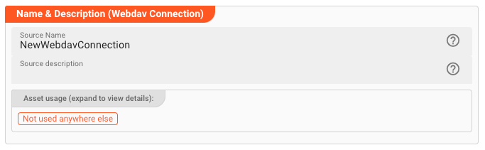
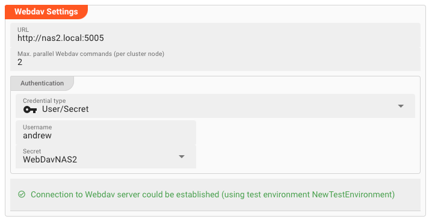
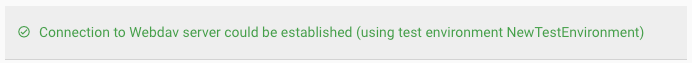
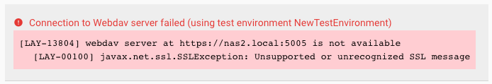

# Connection WebDav

## Purpose

Defines the connection parameters for a WebDav endpoint.

### This Asset can be used by:

| Asset type | Link                                                      |
|------------|-----------------------------------------------------------|
| Source     | [WebDav Source](../sources/asset-source-webdav) |
| Sink       | [WebDav Sink](../sinks/asset-sink-webdav)       |

## Configuration

### Name & Description

**`Name`** : Name of the Asset. Spaces are not allowed in the name.

**`Description`** : Enter a description.

The **`Asset Usage`** box shows how many times this Asset is used and which parts are referencing it. Click to expand and then click to follow, if any.

### Required roles

### WebDav Settings

Specify the connection parameters for the WebDav connection endpoint.

:::info
You should be able to obtain the necessary parameters from your webdav provider or your administrator.
:::

* **`URL`** (_macro supported_):
  The WebDav endpoint URL you want to connect to.

* **`Max. parallel WebDav commands`**:
  The number of commands which can be issued in parallel to a WebDav connection.
  This parameter is used to allow for greater throughput when running multiple instances of this Asset.
  It is valid **per running Reactive Cluster Engine**.
  I.e. if you are running three Reactive Engines in your setup, each one running a Workflow with this configured Connection Asset, then you will have a total of max. 6 concurrent commands which can be
  issued to the WebDav connection.
  Please consider this when settings this parameter.

* **`Credential type`**:
  Select `User/Secret`. This currently is the only supported credential type.

* **`Username`** (_macro supported_):
  Your username.

* **`Secret`**:
  Select a `Secret` from the drop-down list. If the list is empty, then you need to first [create a secret](../resources/asset-resource-secret) to be able to assign it here.

  Please [follow this link to "Advanced Concepts"](../../concept/advanced/secret-management) to learn about the concept and use of the Security Storage.

#### Connection Test Result:

While you are entering and changing connection parameters, layline.io frequently tries to connect to the endpoint.
The status of these attempts are displayed at the bottom of the Settings group box.

In case of error, you can hover the mouse over the red output and view what the problem is:

This usually helps to resolve the issue.

:::tip In case of SSL (https) and invalid certificate
If you connect via https:// and the endpoint does not have a certificate issued by an official authority, you may encounter a connection error.
You can still connect to this endpoint, but must download its respective certificate and make it available to the internal trust store.

For testing import it to the trust store of the Configuration Server.
For production, please do the same, but in the security storage of the Reactive Cluster.
Read here [how to do this](../../concept/advanced/secret-management#importing-a-trusted-certificate-3).
:::

:::warning Must have valid test environment
If you are using environment variables in your macros and/or secrets, then you must have configured a valid Test environment.
layline.io uses these test environment settings to apply during connection testing in these cases.
If you do not have a valid test environment set, then layline.io will not know which environment variables and secrets to apply.
:::

:::info Attention: Connection is not tested between browser and endpoint
Please note that the connection test is not performed between your web browser and the backend.
Connection data is rather sent to the Configuration Server first, which then tries to establish the connection between itself and the endpoint.
In case you run into a connection error, please therefore check whether the endpoint can be reached from the viewpoint of the Configuration Server.

This also does not warrant, that a connection can be established from your deployment on a Reactive Engine, as this will only be evaluated at runtime of the Workflow utilizing this Connection Asset.
The Reactive Engine must be able to reach the configured endpoint, or otherwise connection at runtime will fail.
:::

---

:::tip Fields marked with "**_macro supported_**"
You can use $\{...\} macros to expand variables defined in [environment variables](../resources/asset-resource-environment).
:::
