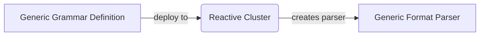
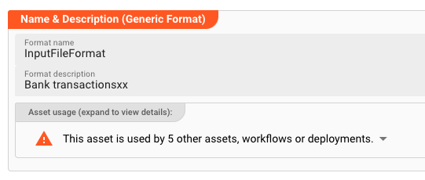
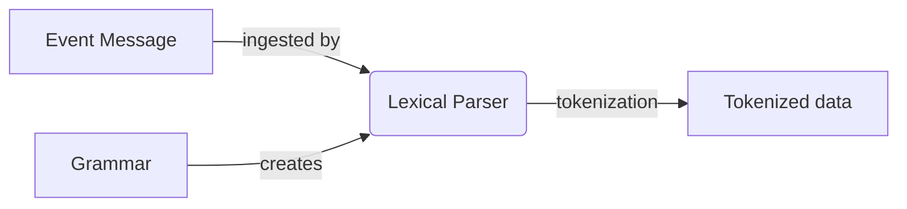
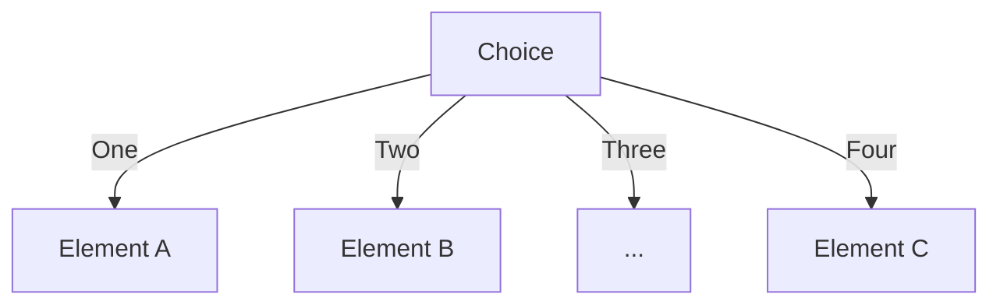

import WipDisclaimer from '../../snippets/common/_wip-disclaimer.md'

# Generic Format

## Purpose

Most of the time you are probably dealing with data that comes in some sort of structured data.
This could be simple CSV formats, complex hierarchical ASCII formats, binary formats, a mix of all of the above or something else.
Use your imagination.

The _Generic Format Asset_ is here to help you configure these specific data formats. Incoming data will be parsed and made available for further processing downstream.

The _Generic Format Asset_ uses a specialized form of **grammar language** to support you in defining a structured data format you may want to ingest, output, and generally work with.
The grammar language is based on regular expressions, i.e. defining data structures which can be identified using regular expressions.
This includes structured text and binary formats, as well as, for example, JSON formats.

The editor enables you to:

1. **Define** the grammar of an arbitrary structured data format.
2. **Test** the grammar with real-life data while in edit-mode.

Once the grammar is defined and tested in the Configuration Center, it can be deployed to a Reactive Cluster as part of a Project.
Remember that a Reactive Cluster may be a single Reactive Engine running locally, e.g., on your laptop as part of the standard installation.
When the Project is activated on the Cluster, the grammars which are part of this Project are read, verified and activated.
The Project is then ready to ingest and output the data in the specified formats.



In addition to this, **and very importantly so**, the grammar also enables you to access the data within defining business logic, e.g. in Javascript and other Assets.

We will explain all of this in this document.

### This Asset can be used by:

| Asset type        | Link                                                                |
|-------------------|---------------------------------------------------------------------|
| Input Processors  | [Stream Input](/docs/assets/processors-input/asset-input-stream)    |
|                   | [Frame Input](/docs/assets/processors-input/asset-input-frame)      |
|                   | [Kafka Input](/docs/assets/processors-input/asset-input-kafka)      |
| Output Processors | [Stream Output](/docs/assets/processors-output/asset-output-stream) |
|                   | [Frame Output](/docs/assets/processors-output/asset-output-frame)   |

## Configuration

### Name & Description



**`Name`** : Name of the Asset. Spaces are not allowed in the name.

**`Description`** : Enter a description.

The **`Asset Usage`** box shows how many times this Asset is used and which parts are referencing it. Click to expand and then click to follow, if any.

### Format Definition

Format definition describes the process of defining a format by way of the mentioned grammar language.
The Configuration Center provides an editor to enter the grammar.
Grammar editing is supported by just-in-time compilation of the grammar.
Potential issues are highlighted.
Hints can be shown by hovering over the red squiggly underlines.
Hovering over property names shows clues about the purpose of the property.

")

The next section now describes the grammar language, which is entered in the Format Editor.

#### Lexical Parser

This grammar which you define is internally processed by a lexical parser.
This in turn compiles a parser which is then able to ingest and/or output the defined format.



Processing event data, the lexical analyzer recognizes lexical patterns in the data.
Based on the grammar, the analyzer identifies and categorizes individual elements/tokens (tokenization) by applying the regular expressions given in the grammar.
An element can look like anything; it just needs to be a useful part of the structured event.
Each element must have an associated regular expression which definitively identifies a specific element, however.

Looking at an example-grammar should help us to understand how it works.
This example is for a simple comma-separated-format.
Please note that virtually any other structured data format can be defined using the grammar language.

```
format {
  name = "Bank Transactions"
  // Name of the grammar for internal purposes.
  description = "Random bank transactions"
  // Description

  start-element = "File"
  //
  target-namespace = "BankIn"

  elements = [
  // #####################################################################
  // ### File sequence
  // #####################################################################
  {
    name = "File"
    type = "Sequence"
    references = [
    {
      name = "Header"
      referenced-element = "Header"
    },
    {
      name = "Details"
      max-occurs = "unlimited"
      referenced-element = "Detail"
    },
    {
      name = "Trailer"
      referenced-element = "Trailer"
    }
    ]
  },
  // #####################################################################
  // ### Header record 
  // #####################################################################
  {
    name = "Header"
    type = "Separated"
    regular-expression = "H"
    separator-regular-expression = ";"
    separator = ";"
    terminator-regular-expression = "\n"
    terminator = "\n"

    mapping = {
      message = "Header"
      element = "BT_IN"
    }

    parts = [
    {
      name = "RECORD_TYPE"
      type = "RegExpr"
      regular-expression = "[^;\n]*"
      value.type = "Text.String"
    },
    {
      name = "FILENAME"
      type = "RegExpr"
      regular-expression = "[^;\n]*"
      value.type = "Text.String"
    }
    ]
  },
  // #####################################################################
  // ### Detail record
  // #####################################################################
  {
    name = "Detail"
    type = "Separated"
    regular-expression = "D"
    separator-regular-expression = ";"
    separator = ";"
    terminator-regular-expression = "\n"
    terminator = "\n"

    mapping = {
      message = "Detail"
      element = "BT_IN"
    }

    parts = [
    {
      name = "RECORD_TYPE"
      type = "RegExpr"
      regular-expression = "[^;\n]*"
      value.type = "Text.String"
    },
    {
      name = "DATE"
      type = "RegExpr"
      regular-expression = "[^;\n]*"
      value = {
        type = "Text.DateTime"
        format = "dd-MMM-uuuu"
      }
    },
    {
      name = "DESCRIPTION"
      type = "RegExpr"
      regular-expression = "[^;\n]*"
      value = {
        type = "Text.String"
      }
    },
    {
      name = "DEPOSITS"
      type = "RegExpr"
      regular-expression = "[^;\n]*"
      value = {
        type = "Text.Decimal"
      }
    },
    {
      name = "WITHDRAWALS"
      type = "RegExpr"
      regular-expression = "[^;\n]*"
      value.type = "Text.Decimal"
    },
    {
      name = "BALANCE"
      type = "RegExpr"
      regular-expression = "[^;\n]*"
      value = {
        type = "Text.Decimal"
      }
    }
    ]
  },
  // #####################################################################
  // # Trailer record                                             
  // #####################################################################
  {
    name = "Trailer"
    type = "Separated"
    regular-expression = "T"
    separator-regular-expression = ";"
    separator = ";"
    terminator-regular-expression = "\r?\n"
    terminator = "\n"

    mapping = {
      message = "Trailer"
      element = "BT_IN"
    }

    parts = [
    {
      name = "RECORD_TYPE"
      type = "RegExpr"
      regular-expression = "[^;\n]*"
      value.type = "Text.String"
    },
    {
      name = "RECORD_COUNT"
      type = "RegExpr"
      regular-expression = "[^;\n]*"
      value.type = "Text.Integer"
    }
    ]
  }
]
}

```

(The structure of the grammar language looks like JSON, but please note that while it is similar, it is **NOT** in JSON format.)

Looking at this example, it can be noted that a grammar defines a hierarchical structure of elements, of which each can be of different types and structures themselves.

In the above, the parser initially identifies three types of elements:

* Header
* Detail
* Trailer

Each of these elements is then again structured into "sub"-elements which represent the individual fields. It's a fairly simple format.

On ingestion of the event message and parsing of the data, the result is written to an internal data format.
This now structured data can be accessed and manipulated throughout the configured processing stages of the Project.

**The whole process works in reverse, when outputting data using the defined grammar.**

#### Language syntax

Let's understand the structure and elements which can be used to define your grammar.

##### Format

The top node of any grammar is **`format`**.
Everything else is defined underneath it.
It represents the bracket of every grammar.

**Syntax Diagram:**

<div className="imgWhiteBackground">

")

</div>

**Properties:**

| Attribute        | Type   | Description                                                                                                                                 | Optional | Default     |
|------------------|--------|---------------------------------------------------------------------------------------------------------------------------------------------|:--------:|-------------|
| name             | string | Name of the format                                                                                                                          |          |             |
| description      | string | Description of the format                                                                                                                   |    x     |             |
| start-element    | string | Name of the element which starts parsing. See`elements` below.                                                                              |          |             |
| target-namespace | string | Internal name of the target namespace. Must be unique across all formats                                                                    |          |             |
| elements         | []     | Array of the types[Choice](#choice), [ListTerminal](#listterminal), [MultiPart](#multipart), [Separated](#separated), [Sequence](#sequence) |          | Empty array |

**Example:**

```
format {
  name = "Bank Transactions"
  description = "Random bank transactions"

  start-element = "File"
  target-namespace = "BankIn"

  elements = [
  // #####################################################################
  // ### File sequence
  // #####################################################################
  {
    name = "File"
    type = "Sequence"
    references = [
    {
      name = "Header"
      referenced-element = "Header"
    },
    {
      name = "Details"
      max-occurs = "unlimited"
      referenced-element = "Detail"
    },
    {
      name = "Trailer"
      referenced-element = "Trailer"
    }
  ]
},
...
```

##### Elements

`Elements` are part of the [format](#format) definition.
The following list of elements exists:

**Logical Elements**

* [Choice](#choice)
* [Sequence](#sequence)

**Terminal Elements**

* [ListTerminal](#listterminal)
* [MultiPart](#multipart)
* [Separated](#separated)

###### Choice

A `Choice` element is a "logical selector" between a number of possible next elements for the parser.
However, only one of the paths is valid for the given message data.
In other words, this element both limits and opens which elements are possible to be next in the parsing process.



**This type of element does not parse data.**
It serves to decide which structure should be used for forward parsing.
Use this if there are different options of what the next structure could be.

**Used in:**

* [format](#format)
* [ElementReference](#element-reference)

**Syntax Diagram:**

<div className="imgWhiteBackground">

")

</div>

**Properties:**

| Attribute  | Type                                     | Description                                                     | Optional | Default     |
|------------|------------------------------------------|-----------------------------------------------------------------|:--------:|-------------|
| name       | [string](#string)                        | Name of the element                                             |          |             |
| type       | "Choice"                                 | Must be "Choice"                                                |          |             |
| mapping    | [MessageMapping](#message-mapping)       | Specifies if the choice shall be mapped into a separate message |    X     |             |
| references | [ElementReference](#element-reference)[] | Array of referenced alternatives                                |    X     | Empty array |

**Example:**

```
...
// #####################################################################
// ### Detail choice
// #####################################################################
{
  name = "DetailChoice"
  type = "Choice"
  references = [
  {
    name = "Carment_19_2"
    referenced-element = "DETAIL_19_2"
    // Next element must be either DETAIL_19_2 as defined below ...
  },
  {
    name = "Carment_19_3"
    referenced-element = "DETAIL_19_3"
    // ... or this element
  }
]
},
// #####################################################################
// ### Detail Carmen 19.2 record
// #####################################################################
{
  name = "DETAIL_19_2                         // Is being referenced from above
  type = "Separated"
  regular-expression = "XYZ(;([^;\n]*)){60}\n"
  separator-regular-expression = ";"
  separator = ";"
  terminator-regular-expression = "\n"
  terminator = "\n"

...
```

###### Sequence

Representation of a logically ordered set of element types.
For each element defined in `references` there must be `0..n` occurrences.
Like the [Choice](#choice) element, this element does not parse data, but further defines rules for the structure of the file.

**Used in:**

* [format](#format)

**Syntax Diagram:**

<div className="imgWhiteBackground">

")

</div>

**Properties:**

| Attribute  | Type                                     | Description                                                                                                           | Optional | Default     |
|------------|------------------------------------------|-----------------------------------------------------------------------------------------------------------------------|:--------:|-------------|
| name       | [string](#string)                        | Name of the element                                                                                                   |          |             |
| type       | "Sequence"                               | Specifies the type of the element                                                                                     |          |             |
| mapping    | [MessageMapping](#message-mapping)       | Specifies if the element shall be mapped into a separate message. This will create a whole new message in layline.io. |    X     |             |
| references | [ElementReference](#element-reference)[] | Array of sub-elements                                                                                                 |    X     | Empty array |

**Example:**
In this example, the file structure is defined as such that it

1. must start with one record of type Header (defined later),
2. must be followed by `0..n` records of type Detail
3. must be followed by one record of type Trailer

```
...
elements = [
  // #####################################################################
  // ### File sequence
  // #####################################################################
  {
    name = "File"
    type = "Sequence"
    references = [
    {
      name = "Header"
      referenced-element = "Header"
      // First element must be defined element "Header"
    },
    {
      name = "Details"
      min-occurs = 0
      max-occurs = "unlimited"
      referenced-element = "DetailChoice"
      // 0..n elements "Detail" must follow "Header"
    },
    {
      name = "Trailer"
      referenced-element = "Trailer"
      // Last element must be defined element "Trailer" 
    }
  ]
},
  ...
]

```

###### ListTerminal

Element which detects a list of elements where

1. the list is terminated at the end of the list
2. the individual elements in the list are separated by a separator

Use this element to work with formats which

1. have records with an arbitrary number of fields in a record
2. each field is of the same type

Example data:

```
Id,Name,Surname,Street,City                      // First line contains column headers --> this is the ListTerminal 
10,John,Doe,MyStreet,MyCity                      // Data records contain the actual data
20,Lara,Croft,Tombstone St.,Death Valley 
...
```

**Used in:**

* [format](#format)

**Syntax Diagram:**

<div className="imgWhiteBackground">

")

</div>

**Properties:**

| Attribute                     | Type                                     | Description                                                                            | Optional | Default     |
|-------------------------------|------------------------------------------|----------------------------------------------------------------------------------------|:--------:|-------------|
| name                          | [string](#string)                        | Name of the element                                                                    |          |             |
| type                          | "ListTerminal"                           | Specifies the type of the element                                                      |          |             |
| mapping                       | [MessageMapping](#message-mapping)       | Specifies if the element shall be mapped into a separate message                       |    X     |             |
| regular-expression            | [string](#string)                        | Regular expression used to detect the Separated element                                |          |             |
| states                        | [string](#string) []                     | List of state names in which the Separated element is detected                         |    X     | Empty array |
| action                        | [Action](#action)                        | Action that is executed, when the Separated element is detected                        |    X     | No action   |
| separator-regular-expression  | [string](#string)                        | Regular expression used to detect the field separator                                  |    X     | ","         |
| separator                     | [string](#string)                        | Separator to use when the element is written                                           |    X     | ","         |
| terminator-regular-expression | [string](#string)                        | Regular expression used to detect the terminator of the element                        |    X     | "\r?\n"     |
| terminator                    | [string](#string)                        | Terminator to use when the element is written                                          |    X     | "\n"        |
| element                       | [ElementPart](#element-parts)            | Element part which describes the elements in the list. One part defines alle elements. |          |             |
| references                    | [ElementReference](#element-reference)[] | Array of referenced elements behind the list                                           |    X     | Empty array |

**Example:**
This example works for the example data above.
At first, we detect and parse the Header columns, and following this then all Detail records.

```
...
elements = [
  // File sequence
  {
    name = "File"
    type = "Sequence" 
    references = [
    {
      name = "Header"
      type = "Reference"
      referenced-element = "Header"
    },
    {
      name = "Details"
      type = "Reference"
      max-occurs = "unlimited"
      referenced-element = "Detail"
    }
    ]
  },
  // Header sequence
  {
    name = "Header"
    // Element name
    type = "ListTerminal"
    // The fixed type name "ListTerminal"
    regular-expression = ".*\n"
    // Matching data
    action = "pushState(DETAIL_STATE)"
    // This element, switches the parser state to "DETAIL_STATE"

    separator-regular-expression = ","
    // regex to find the separator
    separator = ","
    terminator-regular-expression = "\r?\n"
    // regex to find the terminator
    terminator = "\n"

    mapping = {
      message = "Header"
    // message will be mapped as a message of type "Header"
      element = "XYZ"
    }

    element = {
      // This example defines an element of type "RegExpr"
      name = "RecordId"
      type = "RegExpr"
      regular-expression = "[^,\r\n]*"
      // Regular expresssion to find the element
      value.type = "Text.String"
      // Type of ALL found elements. Can only be one type for all.
    }
  },
  {
    name = "Detail"
    type = "ListTerminal"
    regular-expression = ".*\n"
    states = [
      "DETAIL_STATE"
      // Parser state must be in "DETAIL_STATE" for this element to be parsed (see above).
    ]

    separator-regular-expression = ","
    separator = ","
    terminator-regular-expression = "\r?\n"
    terminator = "\n"

    mapping = {
      message = "Detail"
      element = "OMS"
    }

    element = {
      name = "RecordId"
      type = "RegExpr"
      regular-expression = "[^,\r\n]*"
      value.type = "Text.String"
    }
  }
]
...
```

###### MultiPart

Element which detects a record where

1. the end of the record is identified by regular expression,
2. the record contains a number of (sub-)elements, or parts,
3. the sub-elements can be defined as [ElementPart](#element-parts).

Use this if you

1. have a record with individual (sub-)elements,
2. each subelement could be either of type [Fixed](#fixed), [Calculated](#calculated), or [RegExpr](#regexpr).

**Used in:**

* [format](#format)

**Syntax Diagram:**

<div className="imgWhiteBackground">

")

</div>

**Properties:**

| Attribute                  | Type                               | Description                                                      | Optional | Default     |
|----------------------------|------------------------------------|------------------------------------------------------------------|:--------:|-------------|
| name                       | [string](#string)                  | Name of the element                                              |          |             |
| type                       | "MultiPart"                        | Specifies the type of the element                                |          |             |
| mapping                    | [MessageMapping](#message-mapping) | Specifies if the element shall be mapped into a separate message |    X     |             |
| regular-expression         | [string](#string)                  | Regular expression used to detect the separated element          |          |             |
| states                     | [string](#string) []               | List of state names in which the Separated element is detected   |    X     | Empty array |
| action                     | [Action](#action)                  | Action that is executed, when the Separated element is detected  |    X     | No action   |
| parts                      | [ElementPart](#element-parts)[]    | Array of element parts within the element                        |    X     | Empty array |
| token-group-length-formula | [Formula](#formula)                | Formula used to calculate the length of the entire token group   |    X     | No formula  |

**Example:**

```
...
{
  name = "Person"
  // Element name
  type = "MultiPart"
  // Of fixed type "MultiPart"
  regular-expression = ".*\n"
  // Regular expression to detect this element. Terminated by by new line

  mapping = {
    message = "Person"
    element = "Data"
  }

  parts = [
  // Array of elements which make up the MultiPart element
  {
    name = "RecordId"
    // The first element is the Record ID
    type = "Fixed"
    // of fixed length
    length = 3
    // Length is 3
    justification = "left"
    // left justified
    pad-char = " "
    // padded with spaces
    value.type = "Text.String"
    // data type is "String"
  },
  {
    name = "Surname"
    type = "Fixed"
    length = 20
    justification = "left"
    pad-char = " "
    value = {
      type = "Text.String"
      encoding = "utf-8"
    }
  },
  ...

  {
    name = "EOL"
    type = "RegExpr"
    regular-expression = "\r?\n*"
    value.type = "Text.String"
  }
]
}
...
```

###### Separated

Terminal element which is detected by a regular expression and consists of multiple parts separated by a separator and terminated by a terminator.
These are typically records containing fields which are separated by a delimiter character (e.g. `,` or `;`).
The complete record may be terminated by another character (e.g. `\n`  or `\r\n` as record separator).
Because the lexical analyzer has no length information for the record, the regular expression specified as a pattern has to match the full record including the record separator.

**Used in:**

* [format](#format)

**Syntax Diagram:**

<div className="imgWhiteBackground">

")

</div>

**Properties:**

| Attribute                     | Type                                     | Description                                                                                                                                                                                                  | Optional | Default     |
|-------------------------------|------------------------------------------|--------------------------------------------------------------------------------------------------------------------------------------------------------------------------------------------------------------|:--------:|-------------|
| name                          | [string](#string)                        | Name of the element                                                                                                                                                                                          |          |             |
| type                          | "Separated"                              | Specifies the type of the element                                                                                                                                                                            |          |             |
| mapping                       | [MessageMapping](#message-mapping)       | Specifies if the element shall be mapped into a separate message. This will create a whole new message in layline.io.                                                                                        |    X     |             |
| regular-expression            | [string](#string)                        | Regular expression used to detect the Separated element.<br/>Example: <br/>10.*\n. The record must start with the string "10" followed by zero or more characters, and must end with the new line character. |          |             |
| states                        | [string](#string) []                     | List of state names in which the Separated element is detected                                                                                                                                               |    X     | Empty array |
| action                        | [Action](#action)                        | Action that is executed, when the Separated element is detected                                                                                                                                              |    X     | No action   |
| separator-regular-expression  | [string](#string)                        | Regular expression used to detect the field separator and splitting the record up in its field components.                                                                                                   |    X     | ","         |
| separator                     | [string](#string)                        | Separator to use when the element is output                                                                                                                                                                  |    X     | ","         |
| terminator-regular-expression | [string](#string)                        | Regular expression used to detect the terminator of the element. E.g.`\r\n` as CRLF.                                                                                                                         |    X     | "\r?\n"     |
| terminator                    | [string](#string)                        | Terminator to use when the element is output                                                                                                                                                                 |    X     | "\n"        |
| parts                         | [ElementPart](#element-parts)[]          | Array of element parts within the element, e.g. the fields.                                                                                                                                                  |    X     | Empty array |
| references                    | [ElementReference](#element-reference)[] | Array of sub-elements                                                                                                                                                                                        |    X     | Empty array |

**Example:**

```
...
//==================
// Header sequence
//==================
{
  name = "Header"
  type = "Separated"
  regular-expression = "10.*\n"
  separator-regular-expression = ","
  separator = ","
  terminator-regular-expression = "\r?\n"
  terminator = "\n"

  mapping = {
    message = "Header"
    element = "CSV"
  }

  parts = [
  {
    name = "RecordId"
    type = "RegExpr"
    regular-expression = "[^,\r\n]*"
    value.type = "Text.String"
  },
  {
    name = "Sender"
    type = "RegExpr"
    regular-expression = "[^,\r\n]*"
    value = {
      type = "Text.String"
      encoding = "utf-8"
    }
  },
  ...
  {
    name = "ZoneOffset"
    type  "RegExpr"
    regular-expression = "[^,\r\n]*"
    value = {
      type = "Text.String"
      encoding = "utf-8"
    }
  }
  ]
},
...
```

##### Element Parts

The following list of elements exists:

* [Calculated](#calculated)
* [Fixed](#fixed)
* [RegExpr](#regexpr)

**Used in:**

* [MultiPart](#multipart)
* [Separated](#separated)
* [ListTerminal](#listterminal)

###### Calculated

A terminal element part which has a length calculated from some data in the input data stream.

**Syntax Diagram:**

<div className="imgWhiteBackground">

")

</div>

**Properties:**

| Attribute            | Type                | Description                                                                                                                                                                                                                 | Optional | Default     |
|----------------------|---------------------|-----------------------------------------------------------------------------------------------------------------------------------------------------------------------------------------------------------------------------|:--------:|-------------|
| name                 | [string](#string)   | Name of the element                                                                                                                                                                                                         |          |             |
| type                 | "Calculated"        | Specifies the type of the element part                                                                                                                                                                                      |          |             |
| value                | [Value](#value)     | Value of the element                                                                                                                                                                                                        |          |             |
| input-exists-formula | [Formula](#formula) | Boolean formula that specifies if the element exists. The formula can reference another field in its calculation.<br/> Example: `bitIsSet(other_field,31)"` --> the field exists if other_field has bit set at position 31. |    X     | true        |
| input-length-formula | [Formula](#formula) | Fixed value or formula that provides the length of the data                                                                                                                                                                 |          |             |
| justification        | [string](#string)   | Justification of the value data (left or right)                                                                                                                                                                             |    X     | left        |
| pad-char             | [string](#string)   | Padding character used when the value is output                                                                                                                                                                             |    X     | " " (Space) |
| strip-chars          | [string](#string)   | String containing all characters that shall be striped when the value is input                                                                                                                                              |    X     | " " (Space) |
| null-output-value    | [string](#string)   | Value that shall be used as output when the element part is null                                                                                                                                                            |    X     | not set     |

**Example:**

```
...
{
  name = "Bitmap3"
  type = "Calculated"
  input-exists-formula = "bitIsSet(Bitmap1,31)"
  input-length-formula = "8"
  value = { 
    type = "Text.Long"
    base = 16
  }
},
...
```

###### Fixed

A terminal element part with a fixed length.

**Syntax Diagram:**

<div className="imgWhiteBackground">

")

</div>

**Properties:**

| Attribute               | Type                | Description                                                                   | Optional | Default     |
|-------------------------|---------------------|-------------------------------------------------------------------------------|:--------:|-------------|
| name                    | [string](#string)   | Name of the element                                                           |          |             |
| type                    | "Fixed"             | Specifies the type of the element part                                        |          |             |
| value                   | [Value](#value)     | Value of the element                                                          |          |             |
| length                  | [integer](#integer) | Length of the fixed element                                                   |          |             |
| justification           | [string](#string)   | Justification of the value data (left or right)                               |    X     | left        |
| pad-char                | [string](#string)   | Padding character used when the value is written                              |    X     | " " (Space) |
| strip-chars             | [string](#string)   | String containing all characters that shall be striped when the value is read |    X     | " " (Space) |
| null-regular-expression | [string](#string)   | If the value matches this regular expression it is handled as null value      |    X     | not set     |
| null-output-value       | [string](#string)   | Value that shall be used as output when the element part is null              |    X     | not set     |

**Example:**

```
...
{
  name = "CREATE_DATE"
  type = "Fixed"
  length = 14
  justification = "left"
  null-regular-expression  "[ \t]*"
  value = {
    type  "Text.DateTime"
    format = "uuuuMMddHHmmss"
    null-input-value = "1970-01-01T00:00:00Z"
}
...
```

###### RegExpr

A terminal element part which is detected using a regular expression.

**Syntax Diagram:**

<div className="imgWhiteBackground">

")

</div>

**Properties:**

| Attribute               | Type                | Description                                                                    | Optional | Default     |
|-------------------------|---------------------|--------------------------------------------------------------------------------|:--------:|-------------|
| name                    | [string](#string)   | Name of the element                                                            |          |             |
| type                    | "RegExpr"           | Specifies the type of the element part                                         |          |             |
| value                   | [Value](#value)     | Value of the element                                                           |          |             |
| regular-expression      | [string](#string)   | Regular expression used to detect the value in the input stream                |          |             |
| justification           | [string](#string)   | Justification of the value data (left or right)                                |    X     | left        |
| pad-char                | [string](#string)   | Padding character used when the value is output                                |    X     | " " (Space) |
| strip-chars             | [string](#string)   | String containing all characters that shall be striped when the value is input |    X     | "" (Empty)  |
| min-length              | [integer](#integer) | Minimum length on the output side                                              |    X     | 0           |
| max-length              | [integer](#integer) | Maximum length on the output side                                              |    X     | unlimited   |
| null-regular-expression | [string](#string)   | If the value matches this regular expression it is handled as null value       |    X     | not set     |
| null-output-value       | [string](#string)   | Value that shall be used as output when the element part is null               |    X     | not set     |

**Example:**

```
...
{
  name = "RECORD_TYPE"
  type = "RegExpr"
  regular-expression = "[^;\n]*"
  value.type = "Text.Integer"
},
...
```

##### Message Mapping

The MessageMapping specifies how the current element is mapped into a layline.io message.

**Used in:**

* [Choice](#choice)
* [Sequence](#sequence)
* [ListTerminal](#listterminal)
* [MultiPart](#multipart)
* [Separated](#separated)
* [ElementReference](#element-reference)

**Syntax Diagram:**

<div className="imgWhiteBackground">

")

</div>

**Properties:**

| Attribute | Type              | Description                                                                                                                                                                    | Optional | Default |
|-----------|-------------------|--------------------------------------------------------------------------------------------------------------------------------------------------------------------------------|:--------:|---------|
| message   | [string](#string) | Name of the created layline.io message                                                                                                                                         |          |         |
| element   | [string](#string) | Access path of the target element of the mapping. This is the name of the path which is used within layline.io to access the element, e.g. in a script, in field mapping, etc. |    X     |         |

**Example:**

```
...
{
  name = "DETAIL_Carmen_19_3"
  type = "Separated"
  regular-expression = "GSM(;([^;\n]*)){61}\n"
  separator-regular-expression = ";"
  separator = ";"
  terminator-regular-expression = "\n"
  terminator = "\n"

  mapping = {
    message = "Detail"
    element = "D1_GSM"
  }
}
...
```

##### Element Reference

An ElementReference is used to reference another element from a Choice, ListTerminal, Sequence, or Sequence.
In the example below a `Sequence` is defined as a number of references to elements which are defined in another place within the grammar.
E.g., the Sequence is a sequence of Header, Details, and a Footer element.

**Used in:**

* [Choice](#choice)
* [Sequence](#sequence)
* [ListTerminal](#listterminal)
* [MultiPart](#multipart)
* [Separated](#separated)

**Syntax Diagram:**

<div className="imgWhiteBackground">

")

</div>

**Properties:**

| Attribute          | Type                               | Description                                                                                           | Optional | Default |
|--------------------|------------------------------------|-------------------------------------------------------------------------------------------------------|:--------:|---------|
| name               | [string](#string)                  | Name of the reference                                                                                 |          |         |
| mapping            | [MessageMapping](#message-mapping) | Specifies if the reference shall be mapped into a separate message                                    |    X     |         |
| referenced-element | [string](#string)                  | Name of the referenced element. This is an element which was defined by you elsewhere in the grammar. |          |         |
| min-occurs         | [integer](#integer)                | Minimum number of occurrences                                                                         |    X     | 1       |
| max-occurs         | [integer](#integer)/"unlimited"    | Maximum number of occurrences                                                                         |    X     | 1       |

**Example:**

```
...
elements = [
  // #####################################################################
  // ### File sequence
  // #####################################################################
  {
    name = "File"
    type="Sequence"
    // Example for "Sequence"
    references = [
    {
      name = "Header"
      // Reference name is "Header"
      referenced-element = "Header"
      // The actually referenced element is also called "Header". It must be defined elsewhere in the grammar.
    },
    {
      name = "Details"
      // Reference name is "Details"
      min-occurs = 0
      // Must occur zero times --> so it is optional
      max-occurs = "unlimited"
      // Can occur an unlimited number of times
      referenced-element = "DetailChoice"
      // The actually referenced element is called "DetailChoice". It must be defined elsewhere in the grammar.
    },
    {
      name = "Trailer"
      // Reference name is "Trailer"
      referenced-element = "Trailer"
      // The actually referenced element is also called "Trailer". It must be defined elsewhere in the grammar.
    }
  ]
},
// #####################################################################
// ### Header record
// #####################################################################
{
    name = "Header"
    // This is the element being referenced above. 
    type = "MultiPart"
    regular-expression = "10"
    
    mapping = {
      message = "Header"
      element = "D2_AID"
    }

    parts = [
...

```

##### Value

The following list of elements exists:

* [Binary.ByteString](#binarybytestring)
* [Binary.HexString](#binaryhexstring)
* [Binary.Long](#binarylong)
* [Text.BigInteger](#textbiginteger)
* [Text.Date](#textdate)
* [Text.DateTime](#textdatetime)
* [Text.Decimal](#textdecimal)
* [Text.Double](#textdouble)
* [Text.Integer](#textinteger)
* [Text.Long](#textlong)
* [Text.String](#textstring)

**Syntax Diagram:**

<div className="imgWhiteBackground">

")

</div>

###### Binary.ByteString

A binary ByteString value. The bytes from the input will be directly mapped into a ByteString value in the message

**Syntax Diagram:**

<div className="imgWhiteBackground">

")

</div>

**Properties:**

| Attribute        | Type                | Description                                                                                                                                                                                                  | Optional | Default |
|------------------|---------------------|--------------------------------------------------------------------------------------------------------------------------------------------------------------------------------------------------------------|:--------:|---------|
| type             | "Binary.ByteString" | Specifies the type of value                                                                                                                                                                                  |          |         |
| null-input-value | [string](#string)   | Value that will be used when the element part is classified as null                                                                                                                                          |    X     | not set |       
| quote-char       | [string](#string)   | In case the value is quoted, you can define the quote character here. E.g. if the value is quoted with '"', then set this option to "\"". The value will be stripped from quotes as a result.                |    X     | not set |       
| escape-char      | [string](#string)   | Allows you to define an additional character which should be treated as an escape character.                                                                                                                 |    X     | not set |       
| escape-set       | [string](#string)   | Defines the set of characters which should be escaped by the defined escape-char. E.g. if escape-char = "&" and escape-set = "\"!?", then an input string "\"Hallo A&!&?&\"\"" would result in "Hallo A!?\"" |    X     | not set |       

**Example:**

```
...
{
  name = "F65_ReservedForIsoUse"
  type = "Calculated"
  input-exists-formula = "bitIsSet(Bitmap3,31)"
  input-length-formula = "8"
  value = {
    type = "Binary.ByteString"
  }
},
...
```

###### Binary.HexString

A value where the binary ByteString value is encoded as hexadecimal string.

**Syntax Diagram:**

<div className="imgWhiteBackground">

")

</div>

**Properties:**

| Attribute        | Type               | Description                                                                                                                                                                                                  | Optional | Default |
|------------------|--------------------|--------------------------------------------------------------------------------------------------------------------------------------------------------------------------------------------------------------|:--------:|---------|
| type             | "Binary.HexString" | Specifies the type of value                                                                                                                                                                                  |          |         |
| null-input-value | [string](#string)  | Value that will be used when the element part is classified as null                                                                                                                                          |    X     | not set |
| quote-char       | [string](#string)  | In case the value is quoted, you can define the quote character here. E.g. if the value is quoted with '"', then set this option to "\"". The value will be stripped from quotes as a result.                |    X     | not set |       
| escape-char      | [string](#string)  | Allows you to define an additional character which should be treated as an escape character.                                                                                                                 |    X     | not set |       
| escape-set       | [string](#string)  | Defines the set of characters which should be escaped by the defined escape-char. E.g. if escape-char = "&" and escape-set = "\"!?", then an input string "\"Hallo A&!&?&\"\"" would result in "Hallo A!?\"" |    X     | not set |       

**Example:**

```
...
{
  name = "F65_ReservedForIsoUse"
  type = "Calculated"
  input-exists-formula = "bitIsSet(Bitmap3,31)"
  input-length-formula = "8"
  value = {
    type = "Binary.HexString"
  }
},
...
```

###### Binary.Long

A value where the binary ByteString value is encoded as hexadecimal string.

**Syntax Diagram:**

<div className="imgWhiteBackground">

")

</div>

**Properties:**

| Attribute        | Type                | Description                                                                                                                                                                                                  | Optional | Default      |
|------------------|---------------------|--------------------------------------------------------------------------------------------------------------------------------------------------------------------------------------------------------------|:--------:|--------------|
| type             | "Binary.Long"       | Specifies the type of value                                                                                                                                                                                  |          |              |
| null-input-value | [integer](#integer) | Value that will be used when the element part is classified as null                                                                                                                                          |    X     | not set      |
| byte-order       | [string](#string)   | Byte order of the data "BIG_ENDIAN", "BIG-ENDIAN", "BIG-ENDIAN", "MSBF", "LITTLE_ENDIAN", "LITTLE-ENDIAN", "LITTLE-ENDIAN", "LSBF"                                                                           |    X     | "BIG-ENDIAN" |
| quote-char       | [string](#string)   | In case the value is quoted, you can define the quote character here. E.g. if the value is quoted with '"', then set this option to "\"". The value will be stripped from quotes as a result.                |    X     | not set      |       
| escape-char      | [string](#string)   | Allows you to define an additional character which should be treated as an escape character.                                                                                                                 |    X     | not set      |       
| escape-set       | [string](#string)   | Defines the set of characters which should be escaped by the defined escape-char. E.g. if escape-char = "&" and escape-set = "\"!?", then an input string "\"Hallo A&!&?&\"\"" would result in "Hallo A!?\"" |    X     | not set      |       

**Example:**

```
...
{
  name = "MessageLength"
  type = "Fixed"
  length = 2
  value = {
    type = "Binary.Long"
  }
},
...

```

###### Text.BigInteger

A 64-bit whole number value in text format.

**Syntax Diagram:**

<div className="imgWhiteBackground">

")

</div>

**Properties:**

| Attribute        | Type                | Description                                                                                                                                                                                                  | Optional | Default |
|------------------|---------------------|--------------------------------------------------------------------------------------------------------------------------------------------------------------------------------------------------------------|:--------:|---------|
| type             | "Text.BigInteger"   | Specifies the type of value                                                                                                                                                                                  |          |         |
| base             | [integer](#integer) | Base of encoded text value (8, 10, 16, ...).                                                                                                                                                                 |    X     | 10      |
| null-input-value | [integer](#integer) | Value that will be used when the element part is classified as null.                                                                                                                                         |    X     | not set |
| quote-char       | [string](#string)   | In case the value is quoted, you can define the quote character here. E.g. if the value is quoted with '"', then set this option to "\"". The value will be stripped from quotes as a result.                |    X     | not set |       
| escape-char      | [string](#string)   | Allows you to define an additional character which should be treated as an escape character.                                                                                                                 |    X     | not set |       
| escape-set       | [string](#string)   | Defines the set of characters which should be escaped by the defined escape-char. E.g. if escape-char = "&" and escape-set = "\"!?", then an input string "\"Hallo A&!&?&\"\"" would result in "Hallo A!?\"" |    X     | not set |       

**Example:**

```
...
{
  name = "RECORD_SIZE"
  type = "Fixed"
  length = 4
  justification = "right"
  pad-char = "0"
  strip-chars = " "
  null-regular-expression = "[ \t]*"
  value = { 
    type = "Text.BigInteger"
    null-input-value = 0
  }
}, ...
```

###### Text.Date

A Date value in text format.
For DateTime handling, see [Text.DateTime](#textdatetime).

**Syntax Diagram:**

<div className="imgWhiteBackground">

")

</div>

**Properties:**

| Attribute           | Type                | Description                                                                                                                                                                                                   | Optional | Default    |
|---------------------|---------------------|---------------------------------------------------------------------------------------------------------------------------------------------------------------------------------------------------------------|:--------:|------------|
| type                | "Text.Date"         | Specifies the type of value                                                                                                                                                                                   |          |            |
| format              | [string](#string)   | Reference: [Date/Time format](https://docs.oracle.com/javase/8/docs/api/java/time/format/DateTimeFormatter.html). Do not use time formats here. See [Text.DateTime](#textdatetime) to handle DateTime values. |    X     | "uuuuMMdd" |
| null-input-value    | [string](#string)   | Value that will be used when the element part is classified as null. Format like "2011-12-03"                                                                                                                 |    X     | not set    |
| alternative-formats | [[string](#string)] | An array of strings representing date formats, e.g. ["uuuuMMdd", "uuMMdd"]. Will try value defined in "format" first (see above)                                                                              |    X     | not set    |
| quote-char          | [string](#string)   | In case the value is quoted, you can define the quote character here. E.g. if the value is quoted with '"', then set this option to "\"". The value will be stripped from quotes as a result.                 |    X     | not set    |       
| escape-char         | [string](#string)   | Allows you to define an additional character which should be treated as an escape character.                                                                                                                  |    X     | not set    |       
| escape-set          | [string](#string)   | Defines the set of characters which should be escaped by the defined escape-char. E.g. if escape-char = "&" and escape-set = "\"!?", then an input string "\"Hallo A&!&?&\"\"" would result in "Hallo A!?\""  |    X     | not set    |       

**Example:**

```
...
{
  name = "ReceiptDate"
  type = "RegExpr"
  regular-expression = "[^,\r\n]*"
  value = {
    type = "Text.Date"
    format = "uuuuMMdd"
    alternative-formats = ["uuMMdd"]
  }
},
...
```

###### Text.DateTime

A DateTime value in text format. For handling pure Date formats see [Text.Date](#textdate).

**Syntax Diagram:**

<div className="imgWhiteBackground">

")

</div>

**Properties:**

| Attribute        | Type              | Description                                                                                                                                                                                                  | Optional | Default          |
|------------------|-------------------|--------------------------------------------------------------------------------------------------------------------------------------------------------------------------------------------------------------|:--------:|------------------|
| type             | "Text.DateTime"   | Specifies the type of value                                                                                                                                                                                  |          |                  |
| format           | [string](#string) | Reference: [Date/Time format](https://docs.oracle.com/javase/8/docs/api/java/time/format/DateTimeFormatter.html). To handle pure date formats see [Text.Date](#textdate)                                     |    X     | "uuuuMMddHHmmss" |
| null-input-value | [string](#string) | Value that will be used when the element part is classified as null. Format like "2011-12-03T10:15:30+01:00"                                                                                                 |    X     | not set          |
| quote-char       | [string](#string) | In case the value is quoted, you can define the quote character here. E.g. if the value is quoted with '"', then set this option to "\"". The value will be stripped from quotes as a result.                |    X     | not set          |       
| escape-char      | [string](#string) | Allows you to define an additional character which should be treated as an escape character.                                                                                                                 |    X     | not set          |       
| escape-set       | [string](#string) | Defines the set of characters which should be escaped by the defined escape-char. E.g. if escape-char = "&" and escape-set = "\"!?", then an input string "\"Hallo A&!&?&\"\"" would result in "Hallo A!?\"" |    X     | not set          |       

**Example:**

```
{
  name = "Created"
  type = "RegExpr"
  regular-expression = "[^,\r\n]*"
  value = {
    type = "Text.DateTime"
    format = "uuuuMMddHHmmss"
  }
},
...

```

###### Text.Decimal

A Decimal value in text format.

**Syntax Diagram:**

<div className="imgWhiteBackground">

")

</div>

**Properties:**

| Attribute             | Type                | Description                                                                                                                                                                                                  | Optional | Default |
|-----------------------|---------------------|--------------------------------------------------------------------------------------------------------------------------------------------------------------------------------------------------------------|:--------:|---------|
| type                  | "Text.Decimal"      | Specifies the type of value                                                                                                                                                                                  |          |         |
| fixed-precision       | [integer](#integer) | Use a fixed precision                                                                                                                                                                                        |    X     | not set |
| min-fractional-digits | [integer](#integer) | Minimum number of fractional digits on the output side                                                                                                                                                       |    X     | 0       |
| max-fractional-digits | [integer](#integer) | Maximum number of fractional digits on the output side                                                                                                                                                       |    X     | 6       |
| null-input-value      | [string](#string)   | Value that will be used when the element part is classified as null as standard decimal string.                                                                                                              |    X     | not set |
| decimal-separator     | [string](#string)   | Value used to detect decimal separation, e.g. "." in the US.                                                                                                                                                 |    X     | not set |
| grouping-separator    | [string](#string)   | Value used to detect thousands grouping separator, e.g. "," in the US.                                                                                                                                       |    X     | not set |
| use-grouping          | [boolean](#boolean) | Used for grouping thousands values when writing decimals. See "grouping-separator".                                                                                                                          |    X     | false   |
| quote-char            | [string](#string)   | In case the value is quoted, you can define the quote character here. E.g. if the value is quoted with '"', then set this option to "\"". The value will be stripped from quotes as a result.                |    X     | not set |       
| escape-char           | [string](#string)   | Allows you to define an additional character which should be treated as an escape character.                                                                                                                 |    X     | not set |       
| escape-set            | [string](#string)   | Defines the set of characters which should be escaped by the defined escape-char. E.g. if escape-char = "&" and escape-set = "\"!?", then an input string "\"Hallo A&!&?&\"\"" would result in "Hallo A!?\"" |    X     | not set |       

**Example:**

```
...
{
  name = "TOTAL_CHARGE"
  type = "RegExpr"
  regular-expression = "[^;\n]*"
  value = {
    type = "Text.Decimal"
  }
},
...

```

###### Text.Double

A Double value in text format.

**Syntax Diagram:**

<div className="imgWhiteBackground">

")

</div>

**Properties:**

| Attribute             | Type                | Description                                                                                                                                                                                                  | Optional | Default |
|-----------------------|---------------------|--------------------------------------------------------------------------------------------------------------------------------------------------------------------------------------------------------------|----------|---------|
| type                  | "Text.Double"       | Specifies the type of value                                                                                                                                                                                  |          |         |
| fixed-precision       | [integer](#integer) | Use a fixed precision                                                                                                                                                                                        | X        | not set |
| min-fractional-digits | [integer](#integer) | Minimum number of fractional digits on the output side                                                                                                                                                       | X        | 0       |
| max-fractional-digits | [integer](#integer) | Maximum number of fractional digits on the output side                                                                                                                                                       | X        | 6       |
| null-input-value      | [string](#string)   | Value that will be used when the element part is classified as null as standard decimal string.                                                                                                              | X        | not set |
| decimal-separator     | [string](#string)   | Value used to detect decimal separation, e.g. "." in the US.                                                                                                                                                 | X        | not set |
| grouping-separator    | [string](#string)   | Value used to detect thousands grouping separator, e.g. "," in the US.                                                                                                                                       | X        | not set |
| use-grouping          | [boolean](#boolean) | Used for grouping thousands values when writing decimals. See "grouping-separator".                                                                                                                          | X        | false   |
| quote-char            | [string](#string)   | In case the value is quoted, you can define the quote character here. E.g. if the value is quoted with '"', then set this option to "\"". The value will be stripped from quotes as a result.                | X        | not set |       
| escape-char           | [string](#string)   | Allows you to define an additional character which should be treated as an escape character.                                                                                                                 | X        | not set |       
| escape-set            | [string](#string)   | Defines the set of characters which should be escaped by the defined escape-char. E.g. if escape-char = "&" and escape-set = "\"!?", then an input string "\"Hallo A&!&?&\"\"" would result in "Hallo A!?\"" | X        | not set |       

**Example:**

```
...
{
  name = "X"
  type = "RegExpr"
  regular-expression = "[^ \r\n]*"
  value = {
    type = "Text.Double"
    decimal-separator = "."
    grouping-separator = ","
    use-grouping = "true"
  }
}, ...
```

###### Text.Integer

A 32-bit whole number value in text format.

**Syntax Diagram:**

<div className="imgWhiteBackground">

")

</div>

**Properties:**

| Attribute        | Type                | Description                                                                                                                                                                                                  | Optional | Default |
|------------------|---------------------|--------------------------------------------------------------------------------------------------------------------------------------------------------------------------------------------------------------|:--------:|---------|
| type             | "Text.Integer"      | Specifies the type of value                                                                                                                                                                                  |          |         |
| base             | [integer](#integer) | Base of encoded text value (8, 10, 16).                                                                                                                                                                      |    X     | 10      |
| null-input-value | [integer](#integer) | Value that will be used when the element part is classified as null.                                                                                                                                         |    X     | not set |
| quote-char       | [string](#string)   | In case the value is quoted, you can define the quote character here. E.g. if the value is quoted with '"', then set this option to "\"". The value will be stripped from quotes as a result.                |    X     | not set |       
| escape-char      | [string](#string)   | Allows you to define an additional character which should be treated as an escape character.                                                                                                                 |    X     | not set |       
| escape-set       | [string](#string)   | Defines the set of characters which should be escaped by the defined escape-char. E.g. if escape-char = "&" and escape-set = "\"!?", then an input string "\"Hallo A&!&?&\"\"" would result in "Hallo A!?\"" |    X     | not set |       

**Example:**

```
...
{
  name = "RECORD_SIZE"
  type = "Fixed"
  length = 4
  justification = "right"
  pad-char = "0"
  strip-chars = " "
  null-regular-expression = "[ \t]*"
  value = { 
    type = "Text.Integer"
    null-input-value = 0
  }
}, ...
```

###### Text.Long

A 64-bit long value in text format.

**Syntax Diagram:**

<div className="imgWhiteBackground">

")

</div>

**Properties:**

| Attribute        | Type                | Description                                                                                                                                                                                                  | Optional | Default |
|------------------|---------------------|--------------------------------------------------------------------------------------------------------------------------------------------------------------------------------------------------------------|----------|---------|
| type             | "Text.Long"         | Specifies the type of value                                                                                                                                                                                  |          |         |
| base             | [integer](#integer) | Base of encoded text value (8, 10, 16).                                                                                                                                                                      | X        | 10      |
| null-input-value | [integer](#integer) | Value that will be used when the element part is classified as null.                                                                                                                                         | X        | not set |
| quote-char       | [string](#string)   | In case the value is quoted, you can define the quote character here. E.g. if the value is quoted with '"', then set this option to "\"". The value will be stripped from quotes as a result.                | X        | not set |       
| escape-char      | [string](#string)   | Allows you to define an additional character which should be treated as an escape character.                                                                                                                 | X        | not set |       
| escape-set       | [string](#string)   | Defines the set of characters which should be escaped by the defined escape-char. E.g. if escape-char = "&" and escape-set = "\"!?", then an input string "\"Hallo A&!&?&\"\"" would result in "Hallo A!?\"" | X        | not set |       

**Example:**

```
...
{
  name = "Age"
  type = "Fixed"
  length = 3
  justification = "left"
  pad-char = " "
  value = {
    type = "Text.Long"
  }
},
...
```

###### Text.String

A String value.

**Syntax Diagram:**

<div className="imgWhiteBackground">

")

</div>


**Properties:**

| Attribute        | Type                | Description                                                                                                                                                                                                  | Optional | Default |
|------------------|---------------------|--------------------------------------------------------------------------------------------------------------------------------------------------------------------------------------------------------------|----------|---------|
| type             | "Text.String"       | Specifies the type of value                                                                                                                                                                                  |          |         |
| encoding         | [string](#string)   | Used string encoding ([standard Java character set names](https://docs.oracle.com/javase/8/docs/technotes/guides/intl/encoding.doc.html).                                                                    | X        | "UTF-8" |
| null-input-value | [integer](#integer) | Value that will be used when the element part is classified as null.                                                                                                                                         | X        | not set |
| quote-char       | [string](#string)   | In case the value is quoted, you can define the quote character here. E.g. if the value is quoted with '"', then set this option to "\"". The value will be stripped from quotes as a result.                | X        | not set |       
| escape-char      | [string](#string)   | Allows you to define an additional character which should be treated as an escape character.                                                                                                                 | X        | not set |       
| escape-set       | [string](#string)   | Defines the set of characters which should be escaped by the defined escape-char. E.g. if escape-char = "&" and escape-set = "\"!?", then an input string "\"Hallo A&!&?&\"\"" would result in "Hallo A!?\"" | X        | not set |       

**Example:**

```
...
{
  name = "F25_PointOfServiceConditionCode"
  type = "Calculated"
  input-exists-formula = "bitIsSet(Bitmap1,7)"
  input-length-formula = "2"
  value = {
    type = "Text.String"
  }
},
...
```

##### Action

An important feature of the lexical analyzer is the support of different analyzer states.
These states are needed if not all lexical entities of a file can be described with one set of unique regular expressions.
When a special record is recognized, the lexical analyzer can switch to another state to assign a record recognized by a regular expression to a different record type.
The following action can be performed when a state should change:

* `popState`: The lexical analyzer switches back to the last state that was pushed on the stack
* `pushState(state name(s))`: Tells the lexical analyzer to push the current analyzer state(s) on the stack and switch to the specified state.
  It is allowed to push multiple states within one action.
  It is possible to push multiple states.
* `changeState(state name)`: The lexical analyzer switches to the specified state when this record is recognized.

**Used in:**

* [ListTerminal](#listterminal)
* [MultiPart](#multipart)
* [Separated](#separated)

**Syntax Diagram:**

<div className="imgWhiteBackground">

")

</div>

##### Formula

The `Formula` is based on layline.io's internal `QuickScript` language.
Please check the [QuickScript Language Reference](/docs/language-reference/quickscript/quickscript) for more info.

**Used in:**

* [MultiPart](#multipart)
* [Calculated](#calculated)

**Syntax Diagram:**

<div className="imgWhiteBackground">

")

</div>

**Example:**

```
...
{
  name = "Bitmap3"
  type = "Calculated"
  input-exists-formula = "bitIsSet(Bitmap1,31)"
  input-length-formula = "8"
  value = {
    type = "Text.Long"
    base = 16
  }
},
...

```

##### Data types

###### boolean

**Syntax Diagram:**

<div className="imgWhiteBackground">

")

</div>

###### string

**Syntax Diagram:**

<div className="imgWhiteBackground">

")

</div>

###### integer

**Syntax Diagram:**

<div className="imgWhiteBackground">

")

</div>

###### decimal

Immutable, arbitrary-precision signed decimal numbers.
A BigDecimal consists of an arbitrary precision integer unscaled value and a 32-bit integer scale.
If zero or positive, the scale is the number of digits to the right of the decimal point.
If negative, the unscaled value of the number is multiplied by ten to the power of the negation of the scale.
The value of the number represented by the BigDecimal is therefore (unscaledValue × 10^scale).

This data type is based on Java's BigDecimal data type from which the description is also taken. See [here](https://docs.oracle.com/javase/8/docs/api/java/math/BigDecimal.html) for further reference.

**Syntax Diagram:**

<div className="imgWhiteBackground">

")

</div>

###### comment

**Syntax Diagram:**

<div className="imgWhiteBackground">

")

</div>

#### Sample File Testing

##### Matching grammar and data

The UI provides the capability to not only define the grammar for your format, but readily test whether it actually works.
All of this without having to go through the round-trip of deploying a whole Project to a cluster, running it, only to find out that you made a configuration mistake in the grammar.

Next to the Format-Definition Editor is the Sample-File Viewer.
This is where you can upload a sample file with real-life data to see whether your grammar matches your data.

In the image below, we have loaded a small sample file for our example grammar which we have introduced at the beginning of this description.
It has a Header, two Detail records, and a Trailer record.

")

If your file matches the grammar, you will see that the editor has split the data up in fields of alternating color (black and red).
Hovering the mouse over a field will show a popup with information about the field (see "**BankIn.Detail.Balance**" in the image above.)

If you select the `Sample Messages` tab, you should see your data in a structured format:

")

To copy a part of the structure, click the copy button next to it.

:::warning There are two limitations with this approach:

1. Only works with ASCII data. Binary data viewing will be available shortly.
2. Only works with files.
   In other words: If you are working with streaming data / real-time data, you have to put your data structures in a file first, to test whether data matches grammar.
   :::

##### In the case of error

There are a number of reasons why the grammar may not match the data. Let's take a look at what they are and how to remedy them:

1. Grammar contains red squiggly lines under items:

")

This indicates a problem with the grammar. Hover over the marked item and check the popup which should show the cause of the problem.

2. Grammar does not match sample data

In this case, the grammar is probably not fully configured or there is some other problem.
A typical problem is that the data can be partially parsed, while some fields are not correctly recognized.
In this case, it should be fairly easy to allocate the problem within the grammar.

:::tip I tried everything and still need help!
Don't be frustrated in case you run into issues configuring more complex formats!
Help is just around the corner.
Please [get in touch](https://layline.io/contact) with us, and we WILL help you
to set up your format!
:::

## Related Topics

### Internal

**Input Processors**

* [Stream Input](/docs/assets/processors-input/asset-input-stream)
* [Frame Input](/docs/assets/processors-input/asset-input-frame)
* [Kafka Input](/docs/assets/processors-input/asset-input-kafka)

**Output Processors**

* [Stream Output](/docs/assets/processors-output/asset-output-stream)
* [Frame Output Processor](/docs/assets/processors-output/asset-output-frame)

### External

* [Date/Time Formats](https://docs.oracle.com/javase/8/docs/api/java/time/format/DateTimeFormatter.html)
* [Standard Java character set names](https://docs.oracle.com/javase/8/docs/technotes/guides/intl/encoding.doc.html)

## Information missing in the documentation?

---

<WipDisclaimer></WipDisclaimer>
