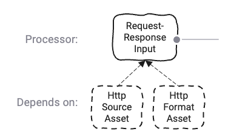
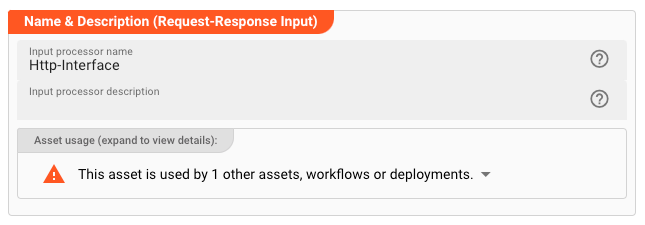
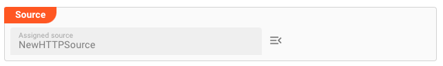

import FailureHandling from '../../snippets/assets/_failure-handling-input.md';
import WipDisclaimer from '../../snippets/common/_wip-disclaimer.md'
import OutputPorts from '../../snippets/assets/_output-ports-single.md';

# Input Request-Response

## Purpose

The Request-Response-Input Processor provides a **two-way** Http-Interface.
Use this to if you want to provide an external interface which can be invoked by an external system (or it could be layline.io itself whichis invoking the interface, e.g. from another workflow.)

This Asset is used within a Workflow definition.

### Prerequisite

You need:

* [Http-Format](../formats/asset-format-http)
* [Http-Source](../sources/asset-source-http)

## Configuration

### Name & Description

* **`Name`** : Name of the Asset. Spaces are not allowed in the name.

* **`Description`** : Enter a description.

The **`Asset Usage`** box shows how many times this Asset is used and which parts are referencing it. Click to expand
and then click to follow, if any.

### Output Ports

<OutputPorts></OutputPorts>

### Format

Assign a [Http-Format](../formats/asset-format-http) which you have previously defined.
This Input-Asset will process the requests and responses which are defined in that assigned [Http-Format](../formats/asset-format-http).
The format will be applied on the incoming data so that it can be accessed via the data dictionary.

### Source

Assign a [Http-Source](../sources/asset-source-http).
The Source defines the physical addresses and ports on how this Input Asset can be reached.

### Failure Handling

<FailureHandling></FailureHandling>

---

<WipDisclaimer></WipDisclaimer>
