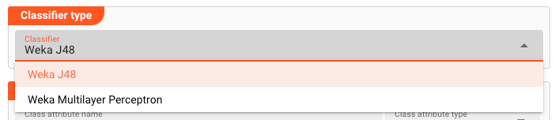
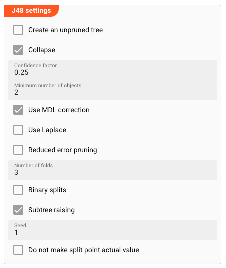
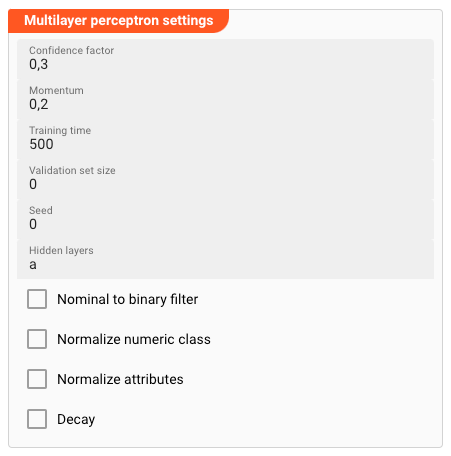

import WipDisclaimer from '../../snippets/common/_wip-disclaimer.md'

## Purpose

Working with AI-Models in layline.io is a two-step process:

1. Create an AI-Model Asset (this Asset)
2. Train the AI-Model
3. Use the AI-Model in a Workflow

This Asset defines the technical parameters for an AI-Model.

It allows you to define the following major parameters:

* The Algorithm to use
* The Training Data
* The Model Parameters

Once you have defined the AI-Model Asset, you can use it in a [AI Training Asset](/docs/assets/processors-flow/asset-flow-ai-trainer) to train the model and in
a [AI Classifier Asset](/docs/assets/processors-flow/asset-flow-ai-classifier) to use the model to infer data.

:::tip
If you are not familiar with the concept of AI in layline.io, please read [Using Artificial Intelligence in Workflows](/docs/concept/advanced/artificial-intelligence) first and then return here.
:::

### This Asset can be used by:

| Asset type     | Link                                                                   |
|----------------|------------------------------------------------------------------------|
| Flow Processor | [AI Trainer](/docs/assets/processors-flow/asset-flow-ai-trainer)       |
| Flow Processor | [AI Classifier](/docs/assets/processors-flow/asset-flow-ai-classifier) |

### Name & Description

")

**`Name`** : Name of the Asset. Spaces are not allowed in the name.

**`Description`** : Enter a description.

The **`Asset Usage`** box shows how many times this Asset is used and which parts are referencing it. Click to expand and then click to follow, if any.

#### Algorithm / Model

Select the algorithm to use for the AI-Model.

We currently support the following algorithms:

##### Weka J48

J48, also known as C4.5 algorithm, is a supervised learning algorithm that can be used for both classification and regression tasks. It is a decision tree algorithm, which means that it generates a
tree-like structure that represents the relationships between variables and the target variable. The tree is built by recursively partitioning the data into smaller and smaller subsets until each
subset contains only homogeneous data. The decision rules at each node of the tree represent the conditions that must be met for a data point to belong to a particular subset.

J48 is based on the ID3 algorithm, which was developed by Ross Quinlan. ID3 is a simple decision tree algorithm that uses information gain to select the best attribute to split the data at each node.
J48 improves on ID3 by using information gain ratio, which is a more refined measure of information gain that takes into account the number of levels in the tree. This makes J48 more efficient at
building smaller and more accurate trees.

J48 is a popular algorithm for classification and regression tasks because it is relatively easy to understand and implement. It is also relatively efficient, especially for smaller datasets. However,
J48 can be sensitive to noise in the data, and it can sometimes overfit to the training data.

Here is a table that summarizes the key characteristics of the J48 algorithm:

| Feature                     | Description                                                      |
|-----------------------------|------------------------------------------------------------------|
| Type                        | Supervised learning                                              |
| Tasks                       | Classification, regression                                       |
| Algorithm                   | Decision tree                                                    |
| Basis                       | ID3 algorithm                                                    |
| Measure of information gain | Information gain ratio                                           |
| Strengths                   | Easy to understand and implement, relatively efficient           |
| Weaknesses                  | Sensitive to noise in the data, can overfit to the training data |

Here is a good article on Weka J48: [Weka J48](https://medium.com/@nilimakhanna1/j48-classification-c4-5-algorithm-in-a-nutshell-24c50d20658e)

##### Weka Multilayer Perceptron

The Weka Multilayer Perceptron (MLP) algorithm is a supervised learning algorithm that is commonly used for classification and regression tasks. It is a type of feedforward artificial neural network (
ANN), which means that it consists of multiple layers of interconnected nodes, or neurons. Each neuron receives input from other neurons and applies a function to the sum of its inputs to produce an
output. The connections between neurons have weights, which are adjusted during training to improve the network's performance.

The MLP algorithm is based on the backpropagation algorithm, which is a method for training ANNs. The backpropagation algorithm works by calculating the error between the network's predictions and the
actual target values, and then using this error to update the weights of the connections between neurons. This process is repeated until the network's predictions are sufficiently accurate.

The MLP algorithm is a powerful and versatile machine learning algorithm that can be used to solve a wide range of problems. However, it can also be computationally expensive to train, and it may not
be suitable for all types of problems.

Here is a table that summarizes the key characteristics of the MLP algorithm:

| Feature    | Description                                                              |
|------------|--------------------------------------------------------------------------|
| Type       | Supervised learning                                                      |
| Tasks      | Classification, regression                                               |
| Algorithm  | Feedforward artificial neural network                                    |
| Basis      | Backpropagation algorithm                                                |
| Strengths  | Powerful and versatile, can solve a wide range of problems               |
| Weaknesses | Computationally expensive, may not be suitable for all types of problems |

Here is a good article
on [Multilayer Perceptron (MLP)](https://towardsdatascience.com/multilayer-perceptron-explained-with-a-real-life-example-and-python-code-sentiment-analysis-cb408ee93141?gi=d1bb617c88c4)

--

Depending on the algorithm you select, you are able to define additional parameters for the model.

### Attributes

Here you define:

1. The attribute which holds the result of the classification
2. The attributes which are used to train the model as well as for classifying data

#### Classification Result

This is the attribute that holds the result of the classification.

* **`Class Attribute Name`**: The name of the attribute which holds the result of the classification.
* **`Class Attribute Type`**: The type of the attribute (see [Types of Attributes](#types-of-attributes)).

#### Input Attributes

These are the attributes that are used to train the model as well as for classifying data.
Add as many attributes as you need.

* **`Attribute Name`**: Enter a name of the attribute. Make sure that the name is unique and contains no spaces.
* **`Attribute Type`**: Select the type of the attribute (see [Types of Attributes](#types-of-attributes)).

#### Types of Attributes

The following types of attributes are supported:

| Data Type | Description                                                                                                                                                                                                                                                                                                                                  |
|-----------|----------------------------------------------------------------------------------------------------------------------------------------------------------------------------------------------------------------------------------------------------------------------------------------------------------------------------------------------|
| Numeric   | Represents continuous numerical values. Numeric attributes can take on any real number within a certain range. For example, the attribute "height" in a dataset of people may be numeric, with values ranging from 5 feet to 6 feet tall.                                                                                                    |
| String    | Represents text or categorical values. String attributes can take on a wide range of values, including text, numbers, and symbols. For example, the attribute "country of origin" in a dataset of products may be string, with values such as "United States," "China," or "India."                                                          |
| Date      | Represents dates and times. Date attributes can take on values such as "2023-10-04" or "2024-01-23."                                                                                                                                                                                                                                         |
| Relation  | Represents a collection of instances, each of which has a set of attributes. Relation attributes can take on complex values that represent other datasets. For example, the attribute "customer" in a dataset of sales transactions may be relation, with values that are themselves instances of a dataset containing customer information. |
| Nominal   | Represents categorical values that can only belong to a finite set of categories. Nominal attributes can only take on values from a predefined set of categories. For example, the attribute "color" in a dataset of cars may be nominal, with possible values such as "red," "blue," "green," etc.                                          |

### Model Parameters

#### Weka J48

If you selected the Weka J48 algorithm, you can define the following parameters:

##### Create an unpruned tree

This parameter tells J48 not to prune the tree after it has been built.
This results in a larger, more complex tree that may have better performance on the training data but may not generalize as well to unseen data.
Here are some things to keep in mind when using an unpruned tree:

- Overfitting: An unpruned tree is more likely to overfit the training data, which means that it may not generalize well to unseen data.
- Computational cost: An unpruned tree can be more computationally expensive to train and use than a pruned tree.
- Interpretability: An unpruned tree can be more difficult to interpret than a pruned tree, as it may have more branches and decision rules.

In general, it is recommended to prune decision trees unless you have a specific reason not to. Pruning can help to improve the generalization performance of the tree and make it more interpretable.
However, if you are concerned about overfitting or computational cost, you can create an unpruned tree and evaluate its performance on unseen data.

##### Collapse

This parameter tells J48 to collapse the tree after it has been built.

In the Weka J48 this is also known as the "post prune" parameter.
It controls whether the decision tree is pruned after it has been built. Pruning is a process of removing
unnecessary branches from the tree to improve its generalization performance. The parameter determines whether or not this pruning step is performed.

When set to "true", J48 will prune the tree after it has been built. This can help to improve the tree's ability to generalize to new data, which means that it will be more
accurate when making predictions about data that it has not seen before.

However, pruning can also make the tree less accurate on the training data. This is because pruning removes some of the information that the tree learned from the training data.
Therefore, it is important to evaluate the performance of the pruned tree on both training and testing data to ensure that it is not overfitting to the training data.

Here is a table that summarizes the effects of the parameter:

| Value | Effect                                            |
|-------|---------------------------------------------------|
| true  | Prunes the decision tree after it has been built. |
| false | Does not prune the decision tree.                 |

In general, it is recommended to set the parameter to "true" for most datasets.
However, if you are concerned about overfitting the training data, you can set the parameter to "false" and evaluate the performance of the unpruned tree on your testing data.

##### Confidence Factor

In the Weka J48 algorithm, the _confidence factor_ parameter controls the aggressiveness of tree pruning.
A higher _confidence factor_ value indicates that J48 should be more aggressive in pruning the tree, leading to a simpler tree structure with fewer branches. On the other hand,
a lower _confidence factor_ value encourages J48 to retain more branches, resulting in a larger and more complex tree.

The _confidence factor_ plays a crucial role in preventing overfitting, a common issue in machine learning where a model performs well on the training data but poorly on unseen data.
Overfitting occurs when a model memorizes the training data rather than learning generalizable patterns. By pruning the tree, J48 removes unnecessary branches that may have been introduced due to
noise or
irregularities in the training data.

The optimal value depends on the specific dataset and task.
A higher value may be suitable for datasets with high noise or irregularities, while a lower value may be better for datasets with more structured and consistent data.

Here's a table summarizing the effects of varying the _confidence factor_:

| Confidence Factor | Pruning Behavior                                              |
|-------------------|---------------------------------------------------------------|
| 0.25              | Aggressive pruning, resulting in a very simple tree           |
| 0.50              | Moderate pruning, balancing simplicity and accuracy           |
| 0.75              | Conservative pruning, maintaining a more complex tree         |
| 1.00              | No pruning, resulting in a large and potentially overfit tree |

In general, it's recommended to start with a value between 0.50 and 0.75 and adjust it as needed based on the performance of the pruned tree on validation or testing data.

Understanding the _confidence factor_ parameter is essential for effectively pruning decision trees in Weka J48 and preventing overfitting, leading to more generalizable and robust models.

##### Minimum Number of Objects

In the Weka J48 algorithm, the "minimum number of objects" parameter (also known as the _MinNumObj_) controls the minimum number of instances required for a node to be split.
A higher value means that J48 will only split nodes with a sufficient number of instances, which can help to prevent overfitting by avoiding the creation of overly complex trees.

Overfitting occurs when a model memorizes the training data too well, resulting in poor performance on unseen data.
This can happen when the model includes too many unnecessary branches, which are not based on generalizable patterns but rather on noise or irregularities in the training data.

The _MinNumObj_ parameter helps to prevent overfitting by ensuring that nodes are only split when there is enough data to support a meaningful split. This can lead to a simpler tree structure with
fewer branches, making it less likely to memorize the training data and more likely to generalize well to unseen data.

The optimal value depends on the specific dataset and task. For datasets with more noise or irregularities, a higher _MinNumObj_ value may be necessary to prevent overfitting.
For datasets with more structured and consistent data, a lower value may be appropriate to allow the model to learn more complex patterns.

Here's a table summarizing the effects of varying the _MinNumObj_ value:

| _MinNumObj_ | Tree Complexity | Overfitting Prevention              |
|-------------|-----------------|-------------------------------------|
| Low         | Complex tree    | More susceptible to overfitting     |
| Moderate    | Balanced tree   | Moderately resistant to overfitting |
| High        | Simple tree     | Less susceptible to overfitting     |

In general, it's recommended to start with a value between 5 and 10 and adjust it as needed based on the performance of the pruned tree on validation or testing data.

By carefully selecting an appropriate value, you can help to prevent overfitting and build decision trees that are more generalizable and robust.

##### Use MDL Correction

The "MDL correction" parameter controls whether to use Minimum Description Length (MDL) correction when pruning the decision tree.
MDL correction is a technique for penalizing overly complex trees to help prevent overfitting.

Overfitting occurs when a model learns the specific details of the training data too well, resulting in poor performance on unseen data.
This can happen when the model includes too many unnecessary branches, which are not based on generalizable patterns but rather on noise or irregularities in the training data.

MDL correction aims to balance the model's ability to fit the training data with its ability to generalize to unseen data.
It does this by penalizing trees for their complexity.
The penalty is based on the length of the description of the tree, which is calculated using MDL.

The _MDL Correction_ parameter determines whether or not to apply MDL correction when pruning the decision tree.
When MDL correction is enabled, the pruning algorithm will consider the MDL penalty when evaluating different tree structures.
This can help to prevent overfitting by encouraging the creation of simpler and more generalizable trees.

The optimal setting depends on the specific dataset and task. For datasets with high noise or irregularities, MDL correction may be beneficial as it can help prevent overfitting.
For datasets with more structured and consistent data, MDL correction may not be necessary as the model may be less prone to overfitting.

Here's a table summarizing the effects of varying the _MDL Correction_:

| _MDL Correction_ | Pruning Behavior  | Overfitting Prevention |
|------------------|-------------------|------------------------|
| False            | No MDL correction | More likely to overfit |
| True             | MDL correction    | Less likely to overfit |

In general, it's recommended to try both settings and evaluate the performance of the pruned tree on validation or testing data to determine which setting is more effective for a
particular dataset.

##### Use Laplace Correction

The _Use Laplace_ parameter in the Weka J48 algorithm controls whether or not Laplace smoothing is used when calculating information gain.
Laplace smoothing is a technique for estimating the probability of a class when there is no data for that class in the training set.

Information gain is a measure of the reduction in entropy caused by splitting the data based on a particular attribute.
Entropy is a measure of the uncertainty or randomness in a set of data.
A lower entropy indicates that the data is more predictable, while a higher entropy indicates that the data is more unpredictable.

When Laplace smoothing is not used, information gain is calculated based on the actual number of instances in each class.
This can lead to problems when there is no data for a particular class in the training set.
For example, if a class has never been observed in the training set, then its information gain will be zero, even if it is a relevant class for splitting the data.

Laplace smoothing addresses this issue by assigning a small probability to each class, even if it is not observed in the training set.
This small probability is known as the Laplace smoothing parameter, and it is typically set to a value of 1.

The _Use Laplace_ parameter determines whether or not Laplace smoothing is used when calculating information gain.
When Laplace smoothing is enabled, the pruning algorithm will use the Laplace smoothed information gain when evaluating different tree structures.
This can help to ensure that the tree is able to learn from all of the available information, even if there is no data for some of the classes.

The optimal setting for the _Use Laplace_ parameter depends on the specific dataset and task.
For datasets with a large number of classes, Laplace smoothing may be beneficial as it can help to prevent overfitting.
For datasets with a small number of classes, Laplace smoothing may not be necessary as there may be enough data for each class.

Here's a table summarizing the effects of varying _Use Laplace_:

| _Use Laplace_ | Pruning Behavior     | Overfitting Prevention |
|---------------|----------------------|------------------------|
| False         | No Laplace smoothing | More likely to overfit |
| True          | Laplace smoothing    | Less likely to overfit |

In general, it's recommended to try both _Use Laplace_ settings and evaluate the performance of the pruned tree on validation or testing data to determine which setting is more effective for a
particular dataset.

##### Use Reduced Error Pruning

The _Use Reduced Error Pruning_ parameter in the Weka J48 algorithm controls whether or not to use reduced error pruning (REP) when pruning the decision tree. REP is a pruning technique that aims to
minimize the increase in classification error on the training set when a node is pruned.

Overfitting occurs when a model learns the specific details of the training data too well, resulting in poor performance on unseen data.
This can happen when the model includes too many unnecessary branches, which are not based on generalizable patterns but rather on noise or irregularities in the training data.

REP pruning aims to prevent overfitting by identifying and removing branches that do not significantly improve the model's performance on the training data.
It does this by calculating the difference in classification error before and after pruning a particular node.
If the difference in error is small, then the node is considered to be redundant and can be pruned without significantly impacting the model's performance on the training data.

The "use reduced error pruning" parameter determines whether or not REP pruning is used when pruning the decision tree.
When REP pruning is enabled, the pruning algorithm will use REP to evaluate different tree structures. This can help to prevent overfitting by encouraging the creation of simpler and more
generalizable trees.

The optimal setting for the "use reduced error pruning" parameter depends on the specific dataset and task. For datasets with high noise or irregularities, REP pruning may be beneficial as it can help
prevent overfitting. For datasets with more structured and consistent data, REP pruning may not be necessary as the model may be less prone to overfitting.

Here's a table summarizing the effects of varying the _Use Reduced Error Pruning_:

| _Use Reduced Error Pruning_ | Pruning Behavior | Overfitting Prevention |
|-----------------------------|------------------|------------------------|
| False                       | No REP pruning   | More likely to overfit |
| True                        | REP pruning      | Less likely to overfit |

In general, it's recommended to try both _Use Reduced Error Pruning_ settings and evaluate the performance of the pruned tree on validation or testing data to determine which setting is more effective
for a particular dataset.

##### Number of Folds

The _Number of Folds_ parameter specifies the number of folds to use when performing cross-validation for pruning the decision tree.
Cross-validation is a technique for evaluating the performance of a model by dividing the training data into multiple folds, training the model on a subset of the folds, and testing it on the
remaining folds.

Overfitting occurs when a model memorizes the training data too well, resulting in poor performance on unseen data. This can happen when the model includes too many unnecessary branches, which are not
based on generalizable patterns but rather on noise or irregularities in the training data.

Cross-validation helps to prevent overfitting by evaluating the model on different subsets of the training data. By averaging the performance across multiple folds, cross-validation provides a more
reliable estimate of the model's generalization performance.

The _Number of Folds_ parameter determines the number of folds to use when performing cross-validation.
A higher value means that the model will be trained and tested on more different subsets of the data, resulting in a more robust estimate of its generalization performance.
However, a higher value also means that the model will take longer to train and evaluate.

The optimal value depends on the specific dataset and task.
For small datasets, a lower value may be sufficient to obtain a reliable estimate of the model's generalization performance.
For larger datasets, a higher value may be necessary to reduce the variance in the estimates.

Here's a table summarizing the effects of varying the _Number of Folds_`:

| _Number of Folds_ | Cross-Validation         | Overfitting Prevention                               |
|-------------------|--------------------------|------------------------------------------------------|
| Low               | Fewer folds              | Less reliable estimate of generalization performance |
| Moderate          | Moderate number of folds | More reliable estimate of generalization performance |
| High              | Many folds               | Most reliable estimate of generalization performance |

In general, it's recommended to start with a value of 10 and adjust it as needed based on the performance of the pruned tree on validation or testing data.

##### Binary Splits

The _Binary Splits_ parameter controls whether or not to use binary splits when pruning the decision tree.
Binary splits are a pruning technique that aims to reduce the size of the tree by merging nodes that have similar information gain.

Overfitting occurs when a model learns the specific details of the training data too well, resulting in poor performance on unseen data.
This can happen when the model includes too many unnecessary branches, which are not based on generalizable patterns but rather on noise or irregularities in the training data.

Binary splits pruning aims to prevent overfitting by identifying and merging nodes that provide redundant information.
It does this by calculating the similarity between nodes based on their information gain.
If two nodes are sufficiently similar, then they can be merged without significantly impacting the model's performance.

The _Binary Splits_ parameter determines whether or not binary splits pruning is used when pruning the decision tree.
When binary splits pruning is enabled, the pruning algorithm will use binary splits to evaluate different tree structures.
This can help to prevent overfitting by encouraging the creation of smaller and more generalizable trees.

The optimal setting for the "binary splits" parameter depends on the specific dataset and task.
For datasets with high noise or irregularities, binary splits pruning may be beneficial as it can help prevent overfitting.
For datasets with more structured and consistent data, binary splits pruning may not be necessary as the model may be less prone to overfitting.

Here's a table summarizing the effects of varying the _Binary Splits_:

| _Binary Splits_ | Pruning Behavior         | Overfitting Prevention |
|-----------------|--------------------------|------------------------|
| False           | No binary splits pruning | More likely to overfit |
| True            | Binary splits pruning    | Less likely to overfit |

In general, it's recommended to try both settings and evaluate the performance of the pruned tree on validation or testing data to determine which setting is more effective for a
particular dataset.

##### Subtree Raising

The _Subtree Raising_ parameter controls whether or not to perform subtree raising when pruning the decision tree.
Subtree raising is a pruning technique that aims to simplify the tree by replacing subtrees with their parent nodes.

Overfitting occurs when a model learns the specific details of the training data too well, resulting in poor performance on unseen data.
This can happen when the model includes too many unnecessary branches, which are not based on generalizable patterns but rather on noise or irregularities in the training data.

Subtree raising aims to prevent overfitting by identifying and merging subtrees that are redundant or unnecessary.
It does this by comparing the classification error of each node to the classification error of its parent node.
If the parent node has lower classification error, then it can replace its children with its own split, effectively merging the subtree into the parent node.

The _Subtree Raising_ parameter determines whether or not subtree raising is used when pruning the decision tree.
When subtree raising is enabled, the pruning algorithm will use subtree raising to evaluate different tree structures.
This can help to prevent overfitting by encouraging the creation of simpler and more generalizable trees.

The optimal setting for this parameter depends on the specific dataset and task.
For datasets with high noise or irregularities, subtree raising may be beneficial as it can help prevent overfitting.
For datasets with more structured and consistent data, subtree raising may not be necessary as the model may be less prone to overfitting.

Here’s a table summarizing the effects of varying the “subtree raising” parameter:

| _Subtree Raising_ | Pruning Behavior   | Overfitting Prevention |
|-------------------|--------------------|------------------------|
| False             | No subtree raising | More likely to overfit |
| True              | Subtree raising    | Less likely to overfit |

In general, it’s recommended to try both “subtree raising” settings and evaluate the performance of the pruned tree on validation or testing data to determine which setting is more effective for a
particular dataset.

##### Seed for Random Data

The _Seed_ parameter controls the initial random seed used for tree generation and pruning.
The random seed determines the order in which the training examples are processed and the way in which splits are chosen during tree construction and pruning.
This can have a significant impact on the resulting decision tree structure and its performance.

A different random seed can lead to different splits being chosen and a different decision tree being generated, even if the same training data is used.
This is because the decision tree induction process is inherently stochastic, meaning that it involves random choices at various points.

The _Seed_ parameter provides a way to control the randomness in tree building and pruning, allowing you to obtain consistent results across different runs of the algorithm.
This is particularly useful for comparing the performance of different parameter settings or for evaluating the stability of the model.

The optimal value for this parameter depends on the specific application and the desired level of reproducibility.
A higher "seed" value will tend to produce more deterministic results, while a lower value will introduce more randomness and variation in the decision trees generated.

Here's a table summarizing the effects of varying the _Seed_:

| Seed Value | Effect                                                               |
|------------|----------------------------------------------------------------------|
| Low        | High randomness, different trees with different training data        |
| High       | Low randomness, more consistent trees across different training data |
| Fixed      | Consistent trees for repeated runs of the algorithm                  |

In general, it's recommended to use a fixed seed value when evaluating the performance of different parameter settings or when comparing the performance of different models. This will ensure that the
results are consistent and can be meaningfully compared.

##### Do not make split point actual value

The "_Do not make split point actual value_" parameter controls whether or not the split point in a decision tree is allowed to be a value that actually occurs in the training data.

Overfitting occurs when a model learns the specific details of the training data too well, resulting in poor performance on unseen data.
This can happen when the model includes too many unnecessary branches, which are not based on generalizable patterns but rather on noise or irregularities in the training data.

The parameter aims to prevent overfitting by ensuring that the split points in the decision tree are based on meaningful distinctions between the data points.
By preventing the use of actual values as split points, the algorithm is forced to find more general patterns that can generalize to unseen data.

The parameter determines whether or not actual values are allowed as split points.
When this parameter is set to `true`, the algorithm will not allow actual values to be used as split points.
Instead, it will try to find other split points that are more generalizable.

The optimal setting for the parameter depends on the specific dataset and task.
For datasets with high noise or irregularities, disabling actual values as split points may be beneficial as it can help prevent overfitting.
For datasets with more structured and consistent data, enabling actual values as split points may not be necessary as the model may be less prone
to overfitting.

Here's a table summarizing the effects of varying the setting of "_Do not make split point actual value_":

| _Do not make split point actual value_ | Split Point Selection                 | Overfitting Prevention               |
|----------------------------------------|---------------------------------------|--------------------------------------|
| True                                   | No actual values as split points      | More likely to find general patterns |
| False                                  | Actual values allowed as split points | More likely to overfit               |

In general, it's recommended to try both settings and evaluate the performance of the pruned tree on validation or testing data to determine which setting is more
effective for a particular dataset.

#### Weka Multilayer Perceptron

If you selected the Weka Multilayer Perceptron algorithm, you can define the following parameters:

##### Confidence Factor

The _Confidence Factor_ parameter controls the aggressiveness of pruning in the backpropagation algorithm used to train the network.
Pruning involves removing weights or connections from the network that are deemed to be unimportant or unnecessary.

Overfitting occurs when a machine learning model learns the specific details of the training data too well, resulting in poor performance on unseen data.
This can happen when the model includes too many unnecessary parameters, which are not based on generalizable patterns but rather on noise or irregularities in the training data.

Pruning helps to prevent overfitting by removing these unnecessary parameters, making the network more compact and generalizable.
The "confidence factor" parameter controls how aggressively the network is pruned.

A higher _Confidence Factor_ value indicates that the algorithm is more aggressive in pruning the network, removing connections that are less confident to be important.
A lower _Confidence Factor_ value indicates that the algorithm is less aggressive in pruning, only removing connections that are very unlikely to be important.

The optimal value for the parameter depends on the specific dataset and task.
For datasets with high noise or irregularities, a higher "confidence factor" value may be beneficial as it can help prevent overfitting.
For datasets with more structured and consistent data, a lower "confidence factor" value may not be necessary as the model may be less prone to overfitting.

Here's a table summarizing the effects of varying the "confidence factor":

| _Confidence Factor_ | Pruning Intensity    | Overfitting Prevention             |
|---------------------|----------------------|------------------------------------|
| High                | Aggressive pruning   | More likely to prevent overfitting |
| Low                 | Conservative pruning | Less likely to prevent overfitting |

In general, it's recommended to start with a moderate value and adjust it as needed based on the performance of the pruned network on validation or testing data.

##### Momentum

The _Momentum_ parameter controls the amount of "inertia" applied to the weight updates during tree building.
Momentum helps to smooth out the weight updates and prevent the algorithm from getting stuck in local optima.

A local optima is a point in the decision tree's parameter space where the algorithm stops improving its performance.
This can happen when the algorithm settles on a set of weights that are not optimal for the entire dataset.

Momentum helps to prevent this by introducing a "memory" into the weight update process.
A portion of the previous weight update is added to the current update, effectively giving the algorithm a "push" in the same direction.
This helps to keep the algorithm moving towards better solutions and avoid getting stuck in local optima.

The _Momentum_ parameter controls the strength of this "inertia".
A higher "momentum" value means that the algorithm will be more resistant to changes in the weight updates, while a lower value means that the algorithm will be more responsive to new information.

The optimal value for the parameter depends on the specific dataset and task.
For datasets with complex decision boundaries, a higher value may be beneficial as it can help the algorithm converge on a good solution.
For datasets with simpler decision boundaries, a lower value may be sufficient.

Here's a table summarizing the effects of varying the _Momentum_:

| _Momentum_ | Weight Update Inertia | Algorithm Behavior                                |
|------------|-----------------------|---------------------------------------------------|
| High       | Strong inertia        | Resistant to changes                              |
| Moderate   | Balanced inertia      | Good balance between exploration and exploitation |
| Low        | Weak inertia          | Highly responsive to changes                      |

In general, it's recommended to start with a moderate value and adjust it as needed based on the performance of the tree on validation or testing data.

##### Training Time

The _Training Time_ parameter controls the maximum amount of time that the algorithm will spend training the neural network.
This is useful for preventing the algorithm from running indefinitely and consuming excessive resources.

Overfitting occurs when a machine learning model learns the specific details of the training data too well, resulting in poor performance on unseen data.
This can happen when the model includes too many unnecessary parameters, which are not based on generalizable patterns but rather on noise or irregularities in the training data.

Setting a maximum training time is crucial for preventing overfitting by limiting the amount of time the algorithm can spend exploring the search space of possible weights and biases.
This prevents the algorithm from getting stuck in local optima or overfitting to the training data.

The _Training Time_ value specifies the maximum number of seconds the algorithm will run for.
Once the specified time limit is reached, the training will stop, even if the algorithm has not converged to an optimal solution.

The optimal value depends on the specific dataset and task.
For datasets with more complex decision boundaries, a higher time limit may be needed to allow the algorithm to explore a wider range of possibilities.
For datasets with simpler decision boundaries, a lower time limit may be sufficient.

Here's a table summarizing the effects of varying the _Training Time_:

| _Training Time_ | Training Duration | Overfitting Prevention                                             |
|-----------------|-------------------|--------------------------------------------------------------------|
| High            | Longer training   | More chances to explore solution space                             |
| Moderate        | Balanced training | Good balance between exploration and exploitation                  |
| Low             | Shorter training  | Less prone to overfitting but may not converge to optimal solution |

In general, it's recommended to start with a moderate "training time" value and adjust it as needed based on the performance of the network on validation or testing data.

##### Validation Set Size

The _Validation Set Size_ parameter controls the proportion of the training data that is set aside for validation during the training process.
Validation data is used to assess the performance of the neural network as it is being trained, allowing the algorithm to adjust its parameters and improve its generalization ability.

Overfitting occurs when a machine learning model learns the specific details of the training data too well, resulting in poor performance on unseen data. This can happen when the model includes too
many unnecessary parameters, which are not based on generalizable patterns but rather on noise or irregularities in the training data.

Using validation data helps to prevent overfitting by providing an unbiased measure of the model's performance on unseen data.
By periodically evaluating the model's performance on the validation data, the algorithm can adjust its parameters to avoid overfitting to the training data.

The _Validation Set Size_ parameter specifies the fraction of the training data that should be used for validation.
A higher value indicates that a larger proportion of the data will be used for validation, while a lower value indicates that less data will be used for validation.

The optimal value for the parameter depends on the specific dataset and task.
For datasets with smaller training sets, a smaller validation set size may be appropriate to ensure that there is enough data for training.
For datasets with larger training sets, a larger validation set size may be more effective for evaluating the model's generalization ability.

Here's a table summarizing the effects of varying the _Validation Set Size_:

| _Validation Set Size_ | Portion of Data Used for Validation | Overfitting Prevention                                       |
|-----------------------|-------------------------------------|--------------------------------------------------------------|
| High                  | More data for validation            | More accurate assessment of generalization ability           |
| Moderate              | Balanced validation                 | Good balance between exploration and exploitation            |
| Low                   | Less data for validation            | May not provide a reliable measure of generalization ability |

In general, it's recommended to start with a moderate value and adjust it as needed based on the performance of the network on validation and testing data.

##### Seed for Random Data

The _Seed for Random Data_ parameter controls the initial random seed used for generating the initial weights and biases of the neural network.
The random seed determines the order in which the training examples are processed and the random initialization of the network's parameters.
This can have a significant impact on the resulting network structure and its performance.

A different random seed can lead to different initializations of the weights and biases, resulting in different network structures and activation patterns.
his is because the MLP algorithm uses random processes to optimize the network's parameters, and the initial state of the network can influence the convergence of the algorithm.

The parameter provides a way to control the randomness in the initialization process, allowing you to obtain consistent results across different runs of the algorithm.
This is particularly useful for comparing the performance of different parameter settings or for evaluating the stability of the model.

The optimal value for parameter depends on the specific application and the desired level of reproducibility.
A higher value will tend to produce more deterministic results, while a lower value will introduce more randomness and variation in the network structures generated.

Here's a table summarizing the effects of varying the _Seed for Random Data_:

| Seed Value | Seeding for Network Initialization                     | Network Performance Reproducibility                          |
|------------|--------------------------------------------------------|--------------------------------------------------------------|
| Low        | High randomness                                        | Different networks with different training data              |
| High       | Low randomness                                         | More consistent networks across different training data sets |
| Fixed      | Consistent networks for repeated runs of the algorithm |

In general, it's recommended to use a fixed seed value when evaluating the performance of different parameter settings or when comparing the performance of different models.
This will ensure that the results are consistent and can be meaningfully compared.

##### Hidden Layers

The _Hidden Layers_ parameter controls the number and size of hidden layers in the neural network.
Hidden layers are intermediate layers between the input layer and the output layer, and they allow the network to learn more complex relationships between the input and output variables.

The number and size of hidden layers can have a significant impact on the performance of the neural network.
A too small number of hidden layers may not be able to capture the complex patterns in the data, while too many hidden layers may lead to overfitting, which is when the network learns the training
data too well and performs poorly on unseen data.

The parameter specifies the number of hidden layers in the network, and each layer can have a different number of nodes.
For example, a setting of "Hidden Layers: 2, 4, 3" would create a network with three hidden layers, the first with two nodes, the second with four nodes, and the third with three nodes.

The optimal number of hidden layers and their sizes depend on the specific dataset and task.
For datasets with simpler patterns, a smaller number of hidden layers may be sufficient.
For datasets with more complex patterns, a larger number of hidden layers may be needed.

Here's a table summarizing the effects of varying the _Hidden Layers_:

| _Hidden Layers_ | Complexity of Patterns Learned                     | Overfitting Prevention           |
|-----------------|----------------------------------------------------|----------------------------------|
| Fewer layers    | Simpler patterns                                   | May not capture complex patterns |
| More layers     | More complex patterns                              | May lead to overfitting          |
| Balanced layers | Good balance between complexity and generalization | More likely to generalize well   |

In general, it's recommended to start with a small number of hidden layers and gradually increase the number until the desired performance is achieved.
Additionally, using regularization techniques, such as L1 or L2 regularization, can help to prevent overfitting and improve generalization ability.

##### Nominal to Binary Filter

The _Nominal to Binary Filter_ parameter controls whether or not to use a nominal-to-binary filter to convert nominal attributes into binary attributes before training the neural network.

Nominal attributes are attributes with a finite set of values, such as colors or categorical labels.
Binary attributes, on the other hand, have only two possible values, such as true or false.

Converting nominal attributes into binary attributes can be beneficial for the MLP algorithm in several ways.
First, it can help to reduce the dimensionality of the input space, which can make the training process more efficient.
Second, it can make it easier for the network to learn the relationships between the input and output variables.

The _Nominal to Binary Filter_ parameter determines whether or not to use this preprocessing step.
When this parameter is set to "true", the MLP algorithm will automatically convert all nominal attributes into binary attributes before training.
When this parameter is set to "false", the MLP algorithm will use the nominal attributes as they are.

The optimal setting for the parameter depends on the specific dataset and task.
For datasets with a large number of nominal attributes, converting them to binary attributes can be helpful.
For datasets with a small number of nominal attributes, this step may not be necessary.

Here's a table summarizing the effects of varying the _Nominal to Binary Filter_:

| _Nominal to Binary Filter_ | Handling of Nominal Attributes                   | Overfitting Prevention                                    |
|----------------------------|--------------------------------------------------|-----------------------------------------------------------|
| True                       | Converts nominal attributes to binary attributes | May reduce dimensionality and improve learning            |
| False                      | Uses nominal attributes as is                    | May not reduce dimensionality and can lead to overfitting |

In general, it's recommended to try both settings and evaluate the performance of the network on validation or testing data to determine which setting is more effective for
a particular dataset.

##### Normalize Numeric Class

The _Normalize Numeric Class_ parameter controls whether or not to normalize the numeric class attribute before training the neural network.
Normalization is a preprocessing step that scales the values of numerical attributes to a common range, typically between 0 and 1.

Numeric class attributes represent the target variable to be predicted by the MLP. Normalization of the class attribute can be beneficial for several reasons:

* **Improved Learning:** Normalization can help to improve the learning process by making the class attribute less sensitive to the scale of the other attributes. This can lead to faster convergence
  and better generalization.
* **Prevent Overfitting:** Normalization can help to prevent overfitting by making the learning process more robust to small changes in the data. This can be particularly important for datasets with
  high-variance numeric classes.

The parameter determines whether or not to use this normalization step.
When this parameter is set to **"true",** the MLP algorithm will automatically normalize the numeric class attribute before training.
When this parameter is set to **"false",** the MLP algorithm will use the class attribute as it is.

The optimal setting for the _Normalize Numeric Class_ parameter depends on the specific dataset and task.
For datasets with numeric class attributes that have a wide range of values, normalization can be helpful.
For datasets with less extreme class values, this step may not be necessary.

Here's a table summarizing the effects of varying the _Normalize Numeric Class_:

| _Normalize Numeric Class_ | Handling of Numeric Class Attribute    | Overfitting Prevention                                 |
|---------------------------|----------------------------------------|--------------------------------------------------------|
| True                      | Normalizes the numeric class attribute | May improve learning and reduce overfitting            |
| False                     | Uses numeric class attribute as is     | May not improve learning and could lead to overfitting |

In general, it's recommended to try both _Normalize Numeric Class_ settings and evaluate the performance of the network on validation or testing data to determine which setting is more effective
for a particular dataset.

##### Normalize Attributes

In the Weka Multilayer Perceptron (MLP) algorithm, the _Normalize Attributes_ parameter controls whether or not to normalize both the numeric and nominal attributes before training the neural network.
Normalization is a preprocessing step that scales the values of attributes to a common range, typically between 0 and 1.

This parameter is different from the "Nominal to Binary Filter" parameter, which only handles nominal attributes.
The "Normalize Attributes" parameter applies normalization to both numeric and nominal attributes.

**Benefits of Normalizing Attributes:**

Normalization offers several benefits for the MLP algorithm:

* **Improved Learning:** Normalization can help to improve the learning process by making the attributes less sensitive to the scale of the data. This can lead to faster convergence and better
  generalization.
* **Prevent Overfitting:** Normalization can help to prevent overfitting by making the learning process more robust to small changes in the data. This can be particularly important for datasets with
  high-variance attributes.
* **Improved Feature Representation:** Normalization can help to make the attributes more comparable, which can improve the quality of the feature representation and lead to better performance.

**Optimal Setting for _Normalize Attributes_:**

The optimal setting for the "Normalize Attributes" parameter depends on the specific dataset and task.
For datasets with a wide range of attribute values, normalization can be helpful.
For datasets with less extreme attribute values, this step may not be necessary.

**Varying the _Normalize Attributes_ Parameter:**

Here's a table summarizing the effects of varying the parameter:

| _Normalize Attributes_ | Handling of Attributes    | Overfitting Prevention                                 | Feature Representation                |
|------------------------|---------------------------|--------------------------------------------------------|---------------------------------------|
| True                   | Normalizes all attributes | May improve learning and reduce overfitting            | Makes attributes more comparable      |
| False                  | Uses attributes as is     | May not improve learning and could lead to overfitting | May not make attributes as comparable |

**Experimentation with _Normalize Attributes_:**

In general, it's recommended to try both settings and evaluate the performance of the network on validation or testing data to determine which setting is more effective for a
particular dataset.

##### Decay

The boolean parameter _Decay_ controls whether or not to use learning rate decay. Learning rate decay is a technique that gradually decreases the
learning rate of the MLP as training progresses.
This can help to prevent the algorithm from overshooting the optimal solution and converging to a local minima.

Overfitting occurs when a machine learning model learns the specific details of the training data too well, resulting in poor performance on unseen data.
This can happen when the model includes too many unnecessary parameters, which are not based on generalizable patterns but rather on noise or irregularities in the training data.

Learning rate decay can help to prevent overfitting by making the MLP more sensitive to changes in the error landscape early on in training, when the algorithm is still exploring the vast space of
possible solutions.
As training progresses and the algorithm gets closer to the optimal solution, the learning rate can be reduced to prevent overshooting the target.

The _Decay_ parameter determines whether or not to use this learning rate decay technique.
When this parameter is set to "true", the MLP algorithm will gradually decrease the learning rate as training progresses.
When this parameter is set to "false", the learning rate will remain constant throughout training.

The optimal setting for the parameter depends on the specific dataset and task.
or datasets with complex patterns, decay may be helpful to prevent overfitting.
For datasets with simpler patterns, decay may not be necessary.

Here's a table summarizing the effects of varying the _Decay_ parameter:

| _Decay_  | Learning Rate Adjustment                         | Overfitting Prevention                                  |
|----------|--------------------------------------------------|---------------------------------------------------------|
| True     | Gradually decreases learning rate                | May help prevent overfitting                            |
| False    | Keeps learning rate constant                     | May lead to overfitting                                 |

In general, it's recommended to try both settings and evaluate the performance of the network on validation or testing data to determine which setting is more effective for a particular
dataset.

---

<WipDisclaimer></WipDisclaimer>
