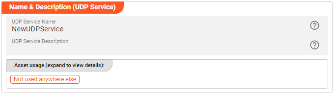

import WipDisclaimer from '../../snippets/common/_wip-disclaimer.md'
import NameAndDescription from '/docs/snippets/assets/_asset-name-and-description.md';
import RequiredRoles from '/docs/snippets/assets/_asset-required-roles.md';
import Testcase from '/docs/snippets/assets/_asset-service-test.md';

# UDP Service

## Purpose

Define a service to interact as client towards UDP APIs.

")

## Prerequisites

You need a Format:

* [Format](/docs/assets/formats)

## Configuration

### Name & Description



<NameAndDescription></NameAndDescription>

### Required roles

<RequiredRoles></RequiredRoles>

### UDP Server

Configure the connection parameters towards the UDP Service Server: 


* **`Host`**: interface address under which your UDP Service Server is reachable.
* **`Port`**: the Port to communicate with your interface address.
* **`Timeout [ms]`**: Connection timeout in milliseconds. This is the time the client will wait for a connection to the UDP Service Server to be established.
* **`Parallelism`**: number of requests to be handled at the same time.

In here you can use $\{...\} macros to expand variables defined in [environment variables](/docs/assets/resources/asset-resource-environment).

### Default Formats

Formats are used to parse (request) respectively build (response) the data packages exchanged via UDP. 
The overall compilation of `Functions` for assigning formats individually are configured in the next section. While it is possible to define default formats in here.
Default Formats will apply in case that no dedicated format has been given.


### Functions

Like with most Services, you define **Functions** to work with the UDP-Server provided API(s).
These Functions can then be invoked within the Workflow.

A Function references a Request and its Response. 
Type and Format of Request / Response need to be assigned in order to parse / build the data packages which will be exchanged. The following Function configuration binds it all together: 


* **`Name`**: define the logical name for the function to reference it in your Javascript logic.
* **`Description`**: a description for the function definition.
* **`Parameter Type`**: type from the format to be used to build the request (Intellisense feature support). 
* **`Parameter Format`**: format to be used for building the request (drop down list support)
* **`Result Type`**: type from the format to be used to parse the response (Intellisense feature support).
* **`Result Format`**: format to be used for capturing the response (drop down list support).

## Example: Using the UDP Service

The UDP Service can be used from within a JavaScript Asset.
In our example we have a simple Workflow which reads a file with input data (1), then in the next step (2) requests data from a UDB service to perform lookup based on the incoming data,
and outputs the findings into a log.
There is no other purpose in this Workflow than to demonstrate how to use the Service.

")

In the middle of the Workflow we find a JavaScript Processor by the name of “_UDPGetData_”.
This Processor determines data based on an incoming key-value by using the UDP Service.

How is it configured?

### Link UDPGetData Processor to UDP Service

To use the UDP Service in the JavaScript Processor, we first have to **assign the Service within the JavaScript
Processor** like so:

")

* **`Physical Service`**: The UDP Service which we have configured above.

* **`Logical Service Name`**: The name by which we want to use the Service within JavaScript. This could be the
  exact same name as the Service or a name which you can choose. Must not include whitespaces.

### Access the Service from within JavaScript

Now let’s finally use the service within JavaScript:

#### Communicate with UDP

Example: `services.TestUdpService.TestFunction({'Command': 'get','Subject': 'data','Key': key,})`

```javascript
/**
 * System function
 * Handle incoming messages
 */
export function onMessage() {
    let response = null;
    let key;

    if (message.data.SMPL_IN.RECORD_TYPE == 'D') {
        key = message.data.SMPL_IN.COUNTRY_ISO;
        try {
            response = services.TestUdpService.TestFunction({
                'Command': 'get',
                'Subject': 'data',
                'Key': key,
            })
        } catch (error) {
            stream.logInfo('Error in UDP request processing - name [' + error.name + '] and message [' + error.message + ']');
            throw error;
        }
        let lines = response.data.ReturnValue.split('\n');
        lines.forEach(function(line) {
            let record = splitLine(line);

            if (record && record.returnCode.startsWith('200')) {
                stream.logInfo('Successful UDP respons;  value: [' + record.value + '] - retrieved from key: [' + key + ']');
            }
            else {
            stream.logInfo('No proper response value from UDP request'); 
            }
        })
    }

    stream.emit(message, OUTPUT_PORT);  // flows to DevNull for sample purposes
}
```

<Testcase></Testcase>

---

<WipDisclaimer></WipDisclaimer>
