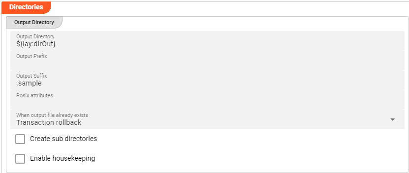
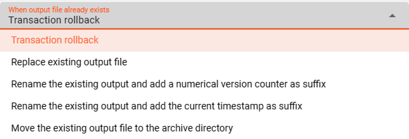
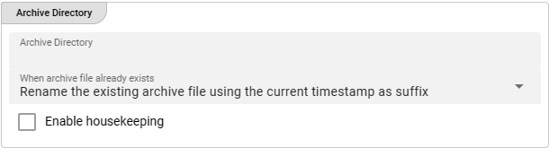
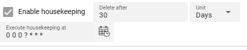

import WipDisclaimer from '../../snippets/common/_wip-disclaimer.md'
import NameAndDescription from '../../snippets/assets/_asset-name-and-description.md';
import RequiredRoles from '../../snippets/assets/_asset-required-roles.md';

# Sink File System

## Purpose

Defines the outbound connection parameters for a File System sink.

### This Asset can be used by:

| Asset type        | Link                                                                          |
|-------------------|-------------------------------------------------------------------------------|
| Output Processors | [Stream Output Processor](../processors-output/asset-output-stream) |

### Prerequisite

None

## Configuration

### Name & Description

")

<NameAndDescription></NameAndDescription>

### Required roles

<RequiredRoles></RequiredRoles>

### Directories

A File System sink allows the definition of the following two different directories:

1. **Output Directory** : The directory to write output files to.
2. **Temporary Directory** : The directory to write output files to during processing (see description below).

#### Output Directory

* **`Output Directory`** : The directory to write output files to.
  The path of the directory must be accessible to the Reactive Engine trying to access the File System Sink.
  You can use $\{...\} macros to expand variables defined in [environment variables](../resources/asset-resource-environment).

* **`Output prefix`** : Prefix to add to the filename of the processed file when writing to the output directory.
  E.g. `out_` will add the `out_`-prefix to the beginning of the filename when written to the output directory.

* **`Output suffix`** : Suffix to add to the filename of the processed file after move to the output directory.
  E.g. `_out` will add the `_out`-suffix to the end of the filename when written to the output directory.

* **`Posix attributes`** : Used in Unix environments and allows `chmod` attribute configurations to be applied to the written output file. Either use a numeric pattern like `775` or the 9-digit code `rw-rw-r--`.   

* **`"File already exists"-Handling`** : Define your required handling in case the file already exists in the output-directory.

  

  The option containing an archive directory will open an additional window for configuration:

  

* **`Create sub directories`** : Activating this check-box interprets the configured [Output Directory](#output-directory) as the root directory and 
creates - if applicable - sub directories for writing the files underneath it. The sub directories are either determined by the related Input Source configured with the `Include sub sirectories` option or 
through a Javascript logic that would create sub directories.

* **`Enable housekeeping`** : Allows to apply housekeeping rules for files within the output-directory. You can configure your required options.

  

#### Temporary Directory

")

* **`Temporary Directory`** : Before the final output file is written to the output directory defined above, the system will create a temporary file.
  When processing is complete, this temporary file will become the final file and moved to the output directory as defined in [Output Directory](#output-directory).
  When finally written to output, the prefix and suffix defined above will be observed.
  In other words: The temporary prefix and suffix defined below will only be relevant for the duration of writing the temporary file, and then be discarded.
  All temporary files should be automatically removed upon successful processing.
  Should you encounter a temporary file in a temporary directory even though there is no current processing ongoing, then this is likely a residue from a crash which needs to be further investigated.

  The path of the directory must be accessible to the Reactive Engine trying to access the File System Sink.
  You can use $\{...\} macros to expand variables defined in [environment variables](../resources/asset-resource-environment).

* **`Temporary prefix`** : Prefix to add to the filename of the temporary file when writing to the temporary directory.
  E.g. `temp_` will add the `temp_`-prefix to the beginning of the filename when written to the output directory.

* **`Temporary suffix`** : Suffix to add to the filename of the temporary file after move to the temporary directory.
  E.g. `_temp` will add the `_temp`-suffix to the end of the filename when written to the output directory.

## Related Topics

### Internal

* [Stream Output Processor](../processors-output/asset-output-stream)
* [File System Source](../sources/asset-source-file)
---

<WipDisclaimer></WipDisclaimer>
