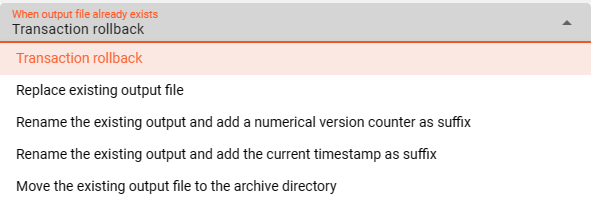
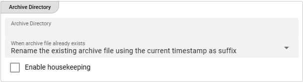

import WipDisclaimer from '../../snippets/common/_wip-disclaimer.md'
import NameAndDescription from '/docs/snippets/assets/_asset-name-and-description.md';
import RequiredRoles from '/docs/snippets/assets/_asset-required-roles.md';

# Sink SharePoint

## Purpose

Defines the specific sink parameters for a SharePoint connected endpoint.

### This Asset can be used by:

| Asset type        | Link                                                                          |
|-------------------|-------------------------------------------------------------------------------|
| Output Processors | [Stream Output Processor](/docs/assets/processors-output/asset-output-stream) |

You need:

* [MS Graph Connection](/docs/assets/connections/asset-connection-msgraph)

## Configuration

### Name & Description

")

<NameAndDescription></NameAndDescription>

### Required roles

<RequiredRoles></RequiredRoles>

### SharePoint Settings

Configure the parameters for your SharePoint endpoint:

")

#### Connection

Use the drop-down list to select an [MS Graph Connection](/docs/assets/connections/asset-connection-msgraph) that should
support this SharePoint configuration. If it does not exist, you need to create it first.

:::info
Your [MS Graph Connection](/docs/assets/connections/asset-connection-msgraph) needs to have the following configured scope:
* Sites.ReadWrite.All
* Files.ReadWrite.All
:::

#### Site and Library

The following settings define the basic location information to write SharePoint data to:

* **`Site name or ID`** : ID or name of the SharePoint site you want to connect to.
* **`Libary name or ID`** : ID or name of the Library underneath the configured SharePoint site name you want to connect to.

:::info
Getting access to a configured SharePoint source through layline.io ensure _**Following**_ the configured site!
:::

### Directories

Underneath the configured base location the SharePoint sink allows the definition of the following different directories:

1. **Output Directory** : The directory to write output files to.
2. **Temporary Directory** : The directory to write output files to during processing (see description below).

#### Output Directory

")

* **`Output Directory`** : The directory to write output files to.
  The path of the directory must be accessible to the Reactive Engine trying to access the SharePoint Sink.
  You can use $\{...\} macros to expand variables defined in [environment variables](/docs/assets/resources/asset-resource-environment).

* **`Output prefix`** : Prefix to add to the filename of the processed file when writing to the output directory.
  E.g. `out_` will add the `out_`-prefix to the beginning of the filename when written to the output directory.

* **`Output suffix`** : Suffix to add to the filename of the processed file after move to the output directory.
  E.g. `_out` will add the `_out`-suffix to the end of the filename when written to the output directory.

* **`"File already exists"-Handling`** : Define your required handling in case the file already exists in the output-directory.

  

  The option containing an archive directory will open an additional window for configuration:

  

* **`Create sub directories`** : Activating this check-box interprets the configured [Output Directory](#output-directory) as the root directory and
  creates - if applicable - sub directories for writing the files underneath it. The sub directories are either determined by the related Input Source configured with the `Include sub sirectories` option or
  through a Javascript logic that would create sub directories.

* **`Enable housekeeping`** : Allows to apply housekeeping rules for files within the output-directory. You can configure your required options.

  

#### Temporary Directory

")

* **`Temporary Directory`** : Before the final output file is written to the output directory defined above, the system will create a temporary file.
  When processing is complete, this temporary file will become the final file and moved to the output directory as defined in [Output Directory](#output-directory).
  When finally written to output, the prefix and suffix defined above will be observed.
  In other words: The temporary prefix and suffix defined below will only be relevant for the duration of writing the temporary file, and then be discarded.
  All temporary files should be automatically removed upon successful processing.
  Should you encounter a temporary file in a temporary directory even though there is no current processing ongoing, then this is likely a residue from a crash which needs to be further investigated.

  The path of the directory must be accessible to the Reactive Engine trying to access the SharePoint Sink.
  You can use $\{...\} macros to expand variables defined in [environment variables](/docs/assets/resources/asset-resource-environment).

* **`Temporary prefix`** : Prefix to add to the filename of the temporary file when writing to the temporary directory.
  E.g. `temp_` will add the `temp_`-prefix to the beginning of the filename when written to the output directory.

* **`Temporary suffix`** : Suffix to add to the filename of the temporary file after move to the temporary directory.
  E.g. `_temp` will add the `_temp`-suffix to the end of the filename when written to the output directory.

### Other Settings

")

There are two more settings which you can use to optimize file output:

* **`Delay post processing steps`** : You can ask the system to slow (delay) post-processing steps such as move and delete.
  Enter a number in milliseconds which should be observed before for example moving a temporary file to the output directory and then deleting it from the temporary directory.
  This can prove to be helpful in environments where connections are a little "sensitive", and allow the system to "settle".
  It's something we learned from working with such systems.

* **`Number of retries`** : In addition defining a post-processing delay time, we can define a number of retries, should an operation fail.
  Again, this is to allow for more robustness in operation as connections can prove to be sensitive at times and ridden with timeouts, etc.
  An optimally connected and tuned sink should not require these settings, but this is often not the case.

---

<WipDisclaimer></WipDisclaimer>
