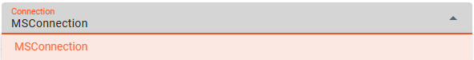

import WipDisclaimer from '../../snippets/common/_wip-disclaimer.md'
import NameAndDescription from '../../snippets/assets/_asset-name-and-description.md';
import RequiredRoles from '../../snippets/assets/_asset-required-roles.md';
import PollingAndProcessing from '../../snippets/assets/_asset-source-polling-and-processing.md';
import Directories from '../../snippets/assets/_asset-source-directories.md';

# Source SharePoint

## Purpose

Defines the specific source parameters for a SharePoint connected endpoint. 

### This Asset can be used by:

| Asset type       | Link                                                                       |
|------------------|----------------------------------------------------------------------------|
| Input Processors | [Stream Input Processor](../processors-input/asset-input-stream) |

### Prerequisite

You need:

* [MS Graph Connection](../connections/asset-connection-msgraph)

## Configuration

### Name & Description

")

<NameAndDescription></NameAndDescription>

### Required roles

<RequiredRoles></RequiredRoles>

### Polling & Processing

<PollingAndProcessing></PollingAndProcessing>

### SharePoint Settings

Configure the parameters for your SharePoint endpoint:

")

#### Connection

Use the drop-down list to select an [MS Graph Connection](../connections/asset-connection-msgraph) that should
support this SharePoint configuration. If it does not exist, you need to create it first.

:::info
Your [MS Graph Connection](../connections/asset-connection-msgraph) needs to have the following configured scope:
* Sites.ReadWrite.All
* Files.ReadWrite.All
:::

#### Site and Library

The following settings define the basic location information to read SharePoint data from: 

* **`Site name or ID`** : ID or name of the SharePoint site you want to connect to.
* **`Libary name or ID`** : ID or name of the Library underneath the configured SharePoint site name you want to connect to.

:::info
Getting access to a configured SharePoint source through layline.io ensure _**Following**_ the configured site!
:::

### Directories

<Directories></Directories>

---

<WipDisclaimer></WipDisclaimer>
