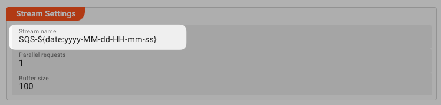
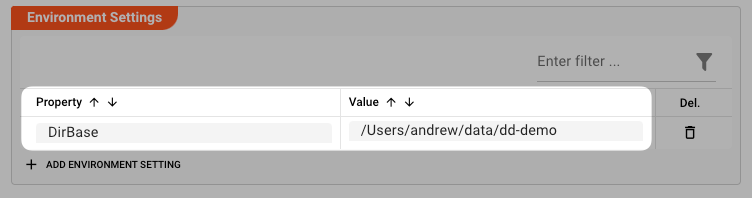
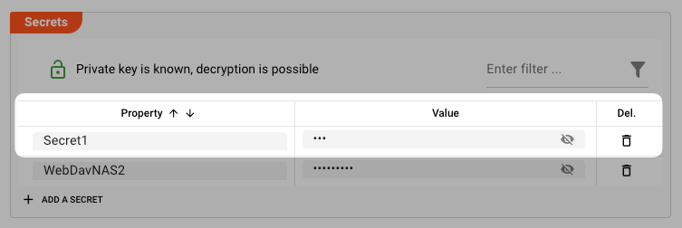
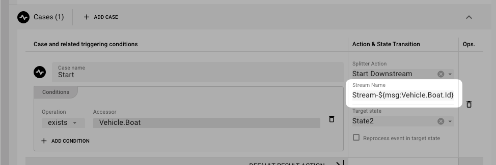
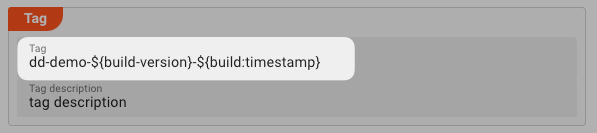
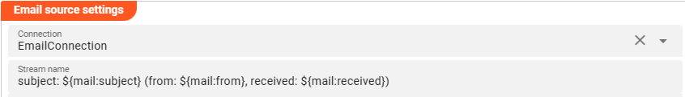

import WipDisclaimer from '../snippets/common/_wip-disclaimer.md'

# Macros

## Purpose

In some cases, when you configure your project, you run into the issue that you want to automatically have certain values filled in by variables.

Some example of variables:

- current date and time
- system environment variable
- layline.io environment variable
- layline.io message content
- etc.

As a quick example, let's assume that you are configuring a [Amazon SQS Source](/docs/assets/sources/asset-source-sqs).
Within that configuration you must define a stream name to represent the stream which is being processed when reading from SQS.
To provide a uniwue name, you could define the name like so:

When the source is accessed and creates a stream, the variable defined by `${date:yyyy-MM-dd-HH-mm-ss}` will then be replaced by the current date/timestamp, e.g. like so: `SQS-2023-01-01-12-23-45`.

:::note
layline.io gives you the option to use macros within most fields. At this point in time, it's not fully documented where exactly.
We are working on this!
:::

## Variable Structure

The structure of a variable within layline.io is compriesed like this:

`${prefix:suffx}`

Where `prefix` defines an group of variables, and the `suffix` defines either a format or a variable within that group.
It will all make sense when we explain the different types of variables which are at you disposal.

## Variable Types

### lay:

The Prefix `lay` references an environment property which you have defined in a [Environment Resource Asset](/docs/assets/resources/asset-resource-environment).
The suffix defines the value which you have defined for that property:

**Example:**

You can then access this variable like this: `${lay:DirBase}`.

:::warning Environment Resource must be deployed
As this variable will be replaced at runtime, it is important that you include the Environment Resource as part of your deployment to the cluster.
Otherwise, you will encounter an error when you try to start the deployment on the Reactive Cluster, as the cluster cannot find the referenced environment variable.
:::

### sec:

The Prefix `sec` references a secret property which you have defined in a [Environment Secret Asset](/docs/assets/resources/asset-resource-secret).
The suffix defines the value which you have defined for that property:

**Example:**

You can then access this variable like this: `${sec:Secret1}`.

:::warning Secret Resource must be deployed
As this variable will be replaced at runtime, it is important that you include the Secret Resource as part of your deployment to the cluster.
Otherwise, you will encounter an error when you try to start the deployment on the Reactive Cluster, as the cluster cannot find the referenced environment variable.

As secrets are encrypted with a public/private key pair, you must make sure, that the secrets you deploy are encrypted with the same public key, for which the private key is available on the Reactive
Cluster.
Otherwise, the cluster will be unable to decrypt the secret at runtime.
:::

### msg:

The prefix `msg` allows you to access message content, as messages are being processed.
This is useful when you want to replace content with a value from the stream which is being processed.

**Example:**

The Stream Boundary Controller Asset allows to split a long stream of data, into smaller individual streams based on configurable criteria.
For each new stream created you need to define a stream name.
You may want the stream name contain content from the message.
In our example we want to include an ID from the message in the stream name, so we define it as `Stream-${msg:Vehicle.Boat.Id}`.

If the Id is `4711`, then the complete expanded stream name would turn out to be `Stream-4711`.
Note how we are using the Data Dictionary Accessor Path `Vehicle.Boat.Id` to access the field content.

:::tip
If you are not familiar with the message format and data dictionary then please take a look at the [Data Dictionary concept](/docs/concept/data-dictionary).
:::

### build:

The prefix `build` provides access to some specific parameters which are available during Deployment to the Cluster.

You can use them within Deployment Assets (go to "_**Project -> Deployment**_" in the UI).

| Variable      | Description                                |
|---------------|--------------------------------------------|
| **timestamp** | Current date and time                      |
| **version**   | Project version (defined in Project Asset) |

**Example:**

For an Engine Configuration Asset ("_Project -> Deployment -> Engine Configurations_"), we want to provide a deployment tag name which contains individual information about the deployment time and
version.
The tag name is how the individual deployment is identified on the cluster.

If we enter the tag name like so: `dd-demo-${build-version}-${build:timestamp}`:

Then the outcome could be `dd-demo-1.2.21-20230808151420` (depending on version number and date/time of deployment to cluster).

### mail:

The prefix `mail` provides access to some specific information available in conjunction with Email sources:

| Variable     | Description                           |
|--------------|---------------------------------------|
| **folder**   | folder name from which email was read |
| **from**     | email address of sender               |
| **subject**  | subject as read from the Email source |
| **received** | timestamp of receipt of email         |

**Example:**

Configuring the Email Settings within an Email Source you can use these macros for defining the stream name:

The outcome would look something like this `subject: Test (from: test@layline.io, received: 2024-05-03T12:13:03Z)`

### Other Prefixes

layline.io utilizes the functionality of the Apache Commons Library for further macro support.
Here is a list of what you can do:

| Prefix        | Variable                | Example                                      | Description                      |
|---------------|-------------------------|----------------------------------------------|----------------------------------|
| base64Decoder | A base64 encoded string | $\{base64Decoder:SGVsbG9Xb3JsZCE=\}          | Decode a base64 encoded string   |
| base64Encoder | A string                | $\{base64Encoder:HelloWorld!\}               | Encode a string in base64 format |
| const         | A string                | $\{const:java.awt.event.KeyEvent.VK_ESCAPE\} | Java constant                    |
| env           | Environment variable    | $\{env:USERNAME\}                            | A system environment variable    |
| localhost     | "canonical-name"        | $\{localhost:canonical-name\}                | The canonical name of the host   |
| urlDecoder    | A url                   | $\{urlDecoder:Hello%20World%21\}             | Decoding a url to a string       |
| urlEncoder    | A string                | $\{urlEncoder:Hello World!\}                 | Encoding a string to a url       |

You can check out the full list [here](https://commons.apache.org/proper/commons-text/apidocs/org/apache/commons/text/StringSubstitutor.html).

---

<WipDisclaimer></WipDisclaimer>
