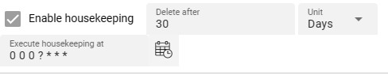

[//]: # (Precede this section with the header "### Folders")

This source requires the definition of `Folders`. A Folder basically consists of the definition of three different directories:

1. **Input Directory** : The directory to read new files from.
2. **Done Directory** : The directory to which read files are moved after reading.
3. **Error Directory** : Files which caused problems during processing are moved to the Error Directory for further analysis.

By using Folders TBD.

#### Input Directory

* **`Input Directory`** : The directory to read files from.
  The path of the directory must be accessible to the Reactive Engine trying to access this Source.
  You can use $\{...\} macros to expand variables defined in [environment variables](/docs/assets/resources/asset-resource-environment).

* **`Filter regular expression`** : Regular expression to filter which files in the directory are pulled.

* **`File prefix regular expression`** : A regular expression filter which is applied to the beginning of a file name.
  E.g. `XYZ.` will lead to only those files read which filename starts with `XYZ` followed by anything.

* **`File suffix regular expression`** : A regular expression filter which is applied to the end of a file name.
  E.g. `.zip` will lead to only those files read which filename ends with `zip` preceded by anything.

* **`Include sub-directories`** : Scan sub-directories to the input directory also.

* **`Enable housekeeping`** : Allows to apply housekeeping rules for files within the input directory. You can configure your required options.

  

#### Done Directory

* **`Done Directory`** : The directory to which files are moved when fully processed.
  The path of the directory must be accessible to the Reactive Engine trying to access this Source.
  You can use $\{...\} macros to expand variables defined in [environment variables](/docs/assets/resources/asset-resource-environment).

* **`Done prefix`** : Prefix to add to the filename of the processed file after move to the done directory.
  E.g. `done_` will add the `done_`-prefix to the beginning of the filename when moved to the done directory.

* **`Done suffix`** : Suffix to add to the filename of the processed file after move to the done directory.
  E.g. `_done` will add the `_done`-suffix to the end of the filename when moved to the done directory.

* **`"File already exists"-Handling`** : Define your required handling in case the file already exists in the done-directory.

  

* **`Enable housekeeping`** : Allows to apply housekeeping rules for files within the done directory. You can configure your required options.

  

#### Error Directory

* **`Error Directory`** : The directory to which files are moved in case of a problem with the file during processing.
  The path of the directory must be accessible to the Reactive Engine trying to access this Source.
  You can use $\{...\} macros to expand variables defined in [environment variables](/docs/assets/resources/asset-resource-environment).

* **`Error prefix`** : Prefix to add to the filename of the processed file after move to the error directory.
  E.g. `error_` will add the `error_`-prefix to the beginning of the filename when moved to the error directory.

* **`Error suffix`** : Suffix to add to the filename of the processed file after move to the error directory.
  E.g. `_error` will add the `_error`-suffix to the end of the filename when moved to the error directory.

* **`"File already exists"-Handling`** : Define your required handling in case the file already exists in the error-directory.

  

* **`Enable housekeeping`** : Allows to apply housekeeping rules for files within the error directory. You can configure your required options.

  