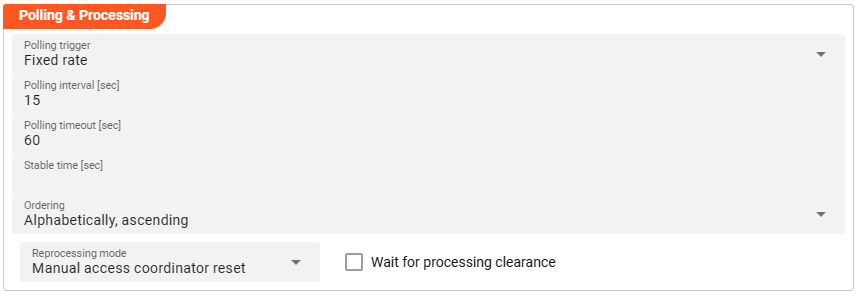
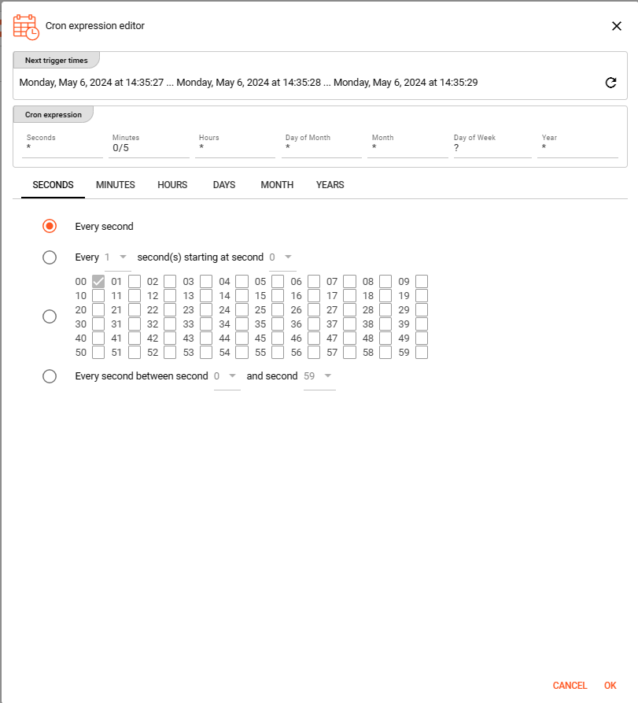
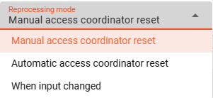

[//]: # (Precede this section with the header "### Polling & Processing")

This source does not reflect a stream, but an object based storage source which does not signal the existence of new objects to observers.
We therefore need to define how often we want to look-up (poll) the source for new objects to process.

You can choose between `Fixed rate polling` and `Cron tab style` polling:

#### Fixed rate

Use `Fixed rate` if you want to poll in constant and frequent intervals.

* **`Polling interval [sec]`**: Enter the interval in seconds in which the configured source should be queried for new objects.

#### Cron tab

Use `Cron tab` if you want to poll at determined times. The `Cron tab expression` follows the cron tab style convention which may be familiar to you.
In all other cases you can read more about crontab and the syntax [here](https://www.quartz-scheduler.org/documentation/quartz-2.3.0/tutorials/crontrigger.html).
You can simulate cron settings using [this smart website](https://www.freeformatter.com/cron-expression-generator-quartz.html).
Or you can use the **Cron expression editor** provided underneath the calendar symbol on the right hand side:

Configure your expression with the help of this editor. The _**Next trigger times**_ at the top helps to 
visualize the configured expression. Press OK towards the end of this editor window to store the given values.

#### Polling timeout

The `Polling timeout [sec]` defines the time in seconds to wait until a polling request fails.
Depending on the endpoint and its responsiveness you may want to change this number to something higher or lower.
You should set it high enough, so that you are confident that the endpoint responds under normal operation.

#### Stable time

The `Stable time [sec]` defines the number of seconds that file statistics must stay unchanged for considering it as stable. 
Configuring a value in here will check the appropriate file stability before processing the file. 

#### Ordering

When listing objects from the source for processing, you can define in what order they should be processed.
Pick one of the following self-explanatory settings:

* `Alphabetically, ascending`
* `Alphabetically, descending`
* `Last modified, ascending`
* `Last modified, descending`

#### Reprocessing mode

Configuring the `Reprocessing mode` relates to layline.io's [Access Coordinator](../../concept/operations/cluster/cluster#access-coordinator) feature.
You can pick between three modes:

* `Manual access coordinator reset`: any source element processed and stored in layline.io's history needs manual reset within the _**Sources Coordinator**_ before reprocessing of a re-ingested source is performed (default mode).   
* `Automatic access coordinator reset`: this mode allows the automatc reprocessig of already processed and re-ingested sources 
as soon as the respective input source has been moved into the configured done or error directory.      
* `When input changed`: this mode behaves as described in `Manual access coordinator reset` while it performs an additional check whether the source has potentially changed; 
i.e. the name of the source is identical but the content differs. 
In case the input in fact changed, the reprocessing will start without manual intervention. 

#### Wait for processing clearance

Activating this checkbox identifies new input sources as `Wait for processing clearance`. This means, the input source
leaves unprocessed in the input directory until a) a manual intervention through Operations provides active clearance for processing the respective file or
b) some Javascript executes the `AccessCoordinator.giveClearance(source: string, stream: string, timeout?: number)` method.

